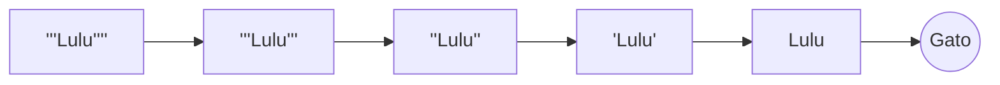
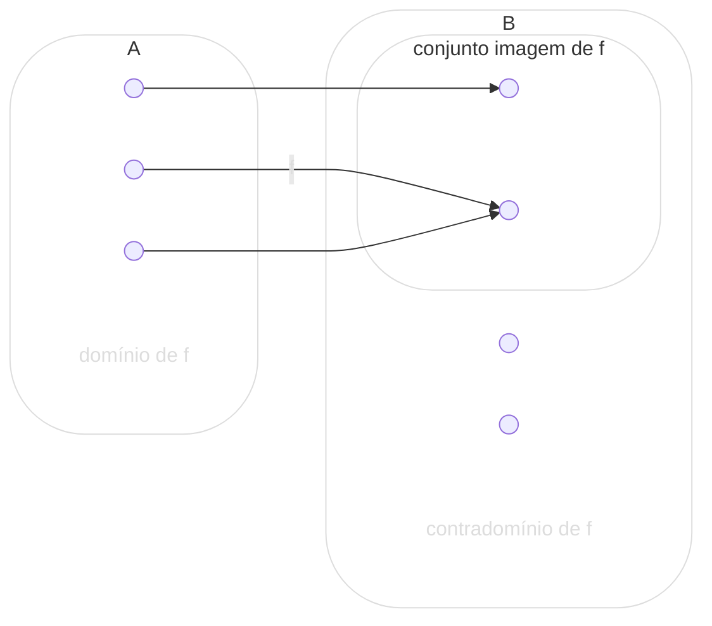
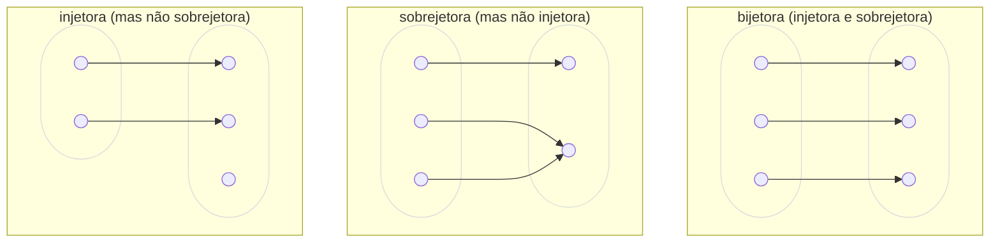

# Introdução à Lógica - 2 Edição

## Nova Edição Revista e Ampliada

Ao contrário do que pensam alguns, a lógica é uma ciência apaixonante e viva, fruto de rica história de evolução e transformação. Essa mesma história dinâmica é refletida por este livro, no qual se constrói uma rigorosa e abrangente introdução aos desenvolvimentos recentes e ao conteúdo clássico dessa ciência ilustre.

Esta nova edição, revista e ampliada, traz um apêndice com noções de teoria do silogismo.

## Agradecimentos

Este livro surgiu de textos redigidos para as minhas aulas de lógica no curso de graduação em Filosofia da Universidade Federal de Santa Catarina. Nesta segunda edição, um pouco do material foi reordenado: atendendo a muitas solicitações, a lógica proposicional é agora apresentada, de maneira independente, antes do cálculo de predicados, e foi também incluído um apêndice com noções de teoria do silogismo.

Agradeço às inúmeras pessoas que leram as diferentes versões do livro em várias ocasiões e sugeriram vários aperfeiçoamentos, muitos dos quais foram incluídos nesta nova edição. Seria impossível nomear todas elas, mas agradeço em especial aos estudantes da filosofia, que sofreram durante as versões preliminares do livro e que, mesmo assim, me encorajaram a melhorá-lo.

Gostaria de agradecer também, pela leitura atenta e pelas inúmeras sugestões e correções, a Luiz Henrique de Araújo Dutra, Antonio Mariano Nogueira Coelho, Marco Antonio Figueiredo Menezes, Roberta Pires de Oliveira e Luiz Arthur Pagani. Um agradecimento em particular ao grande amigo Luiz Henrique Dutra, que sempre me incentivou — entre outras coisas, a publicar de uma vez este livro, e partir para o próximo. *(May the Force be with you, Luiz Henrique!)*

*Florianópolis, dezembro de 2014*

---

# SUMÁRIO

### 1. Introdução 13

- 1.1. O que é lógica? 13

- 1.2. Raciocínio e inferência 14

- 1.3. Argumentos 18

- 1.4. Sentenças, proposições, enunciados 25

### 2. Lógica e argumentos 33

- 2.1. Validade e forma 33

- 2.2. Validade e correção 38

- 2.3. Dedução e indução 42

- 2.4. A lógica e o processo de inferência 46

- 2.5. Um pouco de história 47

### 3. Preliminares 53

- 3.1. Linguagens 53

- 3.2. Linguagens artificiais 55

- 3.3. Uso e menção 57

- 3.4. Linguagem-objeto e metalinguagem 62

- 3.5. O uso de variáveis 63

### 4. Conjuntos 65

- 4.1. Caracterização de conjuntos 65

- 4.2. Conjuntos especiais 68

- 4.3. Relações entre conjuntos 71

- 4.4. Operações sobre conjuntos 73

- 4.5. Propriedades e relações 77

- 4.6. Funções 79

- 4.7. Conjuntos infinitos 82

### 5. O cálculo proposicional clássico 89

- 5.1. Lógicas 89

- 5.2. Introduzindo o CPC 92

- 5.3. Letras sentenciais e fórmulas atômicas 96

- 5.4. Operadores e fórmulas moleculares 99

- 5.5. Sinais de pontuação 106

### 6. Interpretações proposicionais 115

- 6.1. Significado e verdade 115

- 6.2. Ideias básicas 120

- 6.3. Funções de verdade 125

- 6.4. Valorações 133

### 7. Tautologias e consequência tautológica 139

- 7.1. Tabelas de verdade 139

- 7.2. Tautologias, contradições e contingências 145

- 7.3. Implicação e equivalência tautológicas 149

### 8. A sintaxe do cálculo de predicados (I) 157

- 8.1. Introduzindo o CQC 157

- 8.2. Algumas características da lógica clássica 162

- 8.3. Símbolos individuais 163

- 8.4. Constantes de predicado e fórmulas atômicas 167

- 8.5. Operadores e fórmulas moleculares 175

- 8.6. Quantificadores e fórmulas gerais 178

### 9. A sintaxe do cálculo de predicados (II) 187

- 9.1 Linguagens de primeira ordem 187

- 9.2 Proposições categóricas 197

- 9.3 Quantificação múltipla 206

### 10. Estruturas e verdade 213

- 10.1. O valor semântico das expressões 213

- 10.2. Estruturas 216

- 10.3. Verdade 224

- 10.4. Definição de verdade 236

### 11. Validade e consequência lógica 247

- 11.1. Validade 247

- 11.2. Consequência lógica (semântica) 252

- 11.3. Algumas propriedades de |= 257

- 11.4. A validade de argumentos 259

### 12. Tablôs semânticos 263

- 12.1. Procedimentos de prova 263

- 12.2. Exemplos de tablôs 267

- 12.3. Regras para fórmulas moleculares 273

- 12.4. Consequência lógica 277

- 12.5. Quantificadores 280

- 12.6. Invalidade 289

- 12.7. Indecidibilidade do CQC 293

### 13. Sistemas axiomáticos e sistemas formais 297

- 13.1. Os matemáticos e a verdade 297

- 13.2. Geometria 299

- 13.3. Sistemas formais 303

- 13.4. Os doublets de Lewis Carroll 304

### 14. Dedução natural (I) 307

- 14.1. Apresentando a dedução natural 307

- 14.2. Regras de inferência diretas 314

- 14.3. Fazendo uma dedução 318

- 14.4. Regras de inferência hipotéticas 325

- 14.5. Estratégias de Derivação 332

### 15. Dedução natural (II) 339

- 15.1. Regras derivadas 339

- 15.2. Regras para quantificadores 343

- 15.3. Uma regra derivada para quantificadores 357

- 15.4. Teoremas 358

- 15.5. Consequência sintática e consequência semântica 360

### 16. Identidade e símbolos funcionais 365

- 16.1. Identidade 365

- 16.2. Símbolos funcionais 380

- 16.3. Consequência lógica no CQCf 390

- 16.4. Tablôs semânticos para o CQCf 392

- 16.5. Dedução natural no CQCf 398

### 17. Teorias formalizadas 405

- 17.1. Conceitualizações 405

- 17.2. Uma teoria sobre blocos 410

- 17.3. Aritmética formalizada 421

### 18. Lógicas não clássicas 435

- 18.1. O que é a lógica clássica? 435

- 18.2. Lógicas não clássicas 440

- 18.3. Lógica modal alética 444

- 18.4. Outras lógicas modais 460

- 18.5. Lógicas alternativas 462

- 18.6. A história mais recente 477

### Apêndice A - Noções de teoria do silogismo 483

- A.1. Proposições categóricas 483

- A.2. O quadrado tradicional de oposições 486

- A.3. Silogismos categóricos 490

- A.4. A validade dos silogismos 497

- A.5. Diagramas de Venn-Euler 508

- A.6. Validade e existência 517

### Referências bibliográficas 523

---

# 1. INTRODUÇÃO

Neste capítulo inicial, procuraremos caracterizar o que é a lógica e do que ela se ocupa. Trataremos de coisas como raciocínio, inferência e argumento, e de o que a lógica tem a ver com tudo isso.

## 1.1. O que é lógica?

Apresentar a quem se inicia no estudo de alguma disciplina uma definição precisa dela é uma tarefa certamente difícil. (Por exemplo, como você definiria a física?) Geralmente, uma ciência (como a física) tem tantas facetas e especialidades que toda definição termina por ser injusta, ou por deixar de lado aspectos importantes, ou ainda por dar margem a que se incluam coisas que, na verdade, não pertencem à disciplina em questão. Além do mais, as ciências evoluem, novas especialidades surgem, e as fronteiras entre elas geralmente estão longe de serem nítidas. Dessa forma, assim como é difícil dar uma definição impecável do que seja a física, a química ou a matemática, o mesmo acontece com a lógica.

Em vista disso, seria fácil, neste primeiro momento, cair na tentação de dizer a um principiante algo como: “Lógica é aquilo que os lógicos fazem, e ponto final”. Ou então: “Leia o presente livro; ao final dele você vai ter uma ideia do que é a lógica”. Contudo, isso obviamente não esclarece muita coisa, e, uma vez que este texto pretende ser uma introdução ao assunto, seria apropriado começar com uma ideia inicial, ainda que não muito precisa, daquilo que estamos introduzindo. Portanto, para encurtar a conversa e ter um ponto de partida, ainda que provisório, vamos dizer o seguinte:

> *LÓGICA é a ciência que estuda princípios e métodos de inferência, tendo o objetivo principal de determinar em que condições certas coisas se seguem (são consequências), ou não, de outras.*

Obviamente, como definição, isso deixa bastante a desejar: precisamos explicar o que é “inferência”, por exemplo, e o que se quer dizer com “se seguem” ou “consequência”, e que “coisas” estão aí envolvidas. Isso é o que vamos tentar esclarecer no decorrer deste e do próximo capítulo.

## 1.2. Raciocínio e inferência

Vamos começar com o problema apresentado no seguinte miniconto de fadas:

> *Há não muito tempo, num país distante, havia um velho rei que tinha três filhas, inteligentíssimas e de indescritível beleza, chamadas Guilhermina, Genoveva e Griselda. Sentindo-se perto de partir desta para melhor, e sem saber qual das filhas designar como sua sucessora, o velho rei resolveu submetê-las a um teste. A vencedora não apenas seria a nova soberana, como ainda receberia a senha da conta secreta do rei (num banco suíço), além de um fim de semana, com despesas pagas, na Disneylândia. Chamando as filhas a sua presença, o rei mostrou-lhes cinco pares de brincos, idênticos em tudo, com exceção das pedras neles engastadas: três eram de esmeralda e dois de rubi. O rei vendou, então, os olhos das moças e, escolhendo ao acaso, colocou em cada uma delas um par de brincos. O teste consistia no seguinte: aquela que pudesse dizer, sem sombra de dúvida, qual o tipo de pedra que havia em seus brincos herdaria o reino (e a conta na Suíça etc.). A primeira que desejou tentar foi Guilhermina, de quem foi removida a venda dos olhos. Guilhermina examinou os brincos de suas irmãs, mas não foi capaz de dizer que tipo de pedra estava nos seus (e retirou-se, furiosa). A segunda que desejou tentar foi Genoveva. Contudo, após examinar os brincos de Griselda, Genoveva se deu conta de que também não sabia determinar se seus brincos eram de esmeralda ou rubi e, da mesma furiosa forma que sua irmã, saiu batendo a porta. Quanto a Griselda, antes mesmo que o rei lhe tirasse a venda dos olhos, anunciou corretamente, em alto e bom som, o tipo de pedra de seus brincos, dizendo ainda o porquê de sua afirmação. Assim, ela herdou o reino, a conta na Suíça e, na viagem à Disneylândia, conheceu um jovem cirurgião plástico, com quem se casou e foi feliz para sempre.*

Agora, um probleminha para você resolver:

---

**Exercício 1.1**: Que brincos tinha Griselda, de esmeralda ou de rubi? Justifique sua resposta.

---

***Aviso importante:*** *Como você vê, aqui está o primeiro dos muitos exercícios que se encontram espalhados ao longo da aprendizagem da lógica. Da mesma maneira que aprender matemática, aprender lógica envolve a realização de exercícios, sem o que as coisas não progridem. (Mesmo!) O ideal seria que você tentasse resolver todos os que aparecem neste livro. Pense um pouco a respeito desse primeiro e tente colocar suas ideias por escrito.*

Já de volta? Bem, espero que você tenha feito o esforço e descoberto que os brincos de Griselda eram de esmeralda. Contudo, responder ao exercício dizendo apenas que os brincos eram de esmeralda não é suficiente: você pode ter tido um palpite feliz, acertando simplesmente por sorte. Para me convencer de que você sabe mesmo a resposta, você tem de expor as razões que o/a levaram a *concluir* que os brincos eram de esmeralda; você tem de *justificar* essa sua afirmação. Note que as princesas também estavam obrigadas a fazer isso: o velho rei não estava interessado em que uma delas acertasse a resposta por acaso.

Mas, antes de nos ocuparmos com a justificativa pedida, vamos conversar um pouco sobre o que aconteceu enquanto você tentava resolver o problema. Há vários pontos de partida que você pode ter tomado, e vários caminhos que pode ter seguido. Por exemplo, você pode ter começado achando que, em termos de probabilidades, há mais chances de que os brincos de Griselda sejam de esmeralda — afinal, há um número menor de brincos de rubi — e ter, então, tentado mostrar que eles são mesmo de esmeralda. Ou você pode ter procurado imaginar o que aconteceria se os brincos de Griselda fossem de rubi, e ter chegado à conclusão de que isso não poderia ter ocorrido. 

Ou talvez você tenha feito uma lista de todas as combinações possíveis de brincos e princesas, e tenha prosseguido eliminando sistematicamente aquelas combinações que contrariavam os dados do problema. Seja lá como for, em algum lugar do seu cérebro (nas “pequenas células cinzentas”, como diria Hercule Poirot) ocorreu um processo que fez com que você passasse a acreditar numa certa conclusão: os brincos de Griselda tinham que ser de esmeralda. A esse processo um processo mental vamos chamar de *raciocínio*, ou de *processo de inferência*.

Basicamente, raciocinar, ou fazer inferências, consiste em “manipular” a informação disponível aquilo que sabemos, ou supomos, ser verdadeiro; aquilo em que acreditamos e extrair consequências disso, obtendo informação nova. O resultado de um processo (bem-sucedido) de inferência é que você fica sabendo (ou, ao menos, acreditando em) algo que você não sabia antes: que os brincos de Griselda são de esmeralda; que o assassino foi o mordomo; que, se você comprar este televisor de 50 polegadas agora, não vai ter dinheiro para o aluguel. É claro que esse processo também pode terminar num fracasso raciocina-se em vão e não se chega a lugar nenhum , mas essa é outra história.

Por outro lado, é importante notar que nem sempre o ponto de partida do processo são coisas sabidas, ou em que se acredita: muitas vezes, raciocinamos a partir de suposições ou hipóteses. Por exemplo, você pode estar interessado em saber o que acontecerá se você comprar agora o home theater dos seus sonhos, com televisão HD de 50 polegadas e assim por diante. Raciocinando a partir daí, e com conhecimento do estado de seu bolso e/ou conta bancária, você pode chegar à conclusão de que vai faltar dinheiro para o aluguel. O resultado do processo, nesse caso, não é que você fique sabendo que não há dinheiro para o aluguel, mas que isso irá acontecer se você comprar o tal home theater. O conhecimento novo que você obteve, no caso, é que existe uma certa conexão entre comprar o equipamento desejado e não poder pagar o aluguel.

É provavelmente desnecessário mencionar — mas vou fazê-lo assim mesmo — que existem outras maneiras, além de inferências, de obter informação nova. Por exemplo, você pode ter lido na primeira página do jornal de hoje que os brincos de Griselda são de esmeralda. Ou talvez sua namorada (ou namorado) tenha lhe contado isso, e você acredita sistematicamente em tudo o que ela (ele) diz. Em qualquer um desses casos, você passou a acreditar que os brincos de Griselda são de esmeralda sem se ter dado ao trabalho de raciocinar a partir dos dados do problema. Frequentemente, contudo, obtemos informação executando inferências, ou seja, raciocinando, e é aqui que o interesse da lógica se concentra.

O processo de raciocínio acontece no cérebro das pessoas e é o que podemos denominar um processo mental. Exatamente como esse processo se desenrola não se sabe ainda ao certo. Habitualmente, não tomamos consciência de que estamos raciocinando, nem do modo de funcionar desse processo. Muitas vezes, não sabemos nem mesmo explicar como chegamos a alguma conclusão; o processo parece se dar de modo mais ou menos inconsciente.  Costumamos falar em “ter um estalo”, e atinar de repente com a resposta a algum problema que nos preocupa: é como se o subconsciente continuasse funcionando e, de repente, quase que por mágica, chegamos a alguma solução. Para dar um exemplo: você certamente conhece a velha lenda sobre como Isaac Newton descobriu a Lei da Gravitação Universal. 

Conta-se que, estando Sir Isaac sentado a dormitar à sombra de uma frondosa macieira, caiu-lhe à cabeça uma maçã, e ele teve uma visão: os astros se movendo no cosmo, as maçãs (e os aviões) que caem, tudo está sujeito à força da gravidade. Há vários exemplos desse tipo pela história da ciência afora: para citar mais um, Friedrich Kekulé, o proponente da estrutura química dos anéis benzênicos, teve sua inspiração ao observar como chamas na lareira pareciam formar circulos — ou, segundo outras fontes, ao sonhar com uma serpente engolindo sua própria cauda. 

É claro que, muitas vezes, temos plena consciência de que estamos envolvidos num raciocinar, e isso também costuma exigir um certo esforço (o que você deve ter descoberto tentando resolver o exercício anterior).

Mas, enfim, aconteça consciente ou inconscientemente, o raciocínio é um processo mental. Porém, não é de interesse da lógica investigar como esse processo ocorre: ainda que a lógica muitas vezes seja caracterizada como a “ciência do raciocínio”, ela não se considera de modo algum parte da psicologia. A lógica não procura dizer como as pessoas raciocinam (mesmo porque elas “raciocinam errado” frequentemente), mas se interessa, primeiramente, pela questão de se aquelas coisas que sabemos ou em que acreditamos — o ponto de partida do processo — de fato constituem uma boa razão para aceitar a conclusão alcançada, isto é, se a conclusão é uma consequência daquilo que sabemos. Ou, em outras palavras, se a conclusão está adequadamente justificada em vista da informação disponível, se a conclusão pode ser afirmada a partir da informação que se tem. 

Note que isso é diferente de explicar o que foi acontecendo dentro de seu cérebro até você chegar a concluir que os brincos eram de esmeralda. (Há, porém, um sentido em que se pode dizer que a lógica também se interessa por como ocorre o raciocinar, e falaremos um pouco sobre isso quando discutirmos métodos de inferência.)

## 1.3 Argumentos

Justificar uma afirmação que se faz, ou dar as razões para uma certa conclusão obtida, é algo de bastante importância em muitas situações. Por exemplo, você pode estar tentando convencer outras pessoas de alguma coisa, ou precisa saber com certeza se o dinheiro vai ser suficiente ou não para pagar o aluguel: o seu agir depende de ter essa certeza.

A importância de uma boa justificativa vem do fato de que, muitas vezes, cometemos erros de raciocínio, chegando a uma conclusão que simplesmente não decorre da informação disponível. E, claro, há contextos nos quais uma afirmação só pode ser aceita como verdadeira se muito bem justificada: na ciência, de um modo geral, por exemplo, ou em um tribunal (onde alguém só pode ser condenado se não houver dúvida quanto a sua culpa). Assim, precisamos comumente de algum tipo de suporte para as conclusões atingidas, uma certa garantia daquilo que estamos afirmando.
É claro que nem toda afirmação ou conclusão necessita ser justificada: nossos amigos podem se dar por satisfeitos com o que dizemos, sabendo, por exemplo, que não temos o hábito de contar mentiras. Ou pode acontecer que estejamos afirmando algo evidente por si mesmo, Por exemplo, você pode passar meia hora pensando e chegar à conclusão de que as rãs verdes são verdes: uma afirmação como essa é o que se costuma chamar um “óbvio ululante”, e realmente não há necessidade de justificá-la. (É uma afirmação totalmente desinteressante, para falar a verdade.)

Contudo, em muitas situações, você se encontra diante da necessidade de explicar por que você chegou a uma tal conclusão, ou com base em que você está afirmando tal ou qual coisa. Com relação ao problema dos brincos das princesas, uma justificação de que os brincos de Griselda são de esmeralda pode ser algo como o que se segue:

> *Existem apenas dois pares de brincos de rubi; logo, se tanto Genoveva quanto Griselda estivessem com brincos de rubi, Guilhermina, a primeira, teria sabido que os seus são de esmeralda. Guilhermina, contudo, não soube dizer qual o tipo de pedra em seus brincos. Logo, ou Genoveva e Griselda tinham ambas brincos de esmeralda, ou uma tinha brincos de rubi e a outra, de esmeralda. Mas disso se segue agora que, se Griselda tivesse brincos de rubi, Genoveva, a segunda, teria visto isso e, ciente de que Guilhermina não viu dois pares de brincos de rubi, concluiria que os seus são de esmeralda. Genoveva, contudo, também não soube dizer qual o tipo de pedra em seus brincos. Logo, Griselda não tinha brincos de rubi, ou seja, seus brincos eram de esmeralda.*

Note que a justificativa citada não é um processo mental de raciocínio, mas consiste em uma sequência de sentenças em português, as quais podem ser compreendidas por outras pessoas. Ela provavelmente também não é uma descrição de como você chegou a saber qual o tipo de pedra nos brincos de Griselda, mas é uma espécie de “reconstrução racional” desse processo: uma listagem das razões que o/a levam a crer que os brincos são de esmeralda, mostrando como essa conclusão decorre dos dados do problema. Ou seja, o trecho mencionado contém argumentos a favor da conclusão de que os brincos de Griselda são de esmeralda. Para dizer isso usando outros termos, no trecho anterior mostramos como deduzir, ou demonstrar, a partir dos dados do problema, a conclusão a respeito de qual pedra estava nos brincos de Griselda.

Vamos, então, ver o que são estas coisas, os argumentos. Examine a primeira sentença que ocorre na justificação apresentada, isto é:

> *Existem apenas dois pares de brincos de rubi; logo, se tanto Genoveva quanto Griselda estivessem com brincos de rubi, Guilhermina, a primeira, teria sabido que os seus são de esmeralda.*

Podemos dividir essa sentença em duas partes: primeiro, há a afirmação de que existem apenas dois pares de brincos de rubi. Em seguida, temos a palavra “logo”, e então uma segunda afirmação: a de que Guilhermina teria sabido qual a pedra de seus brincos (esmeralda) se Genoveva e Griselda estivessem usando brincos de rubi. Vamos marcar isso no texto:

> *[Existem apenas dois pares de brincos de rubi;] **LOGO**, [se tanto Genoveva quanto Griselda estivessem com brincos de rubi, Guilhermina, a primeira, teria sabido que os seus são de esmeralda.]*

Ora, a palavra 'logo' tem a função de indicar que a segunda afirmação se segue da primeira, ou, dito de outra forma, que a primeira é uma boa razão para aceitar a segunda, que a segunda é uma conclusão a ser tirada da primeira. (Talvez você ainda se lembre, das aulas de português, que “logo” é uma conjunção coordenativa conclusiva.)

Podemos representar isso, de um modo mais explícito, por meio da seguinte construção:

$$
\begin{array}{l}
P_1: \text{Existem apenas dois pares de brincos de rubi.} \\
\hline \\
\therefore\ \text{ Se tanto Genoveva quanto Griselda tivessem brincos de rubi,} \\
\quad\  \text{ Guilhermina teria descoberto que os seus são de esmeralda.}
\end{array}
$$

A primeira das sentenças anteriores, assinalada com ‘P’, expressa algo sabido ou, no exemplo em questão, aceito, pois faz parte do enunciado do problema: que existem apenas dois pares de brincos de rubi. E, como vimos, a outra sentença, assinalada com “**∴**, é afirmada com base na anterior. Com ela, estamos descobrindo algo novo sobre o problema: que, se tanto Genoveva quanto Griselda tivessem brincos de rubi, Guilhermina teria sabido que os seus são de esmeralda. Note que isso não aparece explicitamente na história, mas é uma consequência das informações que lá estão. A essa estrutura — o conjunto formado pelas duas sentenças apresentadas — chamamos argumento.

No caso geral, um argumento pode ser definido assim:

---

> **Definição 1.1**: Um argumento é um conjunto (não vazio e finito) de sentenças, das quais uma é chamada de conclusão, as outras de premissas, e pretende-se que as premissas justifiquem, garantam ou deem evidência para a conclusão.

---

No exemplo citado, temos apenas uma premissa: a sentença marcada com “P"; a outra, assinalada com “**∴**", é a conclusão.

Algumas observações a esse respeito. Primeiro, você deve ter observado que podemos transmitir informação por meio de sentenças de uma língua: uma vez que as pessoas não têm acesso direto aos pensamentos umas das outras, o uso de sentenças tem a vantagem de colocar a informação em uma forma intersubjetiva, sendo assim possível analisar se a justificativa apresentada é correta ou não. Essa é a razão pela qual dizemos que os argumentos são conjuntos de sentenças.

Em segundo lugar, um argumento está sendo definido como um conjunto *não vazio e finito de sentenças*. Que esse conjunto deva ser *não vazio* é óbvio, ou não teríamos nem mesmo uma conclusão. Em geral, um argumento contém uma (e apenas uma) conclusão, e pelo menos uma premissa. Como veremos mais adiante, há situações nas quais é conveniente falar de argumentos que contêm simplesmente a conclusão, isto é, que têm zero premissas, Por outro lado, ainda que o número de premissas possa variar bastante, ele deve ser finito: não aceitaremos (ao menos neste livro) trabalhar com um número infinito de premissas. (De fato, existem sistemas de lógica que procuram tratar de argumentos com um número infinito de premissas, ou com conclusões múltiplas, mas não nos ocuparemos deles, já que este é um texto introdutório.)

Em terceiro lugar, note que um conjunto de sentenças quaisquer, sem relação umas com as outras, não constitui um argumento. Para que se tenha um argumento, deve haver, por parte de quem o apresenta, a intenção de afirmar a conclusão com base nas premissas isto é, de que a conclusão se siga das premissas; que a conclusão decorra das, ou esteja garantida pelas, premissas.

Em quarto lugar, como já mencionei, na justificação de que os brincos de Griselda são de esmeralda há vários argumentos envolvidos; aquele que vimos poucas linhas atrás foi apenas o primeiro, Sua conclusão vai ser usada como premissa para justificar uma nova conclusão, e assim por diante até a conclusão final. Para dar mais um exemplo, um segundo argumento contido no trecho mostrado é o seguinte:

$$
\begin{array}{l}
P_1: \text{Se tanto Genoveva quanto Griselda tivessem brincos de rubi,} \\
\qquad\text{Guilhermina teria descoberto que os seus são de esmeralda.} \\ \\
P_2: \text{Guilhermina não soube dizer qual o tipo de pedra em seus
brincos.} \\
\hline \\
\therefore\ \  \text{Ou Genoveva e Griselda tinham ambas brincos de esmeralda,} \\
\quad\ \text{ou uma tinha brincos de rubi e a outra, de esmeralda.}
\end{array}
$$

A primeira premissa desse argumento é a conclusão do argumento anterior, enquanto a segunda, mais uma vez, consiste de informação contida no problema. A propósito, ser premissa ou conclusão não é algo absoluto: uma sentença pode ser conclusão em um argumento e premissa em outro — como **P**, no caso anterior.

Mas se é assim, se uma sentença pode ora ser premissa, ora ser conclusão, como sabemos, olhando um trecho escrito que contém um argumento, se uma sentença que lá aparece é a conclusão do argumento, ou uma premissa? Aliás: como saber, olhando para uma coleção qualquer de sentenças, se há um argumento sendo apresentado por elas? Como verificar se há a ***intenção*** de que uma certa afirmação feita seja justificada com base em outras?

A resposta a isso é relativamente simples: temos certas palavras e expressões do português que nos dão uma pista. Uma delas nós já vimos no primeiro argumento que eu apresentei: a palavra “logo”, que indica que a sentença que vem após essa palavra é uma conclusão. Outras palavras com essa mesma função são “portanto”, “consequentemente”, “por conseguinte”, “segue-se que” etc. Costumamos denominar tais expressões ***indicadores de conclusão***.

Vejamos um exemplo, para esclarecer esse ponto. Considere um argumento super super simples como este aqui:

$$
\begin{array}{l}
P_1:\quad \text{Lulu é um gato } \\
P_2:\quad \text{Os gatos gostam de queijo.} \\
\hline \\
\therefore\ \qquad  \text{Lulu gosta de queijo}
\end{array}
$$

Apresentado assim, ele já está todo arrumadinho: temos primeiro as duas premissas e só depois a conclusão. Mas isso praticamente só acontece em livros de lógica; na vida cotidiana, as coisas são diferentes e bem mais flexíveis. O argumento anterior poderia ser apresentado de qualquer uma dessas maneiras:

- Lulu é um gato, e os gatos gostam de queijo; portanto, Lulu gosta de queijo.

- Os gatos gostam de queijo. *Ora*, Lulu é um gato; *segue-se disso que* Lulu gosta de queijo.

- Lulu é um gato. Gatos gostam de queijo. *Consequentemente*, Lulu gosta de queijo.

- etc.

Note que em todos os trechinhos anteriores há uma ligação entre algumas sentenças e outra que é feita por meio dos nossos indicadores de conclusão. Podemos, então, perceber que há um argumento: está sendo afirmado, em todos os casos, que Lulu gosta de queijo com base nas outras duas sentenças.

Contudo, essas são apenas algumas maneiras de apresentar informalmente um argumento. Você deve ter notado que, em todos os casos mencionados, a conclusão apareceu em último lugar no argumento — mas isso não precisa ser assim. Vejamos outras versões.

- Uma vez que os gatos gostam de queijo, Lulu *deve* gostar de queijo, porque é um gato.

- Já que Lulu é um gato, *concluímos* que gosta de queijo, dado que os gatos gostam de queijo.

- Lulu gosta de queijo, *pois* é um gato, e *sabemos* que os gatos gostam de queijo.

- etc.

Em todos esses casos, a conclusão, claro, continua sendo a mesma: Lulu gosta de queijo. Porém, você vê agora que ela não precisa aparecer em último lugar: pode estar em primeiro, ou estar entre uma premissa e outra, e assim por diante. E nem sempre temos um indicador de conclusão, como no último dos exemplos apresentados; aqui, a conclusão aparece primeiro, e as premissas vêm a seguir, precedidas da palavra 'pois'. Essa palavra (e expressões como ela) é o que podemos denominar um indicador de premissas. Sua função é indicar que as sentenças (ou a sentença, se só houver uma) que seguem estão sendo usadas como premissas de um argumento.

Outras expressões que funcionam dessa maneira são: ‘uma vez que’, ‘porque’, ‘visto que’, ‘dado que’, ‘sabemos que’, ‘Já que’ etc. Em geral, identificar em um trecho de português escrito ou falado a presença de um argumento, e quais são suas premissas e conclusão, não envolve mais do que interpretar corretamente o que está escrito, ou sendo dito, e as expressões que funcionam com indicadores de premissas e conclusão ajudam nisso. Se o autor faz alguma afirmação e apresenta alguma justificativa para essa afirmação, procurando convencer o leitor da verdade do que está afirmando, estamos diante de um argumento.

Há, agora, um último ponto a considerar no que concerne a nossa definição de argumento. Ainda que os argumentos tenham sido definidos como conjuntos de sentenças, essa definição deixa mesmo assim um pouco a desejar, pois, na verdade, existem vários tipos de sentença e nem todos eles, de acordo com a opinião mais em voga, são admissíveis como parte de um argumento. Além do mais, muitos autores são da opinião de que um argumento envolve outras coisas que não sentenças, coisas como proposições, ou como enunciados. Assim, para que nossa definição de argumento seja realmente uma boa definição, faz-se necessário conversar um pouco mais detalhadamente sobre isso — e é o que vamos fazer na seção a seguir.

## 1.4 Sentenças, proposições, enunciados

Para não complicar muito as coisas, vou começar supondo que você tenha uma boa ideia do que sejam as palavras da língua portuguesa. (Entre outras, aquelas que estão listadas nos dicionários Aurélio ou Houaiss, por exemplo.) Ora, as palavras podem ser combinadas para formar diversas expressões linguísticas, incluindo as sentenças, que, por sua vez, podem formar argumentos, poemas e declarações de amor. Assim, vamos dizer inicialmente que uma sentença (do português) é uma sequência de palavras do português que contenha ao menos um verbo flexionado (e alguns sinais de pontuação, no português escrito), por exemplo:

É claro que nem toda sequência de palavras do português (escrito) constitui uma sentença, como você facilmente pode constatar:

$$
\begin{aligned}
&(1) \qquad \text{O gato está no capacho.} \\
&(2) \qquad \text{Toda vez que faz sol, eu vou à praia.} \\
\end{aligned}
$$

('The cat is on the mat', obviamente, é uma sentença do inglês.)
É claro que nem toda sequência de palavras do português (escrito) constitui uma sentença, como você facilmente pode constatar:

$$
\begin{aligned}
&(3) \qquad *\text{Os gato ta nos capacho.} \\
&(4) \qquad *\text{gato capacho casa que que está é se no.}
\end{aligned}
$$

Nenhuma das sequências de palavras anteriores é uma sentença da norma culta do português (o que os linguistas costumam indicar marcando-as com um asterisco): elas vão claramente contra as regras da gramática da língua portuguesa. Por exemplo, em (3), a segunda palavra (de acordo com a norma culta) deveria ser “gatos" em vez de ‘gato’, uma vez que o artigo definido que precede essa palavra está no plural (e, similarmente, com relação a “capacho”). Essa sentença, ainda que não gramatical no caso da norma culta do português, é gramatical em algumas variantes do português — o que já não é o caso de (4).

Dessa maneira, o que determina quais sequências de palavras de uma língua constituem sentenças dessa língua é sua gramática. Uma gramática, a propósito, nada mais é do que um conjunto de regras que dizem de que forma se podem combinar as palavras. (Essas regras, claro, podem mudar — e mudam — com o tempo, mas isso é uma outra história.)

As sentenças podem ser classificadas em diversos tipos, mas vamos ver agora por que nem todos eles vão poder fazer parte de argumentos. Como num argumento estamos pretendendo afirmar a conclusão com base nas premissas, tanto premissas quanto conclusão devem ser coisas que podem ser afirmadas ou negadas: ou seja, coisas que podem ser consideradas verdadeiras ou falsas. Em vista disso, sentenças como:

$$
\begin{aligned}
\text{Que horas são?} \\
\text{Feche a porta} \\
\end{aligned}
$$

normalmente não são admitidas em argumentos. A primeira é uma pergunta — uma sentença interrogativa —, enquanto a segunda é uma ordem — uma sentença imperativa. Nem uma, nem outra pode ser afirmada ou negada, ou considerada verdadeira ou falsa. As perguntas podem ser interessantes, inoportunas, descabidas, e assim por diante, mas fica esquisito dizer que uma pergunta é verdadeira, ou que é falsa. A mesma coisa acontece com respeito a ordens e pedidos. Assim, as sentenças que nos interessam na lógica são as sentenças declarativas, aquelas que podemos afirmar ou negar, como (1) e (2) anteriores. Isso exclui as sentenças interrogativas, imperativas, exclamativas e assim por diante.

Contudo, será que as sentenças declarativas realmente correspondem ao que desejamos, isto é, são coisas que podem ser ou verdadeiras ou falsas? Ainda que muitos autores afirmem que sim, um bom número tem uma opinião contrária. Acontece que as sentenças (inclusive as declarativas) podem ser usadas para expressar muitas coisas diferentes — e parece que são essas outras coisas que costumamos achar verdadeiras ou falsas. Vamos ver um exemplo: é impossível dizer se a sentença:

$$
\begin{aligned}
&(5) \qquad \text{Está chovendo} \\
\end{aligned}
$$

quando tomada fora de qualquer contexto, é verdadeira ou falsa. Ela pode estar sendo usada para afirmar que está chovendo no centro de Florianópolis, às 21 horas do dia 8 de janeiro de 2014 — o que é verdade — ou para afirmar que está chovendo no lado escuro da Lua, no mesmo dia e hora — o que não é. E para piorar as coisas, supor que são as sentenças que são verdadeiras ou falsas pode implicar uma sentença sendo verdadeira e falsa numa mesma situação. Imagine, por exemplo, que Ollie Hardy e Stan Laurel (mais conhecidos no Brasil como o Gordo e o Magro) estejam juntos numa mesma sala, e afirmem, simultaneamente, a sentença:

$$
\begin{aligned}
&(6) \qquad \text{Eu sou gordo.}
\end{aligned}
$$

Afirmada por Hardy, essa sentença é verdadeira, e falsa se afirmada por Laurel. Somos, então, obrigados a concluir que a sentença é verdadeira e falsa ao mesmo tempo? Esse é um resultado que parece não ser muito desejável, mas que pode ser evitado se considerarmos que são outras as coisas que podem ser verdadeiras ou falsas, e que compõem argumentos. Candidatos tradicionais são proposições e enunciados.

Vamos tentar esclarecer o que essas coisas são, considerando alguns exemplos a mais (onde Lulu é obviamente um gato):

$$
\begin{aligned}
&(7) \qquad \text{Lulu rasgou a cortina.} \\
&(8) \qquad \text{A cortina foi rasgada por Lulu} \\
\end{aligned}
$$

É fácil verificar que temos aqui duas sentenças distintas: (7) começa com a palavra “Lulu", e (8), com a palavra 'A'; logo, se sentenças são sequências de palavras, (8) é diferente de (7), uma vez que as sequências são diferentes. Contudo, apesar de serem diferentes, (7) e (8) têm alguma coisa em comum: elas podem ser usadas para expressar uma mesma proposição (ou seja, que Lulu rasgou a cortina). Mas o que é, afinal, uma proposição?

Aqui, a coisa se complica um pouco, pois há grande discordância sobre o que, exatamente, é uma proposição. É costumeiro identificar uma proposição com o significado de uma sentença declarativa. Isso, entretanto, não resolveria o problema mencionado anteriormente com respeito a Laurel e Hardy. Afinal, a sentença (6), de um certo ponto de vista, tem um único significado, ainda que afirmada por diferentes pessoas.

Fora isso, as proposições têm sido ainda identificadas com conjuntos de mundos possíveis, pensamentos, conjuntos de sentenças sinônimas, estados de coisas, representações mentais, e até mesmo com as próprias sentenças declarativas. Por outro lado, muitos autores estão convencidos de que proposições não existem. Afinal, você não consegue enxergar uma proposição, nem agarrar uma; proposições não ocupam lugar no espaço, não são afetadas pela gravidade, nem refletem a luz. Na melhor das hipóteses, dizem eles, as proposições são complicações desnecessárias e pode-se muito bem trabalhar apenas com sentenças.

O que proponho fazer aqui é o seguinte: vamos reservar o termo ‘sentença’ para falar das sequências gramaticais de palavras, e ‘proposição’ para aquelas coisas que podem ser verdadeiras ou falsas, aquelas coisas que podemos saber, afirmar, rejeitar, de que podemos duvidar, em que podemos acreditar etc.* Assim, vamos caracterizar as proposições como espécies de alegações ou asserções sobre o mundo: por exemplo, quando Hardy afirma a sentença (6) citada, ele está com isso fazendo uma asserção a seu respeito, Hardy, que é diferente da asserção feita por Laurel por meio da mesma sentença. Dito de outro modo, Hardy usa (6) para expressar a proposição verdadeira de que Ollie Hardy é gordo, enquanto o uso por Laurel de (6) expressa a proposição falsa de que Stan Laurel é gordo.

Quanto aos enunciados, também há divergências sobre como defini-los. Alguns autores chamam de enunciado o que estou aqui chamando de proposição. Vamos aqui caracterizar os enunciados como uma espécie de evento que pode ser datado, em que alguém afirma, ou tenta afirmar, alguma proposição, o que é feito pelo uso de uma sentença declarativa (cf. Barwise e Etchemendy, 1987, p.10).

Para diferenciar enunciados de proposições, observe, primeiro, que enunciados diferentes podem expressar uma mesma proposição. Se Hardy afirma “Eu sou gordo" numa certa situação, e Laurel afirma “Ele é gordo" nessa mesma situação, ambos fizeram enunciados diferentes (usando sentenças diferentes), mas expressaram a mesma proposição. Em segundo lugar, note que, às vezes, os enunciados deixam de expressar uma proposição. Por exemplo, se eu afirmar, apontando para uma mesa vazia:

$$
\begin{aligned}
&(9) \qquad \text{Aquela garrafa de cerveja está quebrada.}
\end{aligned}
$$

Embora eu pronuncie uma sentença e, portanto, profira um enunciado, eu falho em expressar uma proposição, porque não há nenhuma garrafa de cerveja lá.

Antes de continuarmos, porém, volto a lembrar que proposições e enunciados são definidos de diversas outras maneiras por outros autores.

Quanto aos argumentos, deveríamos, então, redefini-los como conjuntos não vazios e finitos de *proposições*, pois, afinal, são as proposições que podem ser verdadeiras ou falsas. (Ou conjuntos de enunciados, se considerarmos que são os enunciados as coisas que são verdadeiras ou falsas.) Contudo, a lógica clássica, que é o nosso objeto de estudo neste livro, tem tradicionalmente trabalhado com sentenças. Isso é algo que pode ser feito, se tivermos em mente que, de um modo geral, um argumento é apresentado em um certo contexto, mais ou menos bem definido, no qual se pode dizer que uma sentença expressa uma única proposição, Se o contexto está claro,
podemos tomar uma sentença tal como “Está chovendo' como uma abreviatura de “Está chovendo no centro de Florianópolis às 21 horas do dia 8 de janeiro de 2014’. No exemplo envolvendo Laurel e Hardy, podemos trocar a sentenca ‘Eu sou gordo’ por ‘Ollie Hardy é gordo’, ou por ‘Stan Laurel é gordo’, dependendo do caso.

Em vista disso, e considerando ainda que este é um livro introdutório, vamos fazer a seguinte simplificação: consideraremos que o contexto estará, de um modo geral, claro, e que uma sentença estará, também de um modo geral, expressando apenas uma proposição.” Essa simplificação inicial torna as coisas mais fáceis para um livro introdutório, pois não precisamos, então, fazer uma teoria de proposições, dizendo exatamente o que elas são, e como as sentenças se relacionam com elas. Podemos, portanto, trabalhar diretamente com as sentenças. Assim, vamos falar de argumentos, indiferentemente, como conjuntos de sentenças ou proposições. 

Antes de continuarmos, porém, volto a lembrar que proposições e enunciados são definidos de diversas outras maneiras por outros autores.

Quanto aos argumentos, deveríamos, então, redefini-los como conjuntos não vazios e finitos de proposições, pois, afinal, são as proposições que podem ser verdadeiras ou falsas. (Ou conjuntos de enunciados, se considerarmos que são os enunciados as coisas que são verdadeiras ou falsas.) 

Contudo, a lógica clássica, que é o nosso objeto de estudo neste livro, tem tradicionalmente trabalhado com sentenças. Isso é algo que pode ser feito, se tivermos em mente que, de um modo geral, um argumento é apresentado em um certo contexto, mais ou menos bem definido, no qual se pode dizer que uma sentença expressa uma única proposição. Se o contexto está claro, podemos tomar uma sentença tal como “*Está chovendo*” como uma abreviatura de “*Está chovendo no centro de Florianópolis às 21 horas do dia 8 de janeiro de 2014*”. 

No exemplo envolvendo Laurel e Hardy, podemos trocar a sentença “*Eu sou gordo*” por “*Ollie Hardy é gordo*”, ou por “Stan Laurel é gordo”, dependendo do caso.

Em vista disso, e considerando ainda que este é um livro introdutório, vamos fazer a seguinte simplificação: consideraremos que o contexto estará, de um modo geral, claro, e que uma sentença estará, também de um modo geral, expressando apenas uma proposição.” 

Essa simplificação inicial torna as coisas mais fáceis para um livro introdutório, pois não precisamos, então, fazer uma teoria de proposições, dizendo exatamente o que elas são, e como as sentenças se relacionam com elas. Podemos, portanto, trabalhar diretamente com as sentenças. Assim, vamos falar de argumentos, indiferentemente, como conjuntos de sentenças ou proposições.

---

# 2. Lógica e Argumentos

Neste capítulo, vamos examinar com um pouco mais de detalhes os argumentos e tratar um pouco do interesse que a lógica tem neles. Falaremos da validade e da correção de argumentos, sobre argumentos dedutivos e indutivos e, finalmente, faremos uma breve digressão pela história da lógica.

## 2.1 Validade e Forma

Na definição de lógica que apresentei ao iniciar o capítulo anterior, afirmei que a lógica investiga princípios e métodos de inferência. Como você se lembra, o processo de inferência, ou raciocínio, é um processo mental; contudo, não estamos Interessados, enquanto lógicos, no processo psicológico de raciocínio, mas, sim, em algo que resulta desse processo quando se faz uma listagem das razões para que se acredite em uma certa conclusio: por isso, vamos estudar os argumentos. De certa maneira, você pode dizer que o raciocínio é um processo de construir argumentos para aceitar ou rejeitar uma certa proposição, Assim, na tentativa de determinar se o raciocínio realizado foi correto, uma das coisas em que a lógica pode ser aplicada é a análise dos argumentos que são construídos. Ou seja, cabe à lógica dizer se estamos diante de um “bom” argumento ou não. Ao tentar responder a essa questão, contudo, há dois aspectos distintos que temos de levar em conta. Vamos começar examinando o argumento no seguinte exemplo (e vamos também supor que Lulu seja um gato preto):

$$
\begin{aligned}
&\text{(A1)}\;
P_{1}:\;\text{Todo gato é mamífero.} \\
&\qquad\; P_{2}:\;\text{Lulu é um gato.} \\
\hline \\
&\qquad \therefore \quad\; \text{Lulu é mamífero.}
\end{aligned}
$$

Não deve haver muita dúvida de que a conclusão, “Lulu é um mamífero”, está adequadamente justificada pelas premissas: sendo Lulu um gato, a afirmação de que todo gato é um mamífero também o inclui; assim, ele não tem como não ser um mamífero. Mas compare esse argumento com o exemplo a seguir (Floco, digamos, é aquela peste do cachorro do vizinho):

$$
\begin{aligned}
&\text{(A2)}\;
P_{1}:\;\text{Todo gato é mamífero.}\\
&\qquad\; P_{2}:\;\text{Floco é um mamífero.}\\
\hline \\
&\qquad \therefore \quad\; \text{Floco é gato.}
\end{aligned}
$$

É óbvio que há alguma coisa errada com esse argumento: apesar de as premissas serem verdadeiras, a conclusão é falsa. Floco é de fato um mamífero, mas ele é um cachorro. Como você sabe, existem muitos outros mamíferos além de gatos; ou seja, ser um mamífero não basta para caracterizar um animal como gato. Assim, as duas premissas de (A2), mesmo sendo verdadeiras, não são suficientes para justificar a conclusão.

Considere agora o próximo exemplo (em que Cleo é um peixinho dourado): você diria que a conclusão está justificada?

$$
\begin{aligned}
&\text{(A3)}\;
P_{1}:\;\text{Todo peixe é dourado.}\\
&\qquad\; P_{2}:\;\text{Cléo é um peixe.}\\
\hline \\
&\qquad \therefore \quad\; \text{Cléo é dourado.}
\end{aligned}
$$

Note, antes de mais nada, que é verdade que Cléo é dourado (conforme a suposição que fizemos anteriormente). Ou seja, podemos dizer que a conclusão é verdadeira. Mas não seria correto dizer que a conclusão está justificada ***com base*** nas premissas apresentadas, pois ***não é verdade que todo peixe é dourado***: alguns são de outras cores. Para colocar isso em outros termos, uma proposição falsa não é uma boa justificativa para uma outra proposição. Contudo — e este é agora um detalhe importante — se fosse verdade que todo peixe é dourado, então Cléo teria forçosamente que ser dourado. Se as premissas fossem verdadeiras, isso já seria uma boa justificativa para a conclusão. Note a diferença com relação ao argumento a respeito de Floco, no qual, mesmo sendo as premissas verdadeiras, a conclusão é falsa.

Agora, se você comparar (A1) e (A3), vai notar que eles são bastante parecidos. Veja:

$$
\begin{aligned}
P_{1}:\ &\text{Todo }[\text{gato, peixe}]\ \text{é }[\text{mamífero, dourado}].\\
P_{2}:\ &[\text{Lulu, Cleo}]\ \text{é um }[\text{gato, peixe}].\\
\therefore\ &[\text{Lulu, Cleo}]\ \text{é }[\text{mamífero, dourado}].
\end{aligned}
$$

Não é difícil perceber que a diferença entre (A3) e (A1) é que substituímos ‘Lulu’ por ‘Cléo’, ‘gato’ por ‘peixe’ e ‘mamífero’ por ‘dourado’. O que (A1) e (A3) têm em comum é a estrutura, ou forma, apresentada a seguir:

$$
\begin{aligned}
&\text{(F1)}\;
P_{1}:\;\text{Todo A é B.}\\
&\qquad\; P_{2}:\;\text{c é um A.}\\
\hline \\
&\qquad \therefore \quad\; \text{c é B.}
\end{aligned}
$$

Em (F1), a letra ‘c’ está ocupando o lugar reservado para nomes de indivíduos, como ‘Lulu’ e ‘Cléo’, enquanto ‘A’ e ‘B’ ocupam o lugar de palavras como ‘gato’, ‘peixe’ etc. Assim, se você substituir ‘A’ e ‘B’ por outros termos, como ‘ave’, ‘cachorro’, ‘preto’, ‘detetive’ etc., e ‘c’ por algum nome, como ‘Tweety’, ‘Floco’, ‘Sherlock Holmes’, você terá um argumento com a mesma forma que (A1) e (A3). Por exemplo, substituindo ‘A’, ‘B’ e ‘c’ pelas palavras ‘marciano’, ‘cor-de-rosa’ e ‘Rrringlath’, respectivamente, teremos:

$$
\begin{aligned}
&\text{(A4)}\;
P_{1}:\;\text{Todo marciano é cor-de-rosa.}\\
&\qquad\; P_{2}:\;\text{Rrringlath é um Marciano.}\\
\hline \\
&\qquad \therefore \quad\; \text{Rrringlath é cor-de-rosa.}
\end{aligned}
$$

Com relação a (A4), as premissas e a conclusão aparentemente são falsas (não existem marcianos, tanto quanto se saiba, e, logo, não existem marcianos cor-de-rosa). Contudo, da mesma maneira que (A3), se as premissas fossem verdadeiras, a conclusão também o seria. Podemos, então, dizer, a respeito dos exemplos (A1), (A3) e (A4), que sua conclusão é consequência lógica de suas premissas, que suas premissas implicam logicamente a conclusão, ou seja, que tais exemplos são argumentos válidos.

Um argumento válido pode, assim, ser definido como aquele cuja conclusão é consequência lógica de suas premissas, ou seja, se ***todas as circunstâncias que tornam as premissas verdadeiras tornam igualmente a conclusão verdadeira***. 

Dito de outra maneira, ***se todas as premissas forem verdadeiras em alguma situação, não é possível que a conclusão seja falsa nessa situação***. Vamos juntar isso tudo e oficializar as coisas na definição a seguir:

Um argumento válido pode, assim, ser definido como aquele cuja conclusão é consequência lógica de suas premissas, ou seja, se todas as circunstâncias que tornam as premissas verdadeiras tornam igualmente a conclusão verdadeira. Dito de outra maneira, se todas as premissas forem verdadeiras em alguma situação, não é possível que a conclusão seja falsa nessa situação. Vamos Juntar isso tudo e oficializar as coisas na definição a seguir:

---

> **Definição 2.1**: Um argumento é válido se sua conclusão é consequência lógica de suas premissas; isto é, se qualquer circunstância que torna as premissas verdadeiras faz com que a conclusão, automaticamente, seja verdadeira.

---

Se um argumento é válido — se sua conclusão é ***consequência lógica de suas premissas*** —, dizemos também que as premissas implicam logicamente a conclusão. Essa é uma ***noção informal***, ainda um tanto vaga, que temos de validade de um argumento-e de consequência lógica, e é o ponto de partida para tudo o que vem depois (veremos Tnais adiante como apresentar definições bem mais precisas dessas noções). Note, antes de mais nada, que um argumento pode ser váli- do mesmo que suas premissas e conclusão sejam falsas, como (A4), ou que uma premissa seja falsa e a conclusão verdadeira, como (A3). O que não pode absolutamente ocorrer, para um argumento ser válido, é que ele tenha premissas verdadeiras e conclusão falsa. Isso acontece, por exemplo, com (A2)., Nesse caso, dizemos que a conclusão de (A2) não é consequência lógica de suas premissas, que (A2) não é válido. Ou seja, (A2) é um argumento ***inválido***.

Vamos agora parar e pensar um pouco: se (A1), (A3) e (A4) são válidos, e o que eles têm em comum é a forma (F1), será que a validade não depende da forma? Exatamente. E, para corroborar isso, note que o argumento (À2), considerado por nós inválido, tem uma forma diferente, a saber:

$$
\begin{aligned}
&\text{(F1)}\;
P_{1}:\;\text{Todo A é B.}\\
&\qquad\; P_{2}:\;\text{c é um A.}\\
\hline \\
&\qquad \therefore \quad\; \text{c é B.}
\end{aligned}
$$

A diferenca dessa forma para (FF1) é que as letras ‘A’ e ‘B’, que ocorriam, respectivamente, na segunda premissa e na conclusão, trocaram de lugar. Essa pequena alteração na forma já é suficiente para que (A2) seja inválido. Além disso, qualquer outro argumento que tenha a forma (F2) será inválido também. Considere o argumento seguinte:

$$
\begin{aligned}
&\text{(A2)}\;
P_{1}:\;\text{Todo gato é mamífero.}\\
&\qquad\; P_{2}:\;\text{Lulu é um mamífero.}\\
\hline \\ 
&\qquad \therefore \quad\; \text{Lulu é gato.}
\end{aligned}
$$

Ainda que tanto as premissas quanto a conclusão de (A5) sejam verdadeiras em nosso exemplo (recorde que tínhamos pressuposto que Lulu é um gato preto), o fato é que é possível que as premis- sas sejam verdadeiras e a conclusão, falsa. Basta imaginar, digamos, que Lulu não seja um gato, mas um elefante: continuaria sendo verdade que os gatos são mamíferos, e que Lulu é um mamífero, Porém, seria falso que Lulu é um gato. 

Talvez uma outra maneira de colocar as coisas ajude você a entender essa ideia de forma. Vamos representar a primeira premissa de (Al), que diz que todo gato é mamífero, da seguinte maneira;

$$
\text{gato}\ \rightarrow\ \text{mamífero,}
$$

E a segunda premissa, que diz que Lulu é um gato, assim:

$$
\text{Lulu}\ \rightarrow\ \text{gato.}
$$

Juntando isso, ficarnos com:

$$
\text{(1)}\qquad \text{Lulu}\ \rightarrow\ \text{gato} \rightarrow\ \text{mamífero}
$$

Como você vê, o esquema anterior representa as duas premissas de (A1). É fácil ver agora que a conclusão, que diz que Lulu é mamífero, é uma consequência lógica dessas premissas. Basta iniciar com “Lulu' e ir seguindo as setas para ver que chegamos até ‘mamifero’. Por outro lado, se representarmos (A2) de modo análogo, teremos:

$$
\text{(2)}\qquad \text{Floco}\ \rightarrow\ \text{mamífero} \leftarrow\ \text{gato}
$$

Note que agora não conseguimos atingir a conclusão de que Floco é um gato, como fizemos anteriormente. Se começarmos com Floco' e formos seguindo as setas, não chegaremos até “gato'; não conse- guimos ir além de mamífero”. Ou seja, não podemos concluir que Flocolu é um gato a partir das premissas de (A2). Portanto, (A2) é inválido.

Se você agora comparar os diagramas (1) e (2), vai ver que são estruturas diferentes — formas diferentes. Assim, a validade de um argumento está ligada à forma que ele tem. Entretanto, a questão de como caracterizar a forma de um argumento não é muito fácil de responder, e não vamos tratar disso agora, mas voltaremos a falar dela em capítulos posteriores.

## 2.2. Validade e Correção

Na seção anterior, vimos que os argumentos da forma (F1) — no caso, (Al), (A3) e (A4) — são todos válidos. No entanto, embora todos eles sejam argumentos válidos, apenas (A1) realmente justi- Jica sua conclusão, pela razão adicional de ter premissas verdadei- ras. À um argumento válido que, adicionalmente, tem todas as suas premissas (e, consequentemente, a conclusão) verdadeiras, chama- mos de correto (ou sólido). Ou seja:

---

> **Definição 2.2**: Um argumento é ***correto*** se for válido e, além disso, tiver todas as premissas verdadeiras.

---

Isso nos leva aos dois aspectos a distinguir na análise de um argumento — na verdade, duas questões que devem ser respondidas quando se faz tal análise. À primeira delas é:

$$
[1]\qquad  \text{Todas as premissas do argumento são verdadeiras?}
$$

No caso (A3) isso não acontece; logo, esse argumento não justifica sua conclusão. Embora do ponto de vista lógico ele seja válido, ele não é correto. Contudo, simplesmente o fato de ter as premissas verdadeiras não é suficiente para que um argumento justifique sua conclusão, como vimos no exemplo (A2): a conclusão de que Floco é um gato é falsa, pois ele é um cachorro. Ou seja, em (A2) há alguma coisa faltando, e isso tem a ver com a segunda pergunta, que pode- mos formular da seguinte maneira:

$$
\begin{aligned}
[2]\qquad \text{Se todas as premissas do argumento forem verdadeiras,} \\
\text{a conclusão também será obrigatoriamente verdadeira?} \\
\text{Isto é, o argumento é válido?} \\
\end{aligned}
$$

Essa pergunta pode ser respondida de modo afirmativo para os argumentos (A1), (A3) e (A4). Em (A3), por exemplo, uma das premissas é, de fato, falsa, mas, como eu já disse, se todas elas fossem verdadeiras, então a conclusão estaria justificada. Com relação a (A4), como vimos, todas as proposições provavelmente são falsas (ao que tudo indica, não existem marcianos e, mesmo que existam, provavelmente nenhum se chama “Rrringlath', nem é cor-de-rosa). 

Uma terceira pergunta, que decorre das duas anteriores, é se o argumento é correto ou não. Ele só será correto, claro, se as duas primeiras perguntas forem respondidas afirmativamente. 

Para que você melhor possa comparar os argumentos que vimos, o quadro a seguir apresenta as três perguntas e de que forma elas são respondidas para cada um deles.

|                                                    | (A1) | (A2) | (A3) | (A4) | (A5) |
| -------------------------------------------------- | ---- | ---- | ---- | ---- | ---- |
| *Todas as premissas do argumento são verdadeiras?* | SIM  | SIM  | NÃO  | NÃO  | SIM  |
| *O argumento é válido?*                            | SIM  | NÃO  | SIM  | SIM  | NÃO  |
| *O argumento é correto?*                           | SIM  | NÃO  | NÃO  | NÃO  | NÃO  |

Com relação, agora, ao papel da lógica na análise dos argumentos, ela se ocupa apenas da segunda questão, a da validade. É óbvio que, no dia a dia, se quisermos empregar argumentos que realmente justifiquem sua conclusão — argumentos corretos —, a questão da verdade das premissas também é da maior importância. Mas de terminar, para cada argumento, se suas premissas são verdadeiras ou não, não é uma questão de lógica. Caso contrário, a lógica teria de ser a totalidade do conhecimento humano, pois as premissas de nossos argumentos podem envolver os mais variados assuntos: zoologia, matemática, química industrial, a psicologia feminina, o que cozinhar para o almoço, e assim por diante. Mas a lógica não pretende ser a ciência de tudo. Além do mais, muitas vezes fazemos inferências e procuramos obter conclusões a partir de premissas que sabemos serem falsas. Como mencionei algumas páginas atrás, frequentemente raciocinamos a partir de hipóteses: o que aconteceria se eu fizesse isso ou aquilo? Mesmo sabendo que o ponto de partida é falso, podemos tirar conclusões sobre o que poderia acontecer e basear nossas ações nisso. 

Para colocar isso de outro modo, a lógica não se interessa por argumentos específicos como (Al) ou (A3): o que se procura estudar são as ***formas*** de argumento, como (F1) e (F2); são essas formas que serão válidas ou não. Costuma-se dizer, a propósito, que a lógica não se ocupa de conteúdos, mas apenas da forma — e eis a razão pela qual ela é chamada de ***lógica formal***. 

Assim, não deve ser motivo de surpresa que a lógica deixe de lado a primeira das questões, ou seja, se premissas de um argumento são, de fato, verdadeiras ou falsas. O que interessa é: supondo que elas ***fossem*** verdadeiras, a conclusão teria obrigatoriamente de sê-lo? É essa relação de dependência entre premissas e conclusão que a lógica procura caracterizar. 

Recorde, porém, que a caracterização de validade apresentada anteriormente é informal. Como veremos mais tarde, a lógica procura tornar isso mais preciso. 

Uma última observação, antes de encerrarmos esta seção. Para determinar a validade de um argumento (ou de sua forma), precisamos levar em conta todas as premissas do argumento. Na prática, porém, muitas vezes ocorre de nem todas as premissas serem expli- citadas por quem apresenta o argumento. Por exemplo: você diria que o argumento a seguir é válido?

$$
\begin{aligned}
&\text{(A6)}\;
P:\;\;\text{Lulu é um gato.}\\
&\qquad \therefore \quad\; \text{Lulu é um felino.}
\end{aligned}
$$

Talvez você tenha dito que esse argumento ***não é válido***, e com razão. Formalmente, ele não é mesmo válido. Mas talvez você tenha achado que era válido, dizendo que “ora, afinal, os gatos são felinos; se Lulu é um gato, então claro que é um felino'. Bem... note que no argumento não está dito que os gatos são felinos! E se não fossem? Se abstrairmos a forma do argumento mencionado, ela é, basicamente, a seguinte:

$$
\begin{aligned}
&\text{(F3)}\;
P:\;\;\text{c é um A.}\\
&\qquad \therefore \quad\; \text{c é um B.}
\end{aligned}
$$

Se você substituir ‘c’ por ‘Platão’, ‘A’ por ‘filósofo’ e ‘B’ por ‘cozinheiro', terá um argumento ***com a mesma forma***, mas com premissa verdadeira e conclusão falsa (ou seja, inválido):

$$
\begin{aligned}
&\qquad
P:\quad \text{Platão é um filósofo.}\\
&\qquad\  \therefore \quad\   \text{Platão é um cozinheiro.}
\end{aligned}
$$

Assim, a forma de argumento (F3) é inválida, bem como qualquer argumento que a tenha. A lição que tiramos disso é que, para analisar a validade de um argumento, ou forma de argumento, precisamos ter listadas, explicitamente, todas as premissas. No caso de (A6), 0 argumento que queriamos apresentar era:

$$
\begin{aligned}
&\text{(A6')}\;
P_{1}:\;\text{Todo gato é felino.}\\
&\qquad\; P_{2}:\;\text{Lulu é um gato.}\\
\hline \\
&\qquad \therefore \quad\; \text{Lulu é um felino.}
\end{aligned}
$$

E esse argumento, claro, ***é válido***; ele é da forma (F1), da qual já falamos.

## 2.3. Dedução e Indução

lém de considerar que argumentos são válidos ou inválidos, tradicionalmente tem sido também feita uma distinção entre argumentos ***dedutivos*** e ***indutivos***. É costume diferenciá-los dizendo que os argumentos dedutivos são ***não ampliativos***, isto é, num argumento dedutivo, tudo o que está dito na conclusão já foi dito, ainda que implicitamente, nas premissas. Argumentos indutivos, por outro lado, seriam **ampliativos**, ou seja, a conclusão diz mais, vai além, do que o afirmado nas premissas.

Essa maneira de colocar as coisas, porém, é um tanto insatisfatória, pois não fica claro quando é que a conclusão diz só o afirmado nas premissas e quando diz mais do que isso. Uma saida seria dizer que a conclusão não diz mais do que está dito nas premissas se ela for consequência lógica das premissas —- e então estaríamos identificando argumento dedutivo e argumento válido, o que fazem muitos autores, Num sentido estrito, portanto, podemos começar dizendo que um argumento é dedutivo se e somente se ele for válido. Contudo, há um sentido mais amplo em que um argumento, ainda que inválido, pode ser chamado de dedutivo: quando há a intenção, por parte de quem constrói ou apresenta o argumento, de que sua conclusão seja consequência lógica das premissas, ou seja, a pretensão de que a verdade de suas premissas garanta a verdade da conclusão. 

Os argumentos (A1)-(A5) apresentados anteriormente podem ser todos chamados de dedutivos, no sentido mais amplo do termo. No sentido estrito — isto é, argumento dedutivo e válido são a mesma coisa — apenas (Al), (A3) e (A4) poderiam ser ditos dedutivos, uma vez que são válidos, enquanto (A2) e (A5), sendo inválidos, não poderiam ser considerados dedutivos. 

Porém, independentemente de usarmos o termo “dedutivo num sentido estrito ou amplo, nem todos os argumentos que usamos são dedutivos, ou seja, nem sempre pretendemos que a conclusão do argumento seja uma consequência lógica das premissas. Muitas vezes raciocinamos por analogia, ou usando probabilidades — conforme os exemplos a seguir, nos quais se pretende apenas que a conclusão seja altamente provável, dado que as premissas são verdadeiras:

$$
\begin{aligned}
&\text{(A7)}\;
P:\;\;\text{80 \% dos entrevistados vão votar no candidato X.}\\
&\qquad \therefore \quad\; \text{80 \%  de todos os eleitores vão votar em X.}
\end{aligned}
$$

Ou Então:

$$
\begin{aligned}
&\text{(A8)}\;
P_{1}:\;\text{Esta vacina funcionou bem em macacos.}\\
&\qquad\; P_{2}:\;\text{Esta vacina funcionou bem em porcos.}\\
\hline \\
&\qquad \therefore \quad\; \text{Esta vacina vai funcionar bem em seres humanos.}
\end{aligned}
$$

Os argumentos correspondentes a esses tipos de raciocínio são chamados de ***indutivos***. O primeiro deles poderia ser chamado de um ***argumento estatístico***, ao passo que o segundo poderia ser classificado como um ***argumento por analogia*** (pois está baseado nas grandes semelhanças entre os organismos de humanos, macacos e porcos). Repetindo, não há a pretensão de que a conclusão seja verdadeira caso as premissas o forem — apenas que ela é provavelmente verdadeira ou que temos ***boas razões para acreditar que ela seja verdadeira***.

Como veremos em grande parte do que se segue, a lógica contemporânea é dedutiva. Afinal, estamos interessados, ao partir de proposições que sabemos ou supomos verdadeiras, em atingir conclusões das quais tenhamos uma garantia de que também sejam verdadeiras. Nesse sentido, o ideal a ser alcançado é uma linha de argumentação dedutiva, em que a conclusão não pode ser falsa, caso tenhamos partido de premissas verdadeiras.

Porém, na vida real, muitas vezes não temos esse tipo de garantia, e temos de fazer o melhor possível com aquilo de que dispomos. É aqui que se abre espaço para argumentos como os indutivos. Mas, ao contrário da lógica dedutiva (que, afinal, é o objeto deste livro), a lógica indutiva não foi igualmente tão desenvolvida. Muitas propostas foram e têm sido feitas — poderíamos mencionar a lógica indutiva de Rudolf Carnap (1891-1970), por exemplo —, mas tem sido muito difícil conseguir caracterizar de modo preciso o que seja um argumento indutivamente forte. Quando você diz, por exemplo, que, sendo as premissas verdadeiras, a conclusão é provavelmente verdadeira, qual o grau de probabilidade necessário para que o argumento indutivo seja considerado forte? Certamente uma probabilidade de 95% é alta, enquanto uma probabilidade de, digamos, 10% é baixa. Onde, porém, colocar o limite? 

Questões como essa sempre dificultaram o desenvolvimento de uma lógica indutiva num grau de sofisticação semelhante ao da lógica dedutiva. A última década, contudo, viu ressurgir um interesse muito grande em esquemas de inferência não dedutivos, em razão de aplicações em inteligência artificial. Voltaremos a falar nisso, ainda que de modo breve, no final deste livro, mas, por enquanto, vamos começar estudando a lógica dedutiva.

---

> **Exercício 2.1:** Analise os argumentos a seguir e diga se, de acordo com a noção informal de validade apresentada até agora, eles são válidos ou não, Você classificaria algum deles como dedutivo? Como indutivo? Nenhuma das duas coisas? 

---

---

$$
\begin{aligned}
(g)\ \ &\text{Todos os marcianos são cor-de-rosa.}\\
&\text{Alguns marcianos passam as férias em Saturno.}\\
&\text{Logo, Alguns indivíduos que passam as férias em Saturno são cor-de-rosa.}\\ \\
\end{aligned}
$$

---

$$
\begin{aligned}
(h)\ \ &\text{Muitos papagaios são verdes.}\\
&\text{Muitos papagaios têm duas asas.}\\
&\text{Logo, Há pelo menos um papagaio que é verde e tem duas asas.}\\ \\
\end{aligned}
$$

---

$$
\begin{aligned}
(i)\ \ &\text{A maioria dos papagaios é verde.}\\
&\text{A maioria dos papagaios tem duas asas.}\\
&\text{Logo, Há pelo menos um papagaio que é verde e tem duas asas.}\\ \\
\end{aligned}
$$

---

$$
\begin{aligned}
(j)\ \ &\text{Nenhuma planta sobrevive sem luz solar.}\\
&\text{Pitangueiras são plantas.}\\
&\text{Logo, Pitangueiras não sobrevivem sem luz solar.}\\ \\
\end{aligned}
$$

---

$$
\begin{aligned}
(k)\ \ &\text{Nenhuma planta sobrevive sem luz solar.}\\
&\text{Humanos não sobrevivem sem luz solar.}\\
&\text{Logo, Logo, humanos não são plantas.}\\ \\
\end{aligned}
$$

---

$$
\begin{aligned}
(l)\ \ &\text{As aves voam.}\\
&\text{Tweety é uma ave.}\\
&\text{Logo, Tweety voa.}\\ \\
\end{aligned}
$$

---

$$
\begin{aligned}
(m)\ \ &\text{Tubarões e sardinhas vivem na floresta.}\\
&\text{King Kong não vive na floresta.}\\
&\text{Logo, King Kong não é uma sardinha.}\\ \\
\end{aligned}
$$

---

$$
\begin{aligned}
(n)\ \ &\text{Somente tubarões e sardinhas vivem na floresta.}\\
&\text{King Kong não vive na floresta.}\\
&\text{Logo, King Kong não é uma sardinha.}\\ \\
\end{aligned}
$$

---

$$
\begin{aligned}
(o)\ \ &\text{A maioria das pessoas acredita que existem fantasmas.}\\
&\text{Logo, Logo, fantasmas existem.} \\ \\
\end{aligned}
$$

---

$$
\begin{aligned}
(p)\ \ &\text{Se Maria nao foi a Salvador, então foi a João Pessoa ou a Natal.} \\ 
&\text{Maria não foi a João Pessoa.}\\
&\text{Se Maria não foi a Natal, então foi a Salvador.}\\ \\
\end{aligned}
$$

---

$$
\begin{aligned}
(q)\ \ &\text{Os gaúchos gostam de churrasco.} \\
&\text{Todos os gaúchos são cabeça quente.}\\
&\text{Logo, quem gosta de churrasco é cabeça quente.}
\end{aligned}
$$

---

## 2.4. A lógica e o processo de inferência

Visto que falamos bastante, até agora, da análise de argumentos, e que eu disse que a lógica não quer saber exatamente como as pessoas raciocinam, você pode estar com a impressão de que a análise de argumentos é a única coisa pela qual os lógicos se interessam. Ou seja, de que a lógica não é de auxílio algum quando se raciocina, mas só entra em campo mais tarde, para examinar um argumento e dizer se ele é válido ou não. Você pode até mesmo estar imaginando que a lógica se ocupa apenas das relações entre o ponto de partida (a informação disponível, as premissas) e o ponto de chegada (a con- clusão atingida), não importando como o caminho foi percorrido. Mas isso não é verdade. Lembre que procuramos caracterizar a lógica como o estudo de princípios e métodos de inferência, e isso é mais do que a simples análise de argumentos.

Com certeza, um objeto central de estudo da lógica é a relação de consequência entre um conjunto de proposições e uma outra propo- sição. Essas proposições, claro, não precisam estar necessariamente expressas por sentenças de alguma língua como o português: pode- mos usar, em vez disso, fórmulas de alguma linguagem artificial, como temos na matemática. Mas esse estudo pela lógica de uma relação de consequência não se resume apenas em dizer se, de fato, alguma conclusão é consequência de certas premissas ou não, mas inclui também o estudo de técnicas que auxiliam a produzir uma conclusão a partir da informação disponível. O desenvolvimento da lógica teve como um de seus resultados a identificação de muitas e muitas regras para a produção de bons argumentos, regras que nada mais são do que formas mais simples de argumento válido, como (F1) anterior. Sabendo que (F1) é uma forma válida de argumento, e dispondo da informação de que:

$$
\begin{aligned}
&(i) \quad\qquad \text{quais são as expressões que podem ser colocadas em seu lugar,} \\
&\ \ \ \qquad\qquad \text{ou seja, quais são as expressões pelas quais podemos substituir} \\ &\ \ \ \qquad\qquad \text{uma variável — os substituendos.} \\
&\\
&(ii) \quad\qquad \text{e quais são os valores que uma variável pode tomar, isto é,}  \\
&\ \ \ \qquad\qquad \text{qual é o seu domínio de variação.}
\end{aligned}
$$

vocé pode exclamar ‘Aha!’, e tirar a conclusio de que o pobre Setembrino é desmiolado. Ao fazer isso, você aplicou a forma válida (F1) à informação de que você dispõe, tirando uma conclusão. Em geral, temos à disposição um conjunto de formas válidas simples, ou, para usar a nomenclatura correta, regras de inferência, por meio das quais podemos ir manipulando os dados disponíveis e ir derivando conclusões.

Um outro objetivo da lógica, então, seria o de estudar regras de inferência e seu emprego. Hoje em dia, dada a disponibilidade de computadores, há inclusive diversas tentativas bem-sucedidas de automatizar o processo de inferência. Isso significa, por exemplo, que você pode ter, armazenadas em algum banco de dados, as informações sobre os brincos e princesas, digitar a pergunta e obter automaticamente a resposta de que os brincos de Griselda são de esmeralda. Um programa de computador se encarrega de “raciocinar” em seu lugar. Não vou entrar em mais detalhes neste momento a respeito disso, pois precisamos ver muita coisa primeiro, mas voltaremos a falar no assunto. Enquanto 1880, você já deve ter tido, espero, uma primeira ideia do que seja a lógica e de que ela se ocupa — uma ideia que você pode ir aperfeiçoando com o tempo.

## 2.5. Um pouco de história

Para encerrar este capítulo, vamos dar uma olhada muito rápida na história da lógica e ver um pouco do que andou acontecendo desde o início, A lógica como disciplina intelectual (que poderíamos denomi- nar “Lógica, com “L' maiúsculo) foi criada no século IV a.C. por m filósofo grego chamado Aristóteles (384-322 a.C.), do qual certamente você já ouviu falar. É claro que já antes de Aristóteles havia uma certa preocupação com a questão da validade dos argumentos — por exemplo, por parte dos sofistas e de Platão. 

Mas esses pensadores, embora tenham se ocupado um pouco de tais questões, de fato nunca desenvolveram uma teoria lógica — nunca procuraram fazer um estudo sistemático dos tipos de argumento válido, ao contrário de Aristóteles, que, assim, fundou a lógica praticamente a partir do nada. As contribuições que Aristóteles deu para a lógica foram muitas, e teremos ocasião de falar de alsumas delas mais tarde. Por enquanto, gostaria apenas de mencionar sua teoria do silogismo, que constitui o cerne da lógica aristotélica. Silogismo é um tipo muito particular de argumento, tendo sempre duas premissas e, claro, uma conclusão, Além disso, apenas um tipo especial de proposição, as proposições categóricas, pode fazer parte de um silogismo. Estas são proposições como “Todo gato é preto ou “Algum unicórnio não é cor-de-rosa'; temos primeiro um quantificador, como “todo', “nenhum’, ‘algum’, ‘nem todo’, seguido de um termo (“gato', unicórnio'), uma cópula ('é', não é), e outro termo. O argumento a seguir é um exemplo típico de silogismo:

$$
\begin{aligned}
&P_{1}:\quad \text{Todo gato é mamífero}\\
&P_{2}:\quad \text{Nenhum mamífero é um dinossauro.}\\
\hline
&\therefore \quad\ \ \text{Nenhum dinossauro é um gato.}
\end{aligned}
$$

O que Aristóteles procurou fazer foi caracterizar as formas de silogismo e determinar quais delas são válidas e quais não, o que ele conseguiu com bastante sucesso. Como um primeiro passo no desenvolvimento da lógica, a teoria do silogismo foi extremamente importante. Contudo, restringir os argumentos utilizáveis a silogismos deixa muito a desejar: existem apenas 24 formas válidas de silogismo. (Ou — sem querer entrar agora nos detalhes — até menos ainda, se certas suposições forem abandonadas. Aristóteles, a propósito, falava em 16 formas válidas, pois considerava de mesma forma alguns silogismos que, mais tarde, foram classificados como
tendo uma forma diferente.)

teoria do silogismo é, assim, bastante limitada; por razões históricas, contudo, a lógica de Aristóteles foi considerada a lógica até bem pouco tempo atras — e é por tal razão que, mais adiante, vamos examinar um pouco mais de perto algumas noções da lógica aristotélica. (Você encontra uma exposição mais detalhada no Apêndice A, ao final deste livro.) Mas isso não quer dizer que outros gregos não tivessem se ocupado de lógica. Houve outros, especialmente os megáricos e, mais ainda, os estoicos, como Crísipo (cerca de 280-205 a.C.), que desenvolveram uma teoria lógica diferente da de Aristóteles e certamente tão interessante quanto a dele. Essa teoria forma a base do que hoje em dia se denomina lógica proposicional, da qual ainda vamos falar. 

Como exemplo típico de uma forma de argumento investigada pelos estoicos, temos:

$$
\begin{aligned}
&\text{(F4)}\;
P_{1}:\;\text{Ou A ou B}\\
&\qquad\; P_{2}:\;\text{Não é verdade que A.}\\
\hline \\
&\qquad \therefore \quad\; \text{B}
\end{aligned}
$$

Ao contrário das formas de silogismo aristotélicas, como a (F1) que vimos anteriormente, em que as letras A, B etc. representam termos quaisquer, como ‘gato’, ‘mamifero’ etc., no caso da légica estoica, elas representam proposições inteiras. Um argumento que tem a forma (F4) exibida é o seguinte (colocando “Lulu está dormindo' no lugar de A e “Lulu está caçando ratos' no lugar de B):

$$
\begin{aligned}
&\text{(A9)}\;
P_{1}:\;\text{Ou Lulu está dormindo ou está caçando ratos.}\\
&\qquad\; P_{2}:\;\text{Não é verdade que Lulu está dormindo.}\\
\hline \\ 
&\qquad \therefore \quad\; \text{Lulu está caçando ratos}
\end{aligned}
$$

Assim, na Grécia antiga, Já vimos o surgimento de duas teorias lógicas distintas (ou lógicas' com “1' minúsculo, para diferenciá-las da Lógica como disciplina intelectual). No entanto, essas teorias — a lógica aristotélica e a lógica estoica —- foram encaradas comorivais, como excludentes, embora, na verdade, elas se complementem. Po- deriam ter sido reunidas numa só teoria, mas havia uma certa ini- mizade entre aristotélicos e estoicos, e 18so acabou não acontecendo. E, como as obras dos estoicos não resistiram ao tempo, o que ficou conhecido na Idade Média, e daí por diante, como ‘légica’, foram apenas os escritos de Aristóteles — e os melhoramentos introduzi- dos pelos lógicos depois dele, particularmente pelos medievais. Isso levou o filósofo alemão Immanuel Kant (1724-1804) a afirmar, no prefácio de sua ***Crítica da razão pura***, que a lógica tinha sido inven- tada pronta por Aristóteles, e nada mais havia a fazer.

O grande avanço para a lógica contemporânea, no entanto, veio com a obra do filósofo e matemático alemão Gottlob Frege (1848-1925), mais precisamente, em 1879, com a publicação da obra Begriffsschrift  [Conceitografia].

Ao contrário de Aristóteles, e mesmo de Boole, que procuravam identificar as formas válidas de argumento, uma preocupação bási- ca de Frege era a sistematização do raciocínio matemático, ou, dito de outra maneira, encontrar uma caracterização precisa do que é uma demonstração matemática. Você sabe que, na matemática, para mostrar que uma proposição é uma lei (um teorema) não se recorre à experiência ou à observação, como em várias outras ciências. Na matematica — para coloear as coisas de um modo simples —, a ver- dade de uma lei é estabelecida por meio de uma demonstração dela, isto é, uma sequência argumentativa (dedutiva) mostrando que ela se segue logicamente de outras leis aceitas (ou já estabelecidas). Ora, Frege tinha um projeto filosófico (o logicismo, com a meta de mos- trar que a aritmética podia ser reduzida à lógica), para cuja execução fazia-se necessário identificar em uma demonstração quais eram os princípios lógicos utilizados. Para tanto, Frege procurou formalizar as regras de demonstração, iniciando com regras elementares, bem simples, sobre cuja aplicação não houvesse dúvidas. O resultado, que revolucionou a lógica, foi a criação do cálculo de predicados, um cálculo lógico que é o objeto de estudo de boa parte deste livro. 

O uso por Frege de linguagens artificiais, à maneira da matemá- tica, fez com que a lógica contemporânea passasse a ser denominada “simbólica ou “matemática', em contrapartida à lógica tradicional", expressão que passou a designar a lógica aristotélica —- isto é, teoria do silogismo. Desde então, a lógica tem se desenvolvido acelera- damente, e o século XX viu o surgimento de um grande número de lógicas (isto é, sistemas lógicos), umas procurando complementar outras, outras rivalizando entre si. A lógica como disciplina, hoje em dia, conta com dezenas de especialidades e subespecialidades. Pode-se, inclusive, considerar a lógica — ou ao menos certas áreas e especialidades dela — não mais como uma parte da filosofia (tal como, digamos, ética ou metafísica), mas como uma ciência independente, como a matemática ou a linguística. Alternativamente, claro, podemos dizer que a filosofia mudou e que não há uma fronteira nítida entre certas áreas suas (como a lógica) e disciplinas como matemática ou ciências da computação. 

Embora o objetivo inicial da lógica tenha sido a análise de argumentos, o uso de linguagens artificiais ampliou seu âmbito de atuação: a lógica passou a ocupar-se de muitos outros temas (sobre os quais teremos ainda ocasião de falar), e as linguagens da lógica passaram a ter muitos outros usos. Por exemplo, podemos representar informação em geral por meio de tais linguagens. Hoje em dia, nota-se o grande papel da lógica em investigações científicas de ponta, como é o caso da Inteligência Artificial, particularmente nas áreas de representação de conhecimento e demonstração automática. Estima-se, até mesmo, que a lógica tem ou terá a mesma importância, para a Inteligência Artificial, que a matemática tem para a física teórica. E, para finalizar, note que podemos até utilizar sistemas lógicos como linguagem de programação — é o caso, por exemplo, de PROLOG, uma linguagem cujo nome significa, precisamente, PROgramação em LÓGica.

# 3. Preliminares

Antes de começarmos a nos ocupar propriamente da lógica, precisamos passar por algumas preliminares que serão necessárias para o nosso estudo — e é o que vai acontecer neste capítulo, e também no próximo. Vamos falar um pouco mais sobre linguagens e expressões linguísticas, sobre linguagens artificiais e também sobre o uso de Variáveis.

## 3.1. Linguagens

Se você olhar em um dicionário ou gramática, descobrirá que uma linguagem é definida como um sistema de símbolos que serve como meio de comunicação. Note que isso não se restringe à comunicação entre humanos: hoje em dia existem dezenas de linguagens de programação, que, poderíamos dizer, servem também para comunicar instruções de um humano a uma máquina. Estas serlam exemplos de linguagens artificiais, ao contrário do português, inglês, e assim por diante, que são as chamadas linguagens naturais, ou línguas.

Uma linguagem também pode ser definida como um “conjunto (finito ou infinito) de sentenças, cada uma de comprimento finito e formada a partir de um conjunto finito de simbolos” (Chomsky, 1957, p.13). Isso significa que, numa linguagem, temos um conjunto finito de elementos básicos, com os quais formamos diferentes tipos de expressões linguísticas, como palavras e sentenças. No caso de uma língua, como o português, os elementos básicos correspondem aos fonemas (língua falada) ou letras (língua escrita), cujo número é finito. Combinações de fonemas (ou letras) dão origem aos morfemas: estas são as menores unidades dotadas de significado. Combinações de morfemas, de acordo com certas regras (a morfologia), nos per- mitem formar palavras, e combinações de palavras, de acordo com certas outras regras (a gramática), nos permitem formar frases e sentenças. Com as sentenças, claro, você pode construir estruturas mais complexas, como argumentos, discursos, diálogos, artigos de jornal etc. — sem esquecer as declarações de amor! Há três níveis em que se pode estudar uma linguagem. O primeiro deles corresponde à sintaxe, que se ocupa com o aspecto estrutural dos objetos linguísticos. Por exemplo, ao dizer que a pala- vra ‘gato’ começa com a letra 'g', ou que a sentença

$$
\text{Lulu é um gato e Floco é um cachorro.}
$$

É um período composto, estamos dizendo coisas que pertencem ao âmbito da sintaxe. As regras gramaticais, a propósito, são, em geral, regras sintáticas. A sintaxe, assim, fica num nível puramente formal — ela se ocupa das relações formais entre os símbolos da linguagem, a maneira pela qual os símbolos se combinam — e não diz nada a respeito de significados. Estes já fazem parte de uma outra dimensão no estudo das linguagens, e são o objeto de investigação da semântica. A semântica se ocupa dos significados das expressões linguísticas, 1sto é, das relações entre expressões linguísticas e seus significados —- coisas que estão “fora” da linguagem. Quando dizemos, por exemplo, que um canguru é um mamífero marsupial encontrado na Austrália etc., ou que ‘procrastinar’ significa ‘adiar as coisas’, estamos no Ambito da semântica.

Uma terceira dimensão é a pragmática, que estuda o uso das construções linguísticas pelos falantes de uma língua. Note que semântica e pragmática são coisas bem diferentes. Para dar um exemplo, a sentença obviamente significa que, no local onde o falante se encontra (seja lá onde for isso), está fazendo muito calor. E parece ser também óbvio que essa sentença não significa algo como:

$$
\text{Abra a janela por favor.}
$$

Contudo, em termos pragmáticos, isso pode ser exatamente o que o falante está indiretamente querendo dizer: ao invés de um pedido direto, faz-se um circunléquio. (As pessoas costumam fazer rodeios para falar, vocé sabe disso.) Da mesma forma, se alguém lhe perguntar se você sabe que horas sio, um simples ‘sim’ sera insuficiente como resposta — quem fez a pergunta claramente espera que você informe que horas são (nove e meia, por exemplo). Contudo, se olharmos apenas para o significado da sentença, esquecendo sua dimensão pragmática, consideraremos que a pessoa apenas perguntou se você sabe ou não as horas.

## 3.2. Linguagens Artificiais

Ao contrário de uma língua, que surge e evolui com um grupo de indivíduos,* estando, portanto, em constante mudança, uma lin- guagem artificial tem uma gramática rigorosamente definida, que não se altera com o passar do tempo. Como você terá ocasião de ver nos capítulos seguintes, a lógica faz uso dessas linguagens, também chamadas de linguagens formais. As razões são as de que, tendo as linguagens artificiais uma gramática precisa, sempre se pode dizer se uma expressão da linguagem é gramatical ou não (o que é fre- quenterente difícil com as linguagens naturais como o português). 

Depois, como já mencionei, a lógica faz abstração de conteúdos, e preocupa-se apenas com as formas dos argumentos, Assim, fica mais facil trabathar com linguagens artificiais — nas quais as palavras são substituídas por símbolos. 

O primeiro a ter a ideia de usar linguagens artificiais para a lógica foi o matemático e filósofo alemão Gottfried Wilhelm von Leib- niz (1646-1716), no século XVII. Sua ideia era de desenvolver uma lingua philosophica, ou characteristica universalis, que seria uma linguagem artificial espelhando a estrutura dos pensamentos. Ao lado disso, ele propos o desenvolvimento de um calculus ratiocinator, um cálculo que permitiria tirar automaticamente conclusões a partir de premissas representadas na lingua philosophica. Assim, quando homens de bem fossem discutir algum assunto, bastaria traduzir os pensamentos para essa linguagem e calcular a resposta: os problemas estariam resolvidos. 

Embora Leibniz tenha feito essa proposta, ele não chegou a desenvolvê-la. A lógica, na verdade, só começou a fazer uso de lingua- gens artificiais no século XIX, primeiro, modestamente, com os trabalhos de George Boole e de Augustus De Morgan, e, finalmente, em sua plena forma, em 1879, com a publicação da Concettografia de Gottlob Frege, de quem já falamos no capítulo anterior. Hoje em dia, é impossível pensar a lógica sem linguagens artificiais. 

Uma linguagem artificial consiste em um conjunto de símbolos básicos, ou caracteres, chamado de alfabeto da linguagem, junto a uma gramática (ou regras de formação), um conjunto de regras que dizem como combinar esses símbolos para formar as expressões bem-formadas da linguagem, como os termos e as fórmulas (o que corresponde, digamos, às palavras e sentenças do português). No capítulo 5 vamos começar a investigar uma dessas linguagens (e faremos a mesma coisa no capitulo 8 com uma outra), mas, para dar desde ja um exemplo de linguagem artificial, citemos a linguagem da aritmética, que você já conhece muito bem. O alfabeto dessa linguagem compreende simbolos como ‘=’, ‘+’, ‘0’, ‘1’ etc., e ha um conjunto de regras (que não iremos ver aqui) que nos permitem dizer que esta combinação de símbolos,

$$
4 + 5 = 9
$$

É uma fórmula da aritmética, enquanto a próxima,

$$
> +\ 6\ ==<,
$$

Obviamente não é. Além disso, no que toca à semântica, os símbolos e expressões dessa linguagem também têm um significado padrão: 'O' se refere ao número zero, + é o sinal para a operação de adição, e assim por diante.

## 3.3. Uso e menção

Talvez você tenha notado que, na seção anterior, e também nos primeiros capítulos, viemos fazendo uso, em várias ocasiões, de aspas simples ao redor de certas expressões e simbolos. Por exemplo, eu dizia coisas como:

$$
\begin{aligned}
&\text{A palavra 'gato' começa com um g} \\
&\text{O alfabeto compreende símbolos como '=', '+', '0', '1' etc.} \\
\end{aligned}
$$

Vamos ver agora a razão desse procedimento. Você sabe que usamos expressões linguísticas para falar de coisas e de pessoas. Por exemplo, uso a palavra “Sócrates' para falar do filósofo Sócrates, quando quero dizer que

$$
\text{Sócrates era um filósofo grego e foi mestre de Platão}
$$

Uma expressão linguística, contudo, além de ser usada para falar de certas coisas, pode também ser mencionada, isto é, pode-se Jalar a respeito dela, Para que isso fique mais claro, considere os exemplos a seguir:

$$
\begin{aligned}
&(1) \qquad\qquad \text{Lulu é um gato} \\
&(2) \qquad\qquad \text{'Lulu' tem quatro letras} \\
\end{aligned}
$$

Na sentença (1), a palavra ‘Lulu’ esta sendo usada para falar do próprio Lulu, alirmando que ele é um gato. Na sentença (2), por outro lado, não estamos mais falando de Lulu, mas da palavra que é o nome de Lulu, dizendo, dessa palavra, que ela tem quatro letras. Dito de outra forma, enquanto em (1) a palavra “Lulu ' está sendo usada, em (2) ela está sendo mencionada. Essa é a distinção que se costuma fazer entre uso e menção de uma expressão linguística.

### 3.3.1. Nomes e Expressões

Quando mencionamos uma expressão linguística, isto é, quando falamos dela, precisamos usar, obviamente, o seu nome. (Afinal, quando falamos de Sócrates, usamos o nome de Sócrates.) Mas como é que indicamos que estamos tratando do nome de uma expressão linguística e não do que ela representa? É bastante simples: basta destacar a expressão por meio de algum recurso convencional. Uma das maneiras é como viemos fazendo até agora, utilizando-nos das aspas simples. Assim, para falar da palavra ‘gato’, precisamos usar seu nome, que é simplesmente obtido colocando-se aspas simples ao redor da palavra em questão: “gato'. Desta forma, podemos afirmar que:

$$
\text{O nome de Lulu é 'Lulu'.}
$$

Isto é, o nome do gato Lulu é a palavra “Lulu'. Note que não é correto dizer que “Lulu' é um gato. “Lulu' não é um gato, mas uma palavra do português; é o nome de um gato. Da mesma maneira, é falso dizer que Lulu tem quatro letras. Lulu, sendo um gato, não tem quatro letras. (Ele tem de fato quatro patas, mas isso não é a mesma coisa.) Considere agora a seguinte sentença, e diga se ela é verdadeira ou não:

$$
\text{O nome de 'Lulu' é "Lulu".}
$$

Se você pensar um pouco, vai concluir que ela é verdadeira, é claro. Se “Lulu' é o nome de um gato, “Lulu” é o nome de “Lulu' — é o nome do nome do gato. Como você vê, o procedimento de calocar 

> ***Figura 3.1: Nomes de nomes de nomes...***

À figura 3.1 ilustra isso. As setas indicam, para cada expressão, de que ela é um nome. É claro que as sentenças, sendo expressões linguísticas, também têm nomes. Quando queremos dizer, por exemplo, que uma certa sentença é verdadeira, não estamos usando a sentença — estamos falando dela e, para tanto, devemos usar seu nome, que é obtido colocando-se a dita sentença entre aspas. Como a seguir:

$$
\begin{aligned}
&(3) \qquad\qquad \text{'À neve é branca' é verdadeira.} \\
&(4) \qquad\qquad \text{"'À neve é branca' é verdadeira" é uma sentença do português.} \\
\end{aligned}
$$

 À sentença (3) fala a respeito de outra sentença, a saber, “A neve é branca, dizendo dela que é verdadeira. Do mesmo modo, (4) fala a respeito de (3), afirmando desta que é uma sentença do português. Nos dois casos, como você percebe, precisamos usar o nome da sen- tença da qual falamos. 

Além de expressões do português, símbolos de linguagens artificiais também precisam de nomes, se quisermos falar a respeito deles. Por exemplo, você certamente se recorda, das aulas de matemática, da diferença entre numeral e número. Enquanto um número é um certo tipo de objeto matemático, um numeral é o nome de um número. Assim, se é correto dizer que

$$
\text{4 é um número}
$$

Seria incorreto dizer que:

$$
\text{4 é um numeral.}
$$

Isso é falso, segundo nossa convenção até agora, pois 4 é o número. O correto seria:

$$
\text{'4' é um numeral.}
$$

Da mesma forma que:

$$
\text{‘IV’, em algarismos romanos, é também um nome do número 4.}
$$

Para testar se você compreendeu bem o que foi dito até agora, tente fazer os exercícios a seguir:

---

> **Exercicio 3.1.** Diga se as sentenças a seguir são verdadeiras ou falsas:

$$
\begin{aligned}
&(a) \qquad\qquad \text{'O nome da rosa' é o título de uma obra de Umberto Eco.} \\
&(b) \qquad\qquad \text{Stanford tem oito letras.} \\
&(c) \qquad\qquad \text{'3+1'é igual a 4.} \\
&(d) \qquad\qquad \text{'Pedro Álvares Cabral' descobriu o Brasil.} \\
&(e) \qquad\qquad \text{‘Logik’ nao é uma palavra do portugues.} \\
&(f) \qquad\qquad \text{“Logik” ndo pode ser usada como sujeito de uma sentença do portugues.} \\
&(g) \qquad\qquad \text{“Pedro” não é o nome de Sócrates, mas é o nome de “Pedro”.} \\
&(h) \qquad\qquad \text{Háum livro de James Joyce cujo nome é Ulisses.} \\
\end{aligned}
$$

---

> **Exercicio 3.2.** Coloque aspas, ou não, nas afirmações a seguir, de modo a torná-las verdadeiras.

$$
\begin{aligned}
&(a) \qquad\qquad \text{Rosa é um exemplo de uma palavra dissilaba.} \\
&(b) \qquad\qquad \text{Napoleão foi imperador da França.} \\
&(c) \qquad\qquad \text{Sócrateséonome de um filósofo grego.} \\
&(d) \qquad\qquad \text{A palavra water tem o mesmo significado que a palavra portuguesa água.} \\
&(e) \qquad\qquad \text{A expressão Rosa é o nome da palavra Rosa, que, por sua vez, é o nome de Rosa.} \\
&(f) \qquad\qquad \text{A sentença nenhum gato é preto é falsa.} \\
&(g) \qquad\qquad \text{O numeral 8 designa a soma de 4 mais 4.} \\
&(h) \qquad\qquad \text{2+2 é igual a 3+1,mas 3+1 é diferente de 4.} \\
&(i) \qquad\qquad \text{Todavia e contudo, mas não também, têm o mesmo significado que mas, contudo, não, não.} \\
\end{aligned}
$$

---

### 3.3.2. Uma Simplificação

Agora que você fez os exercícios e entendeu como funciona o uso das aspas, vamos simplificar um pouco as coisas. Quando tratamos de símbolos de linguagens artificiais, existe uma outra maneira de formar nomes, muito usada em textos de lógica e de matemática. Para evitar o uso excessivo de aspas, costuma-se convencionar que os símbolos de uma linguagem artificial, bem como as expressões construídas com eles, são também seus próprios nomes. A Justificativa para essa maneira de gerar nomes é que os símbolos de nossas linguagens artificiais estão geralmente em itálico (por exemplo, “a'), ou são facilmente identificáveis (como "→", "+”). Como o perigo de confusões, então, é bem reduzido, vamos usar essa alternativa neste livro. Continuaremos usando aspas simples para formar nomes de expressões do português, mas, ao tratar de uma linguagem artificial, em vez de escrevermos, por exemplo:

$$
\text{'x', '1', e '+' aparecem na expressão 'x + 1',}
$$

Iremos escrever simplesmente:

$$
\text{x, 1, e + aparecem na expressão x + 1,}
$$

O que torna a leitura mais agradável. E, com um pouco de cuidado, as confusões podem ser evitadas.

Por outro lado, se for necessário, em algumas ocasiões especiais usaremos aspas também para expressões de linguagens artificiais — por questões de clareza ou de estilo. Para dar um exemplo de uma confusão que pode surgir, considere a sentença a seguir:

$$
\text{3+1 é diferente de 4.}
$$

Você pode dizer, e com razão, que essa sentença está expressando uma proposição faisa. Afinal, como todos aprendemos na escola, somando 3 e 1 vamos obter 4. Por outro lado, se estamos usando a convenção de que símbolos e expressões de linguagens artificiais são seus próprios nomes, a sentença anterior poderia, na verdade, estar querendo dizer o seguinte:

$$
\text{'3+1' é diferente de '4',}
$$

Que, obviamente, expressa uma proposição verdadeira, uma vez que as expressões “3 + 1º e “4º são, de fato, diferentes, Como eu disse, porém, com um pouco de cuidado, as confusões podem ser evitadas e, quando houver risco de acontecerem, colocarei aspas.

## 3.4. Linguagem-objeto e metalinguagem

Como você notou, em várias ocasiões, na seção anterior, estlvemos usando uma linguagem para falar de expressões dessa própria linguagem. Isso indica a presença de diferentes níveis de discurso; por exemplo, se dizemos que a palavra “Logik' não é uma palavra do português, estamos fazendo uma afirmação, em português, sobre uma palavra do alemão. Considere agora a sentença a seguir:

$$
\text{'The cat is on the mat' é uma sentença em inglês.}
$$

Aqui estamos, em português, falando sobre uma sentença do inglês. Para usar uma distinção introduzida por Alfred Tarski em 1931, o inglês, nesse caso, está sendo uma linguagem-objeto (isto é, a linguagem da qual se fala), enquanto o português está sendo uma metalinguagem (a linguagem com a qual se fala). Note que isso é algo relativo, pois poderíamos ter o caso inverso:

$$
\text{'Lulu é um gato' is a grammatical sentence in Portuguese,}
$$

em que o português estaria sendo a linguagem-objeto e o inglês, a metalinguagem. Note, finalmente, que o portugués pode ser a sua prépria metalinguagem: é quando falamos do português, usando português. Essa hierarquia de linguagens pode ser estendida a vários níveis: uma linguagem-objeto, uma metalinguagem, uma meta-metalinguagem etc. O que vai nos interessar é que, na lógica, vamos estudar certas linguagens artificiais — que serão nossas linguagens-objeto — usando o português, acrescido de alguns símbolos, como metalinguagem.

## 3.5. O Uso de Variáveis

As variáveis são colsas que, com certeza, você conhece bem: afinal, você passou por vários anos de matemática na escola. Mas, em todo O caso, vamos dar uma rápida recapitulada. Suponhamos que você quisesse expressar uma lei aritmética como aquela a respeito do quadrado da soma de dois números quaisquer. Você poderia dizer algo como:

$$
\begin{aligned}
&\text{quadrado da soma de dois números quaisquer} \\
&\text{é igual ao quadrado do primeiro número,} \\
&\text{mais duas vezes o produto do primeiro pelo segundo,} \\
&\text{mais o quadrado do segundo.}
\end{aligned}
$$

No entanto, essa formulação em português é obviamente complicada e difícil de apreender. Tudo ficaria muito mais simples de visualizar se você usasse, em vez do palavreado mostrado, a expressão:

$$
(x+y)^2 = x^2 + 2xy + y^2.
$$

Concorda? Mas o que são essas coisas que aparecem aí, 'x' e 'y'? Obviamente, não são o nome de algum número em particular (como '4' é o nome de 4), mas indicam indivíduos de um certo domínio: as letras $x$ e $y$ podem ser usadas para falar de dois números naturais quaisquer. Usando essas variáveis, você pode dizer coisas como: se $x$ e $y$ são dois números racionais quaisquer, então $x +y=3 + x.$ Resumindo, o uso de variáveis permite a você fazer generalizações de uma forma inteligível, E isso não se resume à matemática, mas aparece também na vida cotidiana, Por exemplo:

$$
\begin{aligned}
&\text{Se uma pessoa X comete um crime auxiliado por Y,} \\
&\text{mas Y, tendo sido enganado por X,} \\
&\text{não tinha consciência de que sua ação era ilegal...}
\end{aligned}
$$

Como você vê, um uso perfeitamente não matemático de variáveis. (Aliás, nos romances policiais, o criminoso costuma ser designado pela letra X.) Mesmo Aristóteles já havia utilizado variáveis em seus trabalhos sobre lógica — ao dizer, por exemplo, que, de “*Todo A é B*" e de “*Nenhum B é C*", podemos concluir “*Nenhum A é C*". Nesse caso, as letras A, B e E são variáveis para termos do português como '*gato*', '*filósofo*', e assim por diante.

Ao usar variáveis, há duas coisas que devem ser esclarecidas:

Por exemplo, na fórmula $x + y = y + x$ podemos substituir $x$ e $y$ por numerais quaisquer — mas não por nomes de pessoas, como ‘Socrates’ ou “Napoleão'. Nesse caso, os substituendos que $x$ e $y$ podem tomar são numerais, e os valores são números. Contrariamente, em ‘X é o criminoso”, precisamos do nome de alguém para colocar no lugar de X — numerais estariam aqui completamente fora de lugar. Nesse caso, os substituendos que a variável X pode tomar são nomes de pessoas, e os valores, claro, pessoas.

---

# 4. Conjuntos

Para encerrar esta série de capítulos introdutórios, vamos falar agora um pouco sobre conjuntos. Caso você ainda se lembre bem do que aprendeu na escola, pode pular este capítulo e passar diretamente para o capitulo seguinte — quem sabe voltando a este caso surja alguma dúvida. Mas, se já faz muito tempo desde a última vez que você viu o símbolo e, talvez seja melhor continuar lendo o presente capítulo, e quem sabe até fazer seus exercícios.

## 4.1. Caracterização de conjuntos

o começarmos a falar sobre conjuntos, o primeiro passo deveria ser tentar caracterizá-los de um modo preciso. Mas é naturalmente muito difícil dar uma definição de conjunto; o máximo que podemos fazer é tentar uma caracterização intuitiva. A ideia básica é de que conjuntos são coleções de objetos. (Outros termos usados são ‘classe’, ‘agregado’, e totalidade.) Uma tal caracterização, obviamente, é imprecisa: a ideia de coleção parece implicar que os elementos dessa coleção devam estar de alguma forma fisicamente próximos, ou que tenham alguma coisa em comum. Isso, contudo, não é absolutamente exigido dos elementos de um conjunto — até porque temos, por exemplo, conjuntos infinitos, onde fica difícil falar de proximidade.

Fssa ideia intuitiva, contudo, deixa claro que conjuntos são formados por objetos, os quais são chamados de ***elementos***. Entre esses elementos, podemos ter também outros conjuntos. Para indicar que um objeto é um elemento de um conjunto, vamos utilizar o simbolo **∈**, '*pertence a*'. Assim, se a letra **F** designa o conjunto dos filósofos, e a letra s denota Sócrates, podemos representar a afirmação de que Sócrates é um filósofo (ou seja, de que Sócrates pertence ao conjunto dos filósofos) da seguinte forma:

$$
s ∈ F
$$

No caso negativo — ou seja, quando quisermos dizer, por exemplo, que Sócrates não pertence ao conjunto dos filósofos — escrevemos:

$$
s ∉ F
$$

Como vamos representar os conjuntos? Por exemplo, como representar o conjunto formado pelos indivíduos Pedro, Paulo e Maria? Ou o conjunto dos estudantes de filosofia da UFSC? Há pelo menos duas maneiras de fazer isso:

$$
\text{Enumeração: } \{ \text{Pedro, Paulo, Maria}\},
$$

$$
\text{Descrição: }\{x\ |\ x\text{ é um estudante de filosofia da UFSC}\}.
$$

Na enumeração, fazemos uma listagem de todos os elementos do conjunto. Isso só pode ser feito, contudo, com conjuntos que tenham um número pequeno de elementos, como o conjunto indicado anteriormente, ou que tenham alguma "lei de geração" facilmente reconhecida, como o conjunto dos números pares

$$
\text{\{0,\ 2,\ 4,\ 6,\ 8,\ 10,\ ...\}.}
$$

As reticências são usadas para indicar que o conjunto “prossegue” seguindo a mesma relação entre os elementos que vinha sendo usada até então (ou seja, de que cada elemento é igual ao anterior, somado com 2). Não se aplicando nenhum desses casos, a solução é fazer uma descrição do conjunto, o que se consegue por meio de uma propriedade comum aos elementos do conjunto, e só a eles, como no caso anterior dos estudantes de filosofia da UFSC. Isso é o que fazemos ao mencionar conjuntos na linguagem do dia a dia: conjuntos reúnem elementos que têm alguma coisa em comum, como o conjunto dos brasileiros ou o conjuntos dos professores de violino que moram no Canto da Lagoa. 

Há uma relação muito estreita entre ter uma certa propriedade e pertencer a um certo conjunto (e, como você vai ver depois, entre relações em geral e certos tipos de conjuntos). De fato, poderíamos dizer que, grosso modo, uma propriedade determina um conjunto. Tomemos como exemplo a propriedade de ser um professor de matemática. A partir dela, podemos determinar um conjunto P, a saber, o conjunto de todos os elementos x tal que x é um professor de matemática. 

Ou seja:

$$
\text{P\ = \ }\text{\{x\ |\ x é um professor de matemática\}.}
$$

Entretanto, na teoria de conjuntos, não fazemos a restrição de que deve haver uma propriedade comum aos elementos do conjunto. Assim, o conjunto ***S***, a seguir, é um conjunto perfeitamente legítimo:

$$
\text{S\ = \ }\text{\{Claudia Schiffer, o planeta Marte, Dom Casmurro)\}.}
$$

Poderíamos, contudo, dizer, de um modo trivial, que há uma propriedade correspondendo a esse conjunto: a propriedade “x é um elemento de S'. (Ágora, é claro que não podemos usar essa “propriedade” para definir o conjunto S, pois teríamos, então, uma definição circular,) 

Para finalizar esta seção inicial, note que entre os elementos de um conjunto podemos ter também outros conjuntos. Por exemplo, considere o conjunto:

$$
\text{\{3,\ 4,\ \{ 0, 1 \}, 6\}.}
$$

Esse conjunto tem quatro elementos: os números 3, 4 e 6, e o conjunto $\{0, 1\}$. Em outras palavras, $\{0, 1\}$ é um elemento do conjunto $\{3, 4, \{0, 1\}, 6\},$ e podemos perfeitamente escrever:

$$
\text{\{ 0, 1 \} ∈ \{3, 4, \{0, 1\}, 6\}.}
$$

alvez você possa achar isso estranho, mas realmente não há problema nenhum nisso (e, mais adiante, veremos alguns outros exemplos de situações em que um conjunto é elemento de algum outro).

---

> **Exercício 4.1.** Expressar em símbolos:

$$
\begin{aligned}
&(a) \qquad\qquad \text{b é um elemento de A.} \\
&(b) \qquad\qquad \text{k não é um elemento de B.} \\
&(c) \qquad\qquad \text{o conjunto consistindo nos elementos a, b e c.} \\
&(d) \qquad\qquad \text{b pertence ao conjunto consistindo nos elementos a, b e c.} \\
&(e) \qquad\qquad \text{o conjunto {b} pertence ao conjunto cujos elementos são 4, 6, e o conjunto {b}.} \\
&(f) \qquad\qquad \text{o conjunto dos filósofos brasileiros.} \\
&(g) \qquad\qquad \text{o conjunto dos números pares maiores que 6 e menores que 20.} \\
&(h) \qquad\qquad \text{Platão não é um elemento do conjunto dos indivíduos que} \\
&\ \qquad \quad \qquad \text{são filósofos e moram no Canto da Lagoa.} \\
\end{aligned}
$$

---

## 4.2. Conjuntos Especiais

Alguns conjuntos merecem consideração à parte. Por exemplo, dada a propriedade ‘*x é diferente de si mesmo*’, podemos formar o seguinte conjunto:

$$
\{x\ |\ x\text{ é diferente de}\ x\}.
$$

Como, obviamente, não há um indivíduo que seja diferente de si próprio, o conjunto definido não tem elementos: é o chamado conjunto vazio, que denotaremos pelo simbolo ***∅***. Analogamente, há o conjunto dos x que são idênticos a si mesmos: isso inclui todos os objetos do universo. Temos, nesse caso, portanto, o conjunto universo, que podemos denotar por ***∪***.

É preciso aqui fazer um comentário a respeito do assim chamado “universo”, Na verdade, não existe um conjunto universal, contendo todas as entidades do universo — o qual incluiria os outros conjuntos e também a si mesmo. (Ver observações a respeito ao final deste capitulo.) Assim, ao falarmos de “conjunto universo”, queremos com isso indicar apenas o conjunto das entidades que nos interessa estudar num certo momento: o universo de discurso de uma certa situação. Por exemplo, se tudo sobre o que estamos falando são gambás e quatis, então o conjunto universo ∪, nesse momento, seria:

$$
∪ = \{\ x\ |\ x\ \text{é um gambá ou}\ x\ \text{é um quati}\}
$$

o que exclui, então, as pessoas, as estrelas, e assim por diante. Numa aula de matemática, o universo incluiria, digamos, todos os números e apenas eles. Resumindo, o assim chamado conjunto universo é sempre relativo a uma situação específica. Um outro caso particular são os conjuntos que só têm um elemento: a esses chamamos de conjuntos unitários. Por exemplo, $\{a\}$, $\{π\}$, $\{\text{Salma Hayek}\}$ etc. Evidentemente, Salma Hayek e $\{\text{Salma Havek}\}$ são duas entidades distintas: no primeiro caso, temos uma atriz de cinema; no segundo, um conjunto cujo único elemento é a moça em questão. 

Nada impede, a propósito, que um conjunto unitário seja apresentado de maneira descritiva. Os conjuntos a seguir são todos unitários — apenas um objeto satisfaz a condição estipulada:

$$
\begin{aligned}
&\{\ x\ |\ x\ \text{um número natural que é par e primo}\}, \\
&\{\ x\ |\ x\ \text{x é a capital do Brasil em 1952} \}, \\
&\{\ x\ |\ x\ =32+4^2. \}, \\
\end{aligned}
$$

oltando a falar do conjunto vazio, até agora estive me referindo ao conjunto vazio; mas será que podemos afirmar que ha apenas um conjunto vazio? Sim; isso é garantido pelo chamado ***Princípio de Extensionalidade***, que poderia ser formulado da seguinte maneira: se A e B são conjuntos que têm exatamente os mesmos elementos, então, trata-se do mesmo conjunto, e não de conjuntos diferentes. Ou seja, A = B. É o que acontece com os exemplos a seguir. Digamos que temos À e B assim especificados:

$$
\begin{aligned}
&A = \{3,5,7\} \\
&B =\{\ x\ |\ x\ \text{∈ um número primo tal que}\ 2 < x < 10 \}, \\
\end{aligned}
$$

Como você facilmente pode ver, A e B, na verdade, são o mesmo conjunto. Em outras palavras, para um conjunto A ser diferente de um conjunto B, é preciso que haja pelo menos um elemento em A que não esteja em B, ou vice-versa. Dessa forma, só há um conjunto vazio: se houvesse dois candidatos distintos, um deles teria de conter um elemento que não se encontrasse no outro, Por definição, contudo, o conjunto vazio não contém nenhum elemento. Uma consequência interessante do princípio de extensionalidade é que há várias maneiras de escolher os elementos de um conjunto, ou seja, de caracterizar um conjunto. Por exemplo, seja A o conjunto dos triângulos equiláteros e B o conjunto dos triângulos equiângulos: A e B são o mesmo conjunto, uma vez que um triângulo é equilátero se e somente se for equiângulo. Ou: seja A o conjunto dos homens que foram Miss Universo, e B o conjunto dos gatos que viajaram a Saturno. Mais uma vez, A e B são o mesmo conjunto -— neste caso, o conjunto vazio, 8. (Que eu saiba, nenhum homem foi Miss Universo, e nenhum gato viajou até Saturno.) Contudo, é bom lembrar que as expressões 'equilátero' e equiângulo' têm significados diferentes, e “x é um triângulo equilátero' e “x é um triângulo equiângulo' são propriedades diferentes. É o que se costuma denominar intensão (ou conotação) de um termo, em contrapartida a sua extensão (ou denotação). Consideremos a expressão “os cachorros que têm orelhas felpudas': essa expressão se refere a certos indivíduos no universo especificando uma propriedade que é comum a todos eles, O conjunto desses indivíduos constitui a extensão da expressão anterior, enquanto o modo pelo qual eles são referidos (os critérios usados para determinar a extensão da expressão) constituem sua intensão.

---

> **Exercicio 4.2.** Há alguma diferença entre os conjuntos ∅ e {∅}? E entre $\{0, 1\}$ e $\{\{ 0,1\}\}$?

---

## 4.3. Relações entre conjuntos

O princípio de extensionalidade nos permite definir uma relação entre conjuntos: a relação de inclusão. Se cada elemento de um conjunto A for também elemento de um outro conjunto B, dizemos que A está contido em B, ou que A é um subconjunto de B, e representamos esse fato da seguinte maneira:

$$
A ⊆ B 
$$

Isso pode ser traduzido pela expressão “*Todo elemento de A é elemento de B*". Por exemplo, podemos afirmar o seguinte:

$$
\{ 0, 2 \} ⊆ \{ 0, 1, 2, 3 \} \\
\{\ x\ |\ x\ \text{é um gato} \} ⊆  \{\ x\ |\ x\ \text{é um felino} \} \\
$$

Em ambos os casos, todo elemento do primeiro conjunto é elemeto do segundo: tanto O quanto 2 pertencem ao conjunto {0, 1, 2, 3}, e obviamente qualquer coisa que seja um gato é também um felino. Note agora que, se A e B são o mesmo conjunto, é verdadeiro que A ⊆ B. Em outras palavras, todo conjunto é um subconjunto de si mesmo. Veja:

$$
\{0,2,4\} ⊆ \{0,2,4\}
$$

Isso é verdade, pois todo elemento do conjunto {0,2,4} pertence ao conjunto {0,2,4}. Podemos definir, contudo, uma relação de inclusão própria entre dois conjuntos:*

$$
A ⊂ B =_{df}\ \  A ⊆ B\ e\  A ≠ B
$$

---

> **Nota de Rodapé**: Vou utilizar a notação $=_{df}$ para indicar que a expressão à esquerda, chamada ***definiendum***, pode ser definida por meio daquela do lado direito, o ***definiens***.

---

Nesse caso, dizemos que A é um ***subconjunto*** próprio de B, ou que À está propriamente contido em B: todos os elementos de A estio em B, mas B tem ao menos algum elemento que não pertence a A. Assim, a primeira das afirmações a seguir é verdadeira, mas a segunda é falsa:

$$
\{ 0,2 \} ⊂ \{ 0,1,2,3 \}, \\
\{0,2,4 \} ⊂ \{ 0,2,4 \}
$$

Finalmente, claro, quando A e B têm exatamente os mesmos elementos, eles são o mesmo conjunto, o que representamos escrevendo que:

$$
A = B
$$

como vimos antes, Evidentemente, se $A ≠ B$ (ou seja, A e B são conjuntos distintos), então há pelo menos um $x ∈ A$ tal que $x ∉ B$, ou algum $x ∈ B$ tal que $x ∉ A$, ou ambas as coisas. 

A partir dessas definições de inclusões entre conjuntos, algumas propriedades muito gerais podem ser demonstradas, por exemplo:

---

> **Proposição 4.1.** Sejam A, Be C três conjuntos quaisquer. Então:

---

$$
\begin{aligned}
(a)\qquad & ∅ ⊆ A;\\
(b)\qquad &A ⊆ A;\\
(c)\qquad &\text{se } A ⊆ B \text{ e } B ⊆ C \text{ então } A ⊆ C;\\
(d)\qquad &\text{se } A ⊆ B \text{ e } B ⊆ A \text{ então } A = B;\\
(e)\qquad&\text{se } A ⊂ B \text{ então } A ≠ B.
\end{aligned}
$$

Demonstração. É fácil ver que a propriedade (a), por exemplo, deve ser verdadeira. Suponhamos que não seja o caso que $∅ \subseteq A$. Então, deve existir algum elemento $a ∈ ∅$; e $a \notin A$. Mas é impossível que tenhamos algum $a ∉ ∅$, pois o vazio não tem elementos. Logo, $∅ \subseteq A$. Vamos agora considerar (c). Suponhamos que $A \subseteq B$ e $B \subseteq C$. Por definição, todo elemento de $A$ pertence a $B$, e todo elemento de $B$ pertence a $C$. É imediato, então, que qualquer elemento de $A$ é também elemento de $C$. Logo, $A \subseteq C$.

---

> **Exercício 4.3.** *Tente demonstrar, como eu fiz anteriormente, as propriedades (b), (d) e (e) da proposição anterior.*

---

## 4.4 Operações sobre conjuntos

Uma outra maneira de caracterizar conjuntos, além de enumeração ou descrição, é gerá-los através de algumas operações. Por exemplo, dados dois conjuntos A e B, podemos formar o conjunto união de A e B, que denotaremos por $$A ∪ B$$.

Por definição, o conjunto A ∪ B contém todos os elementos que são ou elementos de A ou elementos de B. Ou seja:

$$
A ∪ B =_{def} \{ x \mid x ∈ A \text{ ou } x ∈ B \}
$$

Para um exemplo, se $A = \{2, 3, 4\}$ e $B = \{3, 4, 5, 6\}$, temos que:

$$
A ∪ B = \{2, 3, 4, 5, 6\}
$$

Uma outra operação é a de interseção: um elemento x pertence à interseção de A e B se x pertence tanto a A quanto a B. Ou seja, a interseção de dois conjuntos é o conjunto que contém os elementos comuns aos dois. Em símbolos, A ∩ B, o que podemos definir da seguinte maneira:

$$
A ∩ B =_{def} \{ x \mid x ∈ A \text{ e } x ∈ B \}
$$

Usando os conjuntos A e B exemplificados, vemos assim que:

$$
A ∩ B = \{3, 4\}
$$

Ainda uma terceira operação é a de complemento: dado um universo U, e um conjunto A contido em U, o complemento de A, em símbolos Ā, é o conjunto de todos os elementos do universo U que não pertencem a A. Ou seja:

$$
Ā =_{def} \{ x \mid x ∈ U \text{ e } x ∉ A \}
$$

Além das operações de união, interseção e complemento, temos ainda a diferença entre conjuntos, que representamos por $A - B$. Um elemento x pertence ao conjunto $A - B$ se $x$ pertence a
A mas no a B. Podemos definir isso da seguinte maneira:

$$
A - B =_{def} \{ x \mid x ∈ A \text{ e } x ∉ B \}
$$

Analogamente, $B - A$ consiste em todos os elementos de $B$ que não estão em $A$.

Utilizando ainda os conjuntos $A$ e $B$ já exemplificados, temos:

$$
A - B = \{2\}
$$

$$
B - A = \{5, 6\}
$$

Dado um conjunto $A$, podemos também formar o conjunto potência de $A$ (ou conjunto das partes de $A$), que corresponde ao conjunto de todos os subconjuntos de $A$, e que denotaremos por $\wp\ (A)$:

$$
℘\ (A) =_{def} \{ x \mid X ⊆ A \}
$$

Por exemplo, se $A = \{1, 2\}$, temos que:

$$
℘\ (A) = \{ ∅,\; \{1\},\; \{2\},\; \{1, 2\} \}
$$

E como você deve ter notado, temos aqui um outro exemplo de um conjunto cujos elementos são conjuntos.

De um modo geral, se um conjunto $A$ tem $n$ elementos, $℘(A)$ terá $2^n$ elementos. Seja $B = \{0, 1, 2\}$. Então $℘(B)$ tem 8 elementos, a saber:

$$
℘(B) = \{ ∅, \{0\}, \{1\}, \{2\}, \{0, 1\}, \{0, 2\}, \{1, 2\}, \{0, 1, 2\} \}.
$$

Uma última operação entre conjuntos que iremos ver é o produto cartesiano de dois conjuntos $A$ e $B$, mas para isso vamos precisar da noção de um par de elementos. Assim como chamávamos a um conjunto de um elemento de conjunto unitário, podemos chamar a um conjunto de dois elementos de par. Assim definido, um par é Um conjunto e, como qualquer conjunto, a ordem em que os elementos são apresentados é irrelevante. Desse modo, quaisquer que sejam os objetos x e y, é válido o seguinte: $ \{x, y\} = \{y, x\} $.

Por outro lado, se quisermos considerar que os elementos de um par tenham uma certa ordem — isto é, falar em termos de primeiro e segundo elementos do par —, podemos introduzir a noção de par ordenado. Para indicar um par ordenado, não usaremos mais as chaves (que continuamos usando para representar conjuntos), mas os símbolos ‘⟨’ e ‘⟩’. Assim, o par ordenado constituído pelos elementos a e b pode ser representado como $⟨a, b⟩$, que, obviamente, é diferente do par ordenado $⟨b, a⟩$. Um par ordenado $⟨x, y⟩$ só é idêntico a um par ordenado $⟨z, w⟩$ se $x = z$ e $y = w$.

Gostaria de enfatizar que pares ordenados são um tipo particular de conjunto. E se você está imaginando como é que vamos obter a ideia de ordem a partir de conjuntos (que não têm ordem), o pequeno truque a seguir resolve a questão. Podemos definir um par ordenado $⟨x, y⟩$ da seguinte maneira:

$$
⟨x, y⟩ =_{df} \ \{ \{x\}, \{x, y\} \ \}.
$$

É fácil ver, a partir dessa definição, que o par $⟨a, b⟩$, por exemplo, é mesmo diferente de $⟨b, a⟩$. Pela definição, temos que

$$
⟨a, b⟩ = \ \{ \{a\}, \{a, b\} \ \},
$$

e que:

$$
⟨b, a⟩ = \ \{ \{b\}, \{b, a\} \ \}.
$$

Obviamente, $\ \{ \{a\}, \{a, b\} \ \}$ é diferente de $\ \{ \{b\}, \{b, a\} \ \}$, já que, por exemplo, $\{a\}$ é um elemento do primeiro desses conjuntos, mas não do segundo.

A noção de par ordenado pode ser ainda generalizada: é assim que podemos falar de triplas ordenadas, que são sequências de três elementos com uma ordem, por exemplo, as triplas $⟨a, b, c⟩$ e $⟨b, c, a⟩$.

De modo análogo, temos as quádruplas ordenadas, e, no caso geral, sequências ordenadas ⟨a₁, \ldots, a_n⟩ de n elementos — as n-uplas, ou êntuplas. Uma tripla ordenada ⟨x, y, z⟩ pode ser definida como de um par ordenado, o par ⟨x, ⟨y, z⟩⟩ — e assim por diante.

Agora, o produto cartesiano de dois conjuntos A e B, que denotamos por $A \times B$, é simplesmente o conjunto dos pares ordenados ⟨x, y⟩, onde $x ∈ A$ e $y ∈ B$. Ou seja:

$$
A \times B =_{df} \{ \langle x, y \rangle \mid x ∈ A \text{ e } y ∈ B \}.
$$

Para dar um exemplo, se $A = \{1, 2\}$ e $B = \{a, b\}$, o produto cartesiano é

$$
A \times B = \{\langle 1, a\rangle, \langle 1, b\rangle, \langle 2, a\rangle, \langle 2, b\rangle\}.
$$

Note que, se A e B são conjuntos distintos, como no exemplo citado, $A \times B$ não é a mesma coisa que $B \times A$. Veja:

$$
B \times A = \{\langle a, 1\rangle, \langle a, 2\rangle, \langle b, 1\rangle, \langle b, 2\rangle\}.
$$

O produto cartesiano pode ainda ser generalizado para mais conjuntos: $A \times B \times C$ será, assim, um conjunto de triplas ordenadas, com o primeiro elemento de A, o segundo de B e o terceiro de C. No caso geral, o produto de n conjuntos, naturalmente, será um conjunto de êntuplas.

Você pode também fazer o produto cartesiano de um conjunto por ele mesmo. Nesse caso, costuma-se usar $A^{2}$ para denotar $A \times A$; $A^{3}$ para $A \times A \times A$ etc. Obviamente, $A^{n}$ denota o produto de A por A n vezes, e $A^{1}$ é o próprio A.

---

> **Exercício 4.4**.  Expressar em símbolos:

$$
\begin{aligned}
&(a) \qquad\qquad \text{A é um subconjunto de B} \\
&(b) \qquad\qquad \text{A é um subconjunto próprio de B} \\
&(c) \qquad\qquad \text{o conjunto união de D e S} \\
&(d) \qquad\qquad \text{c é elemento da interseção de A e B} \\
&(e) \qquad\qquad \text{a é um elemento do complemento de B} \\
&(f) \qquad\qquad \text{a não é um elemento do complemento da união de M e N} \\
\end{aligned}
$$

---

> Exercício 4.5  Quais das seguintes afirmações são verdadeiras e quais são falsas?

$$
\begin{aligned}
(a)\ &\ \text{$c ∈ \{a, c, e\}$}\\
(b)\ &\ \text{$e ∉ \{a, b, c\}$}\\
(c)\ &\ \text{$\{0, 1, 2\} ⊂ \{0, 1, 2\}$}\\
(d)\ &\ \text{$\{0, 1, 2\} ⊆ \{0, 1, 2\}$}\\
(e)\ &\ \text{$\{a, b\} ⊆ \{a, b, c\}$}\\
(f)\ &\ \text{$a ∈ \{b, \{a\}\}$}
\end{aligned}
\qquad
\begin{aligned}
(g)\ &\ \text{$\{a\} ∈ \{b, \{a\}\}$}\\
(h)\ &\ \text{$\{a\} ⊆ \{c, \{b\}, a\}$}\\
(i)\ &\ \text{$c ∈ \{a, b\} ∪ \{d, c, e\}$}\\
(j)\ &\ \text{$∅ ⊆ \{a, b, c\}$}\\
(k)\ &\ \text{$\{0, 1, 2\} ⊂ \{3, 2, 5, 4, 6\}$}\\
(l)\ &\ \text{$\{1, b\} ⊆ \{1, b, c\} ∩ \{4, d, 1, f, b\}$}
\end{aligned}
$$

---

> **Exercício 4.6.**  Sejam $A, B, C, D, E$ e $F$ os seguintes conjuntos: 
> $A = \{x, y, z\},\; B = \{2, 4\},\; C = \{\pi\},\; D = \{a, b\},\; E = \{1, 4, 8\},\; F = \{4\}.$  
> 
> **Calcule:**

$$
\begin{aligned}
(a)\ &\ \text{$A \times B$}\\
(b)\ &\ \text{$B \times C$}\\
(c)\ &\ \text{$B \times A$}\\
(d)\ &\ \text{$D \times F \times B$}\\
(e)\ &\ \text{$C \times F \times A$}\\
(f)\ &\ \text{$E - B$}
\end{aligned}
\qquad
\begin{aligned}
(g)\ &\ \text{$D \times (B - E)$}\\
(h)\ &\ \text{$(B ∩ E) \times F$}\\
(i)\ &\ \text{$(E ∪ F) \times D$}\\
(j)\ &\ \text{$(C ∪ F) \times (A - \{x\})$}\\
(k)\ &\ \text{$℘(A)$}\\
(l)\ &\ \text{$℘(B)$}
\end{aligned}
$$

---

## 4.5  Propriedades e relações

Vamos, agora, discutir com um pouco mais de detalhes a ideia de que, dada uma propriedade, há o conjunto dos indivíduos que a têm. O problema com essa formulação é que ela é muito liberal. Se usarmos uma propriedade como ‘não pertence a si mesmo’, teremos o paradoxo de Russell, assim chamado em referência ao filósofo, lógico e matemático britânico Bertrand Russell (1872–1970), que o formulou. Podemos tomar essa propriedade para definir o seguinte conjunto:

$$
R = \{x \mid x \text{ não pertence a } x\}.
$$

Agora seria lícito perguntar se $R ∈ R$ ou $R ∉ R$. Suponhamos que $R ∈ R$. Então $R$ tem a propriedade de não pertencer a si mesmo, o que significa que $R ∉ R$. E, claro, se $R ∉ R$, então $R$ não pertence a si mesmo; logo, ele tem a propriedade que define R, e concluímos que R e R. Assim, derivamos uma contradição: $R ∈ R$ se, e somente se, $R ∉ R$.

O cuidado que se deve tomar é fazer uma restrição nessa ideia geral: dado um conjunto $A$ qualquer e uma propriedade $P$, então podemos determinar o subconjunto de $A$ formado por aqueles elementos que pertencem a $A$ e têm a propriedade $P$. (Por exemplo, dado o conjunto $F$ de todos os filósofos, podemos formar o subconjunto de $F$ formado pelos filósofos alemães.)

Assim, guardados certos cuidados, a uma propriedade pode-se fazer corresponder um conjunto dos elementos que têm aquela propriedade. Mas como tratar o caso de, por exemplo, uma relação binária?

É aqui que o conceito de par ordenado vai nos ajudar a modelar relações binárias. Uma relação binária, como ‘x é pai de y’, envolve dois indivíduos. Por exemplo, quando dizemos que João é pai de Maria, temos dois indivíduos relacionados: João e Maria. É importante observar aqui que uma noção de ordem se faz necessária: ‘João é pai de Maria’ pode muito bem ser verdadeira para um certo João e uma certa Maria, enquanto ‘Maria é pai de João’ certamente não o é. (As relações ‘x é mãe de y’ e ‘x é filha de y’, naturalmente, são outras relações.)

Assim, uma relação binária qualquer pode ser representada por meio de um conjunto de pares ordenados, a saber, o conjunto daqueles pares onde o primeiro elemento do par está relacionado por essa relação com o segundo. Para dar um exemplo, a relação ‘x é pai de y’ poderia ser representada pelo seguinte conjunto, onde o primeiro elemento de cada par é pai do segundo:

$$
\{\langle \text{João}, \text{Maria}\rangle,\ \langle \text{João}, \text{Antônio}\rangle,\ \langle \text{Antônio}, \text{Teresa}\rangle,\ \ldots \}.
$$

Se $a$ e $b$ estão numa relação binária $R$, escrevemos que $Rab$. Nesse caso particular de relações binárias, é também costumeiro colocar o símbolo da relação entre os símbolos $a$ e $b$, ou seja: $aRb$. Você conhece isso da matemática; por exemplo, 3 está relacionado com 5 pela relação ‘x é menor que y’, o que costumamos escrever assim: $3 < 5$.

Ainda a propósito de relações binárias, é claro que existem relações em que $aRb$ equivale a dizer que $bRa$. Por exemplo, ‘x tem a mesma altura que y’: se João tem a mesma altura que Maria, então obviamente Maria tem a mesma altura que João. Esse tipo de relação é chamada de \textit{simétrica}: se $x$ tem a relação $R$ com $y$, então $y$ tem a relação $R$ com $x$. Ou seja, $xRy$ implica que $yRx$. Se temos uma relação em que, para cada indivíduo $x$, $x$ está na relação $R$ consigo mesmo (isto é, $xRx$), dizemos que essa relação é \textit{reflexiva}. Além disso, uma relação é chamada \textit{transitiva} se $xRy$ e $yRz$ implica que $xRz$. Por exemplo, a relação $<$ no conjunto dos números naturais é transitiva: se $x < y$ e $y < z$, então claramente $x < z$. A uma relação que é reflexiva, simétrica e transitiva chamamos de uma \textit{relação de equivalência}.

Essa noção de relação binária pode naturalmente ser estendida. Uma relação \textit{ternária}, por exemplo, como ‘x está entre y e z’, pode ser representada por um conjunto de triplas ordenadas; uma relação \textit{quaternária}, por um conjunto de quádruplas ordenadas, e assim por diante. No caso geral, podemos representar uma relação \textit{n-ária} (ou seja, envolvendo $n$ indivíduos) por meio de um conjunto de ênuplas.

## 4.6 Funções

Um outro conceito importante a considerar é o de uma \textit{função}, que é um tipo muito particular de relação. Comecemos com um exemplo: suponhamos que cada filósofo tenha um número de RG — o que podemos representar como no diagrama a seguir:

$$
\begin{bmatrix}
\text{Kant} & → & 1234567\\
\text{Descartes} & → & 7654321\\
\text{Platão} & → & 6969696 \\
\text{ } & \text{...} & \text{ }
\end{bmatrix}
$$

Esse diagrama representa, assim, a função ‘o RG de x’. Poderíamos representar isso também por um conjunto de pares ordenados $⟨x, y⟩$, da seguinte maneira:

$$
\{\langle x, y\rangle \mid y = \text{o RG de } x\}
$$

Ou seja, teríamos algo como:

$$
\{\langle \text{Kant}, 1234567\rangle,\ \langle \text{Descartes}, 7654321\rangle,\ \langle \text{Platão}, 6969696\rangle,\ \ldots \}
$$

A cada primeiro elemento, $x$, do par, nós atribuímos o segundo elemento, $y$, do par. Tal atribuição é chamada de função. Para que uma relação entre dois conjuntos $A$ e $B$ seja uma função de $A$ em $B$, deve haver no conjunto $B$ exatamente um elemento para cada elemento em $A$. Pode acontecer que a vários elementos de $A$ tenha sido atribuído o mesmo elemento de $B$. Por exemplo, a cada pessoa corresponde um lugar de nascimento. Isso caracteriza uma função, pois nenhuma pessoa nasceu em dois lugares diferentes, embora, por outro lado, haja várias pessoas que nasceram no mesmo lugar. Por outro lado, a relação ‘x é pai de y’ não é uma função, pois a um homem podem corresponder vários indivíduos de quem ele é o pai.

Sejam $A$ e $B$ dois conjuntos, e $f$ uma função de $A$ em $B$ (veja na figura 4.1). O conjunto $A$ é então chamado de domínio de $f$, e $B$, de contradomínio de $f$. Os elementos do domínio $A$ são chamados de argumentos da função $f$, e os valores de $f$ são elementos de $B$ — mas talvez nem todos eles. Um elemento de $B$ que é associado por $f$ a um elemento de $A$ é chamado de uma imagem. A aplicação de $f$ a algum elemento $x ∈ A$ é representada por $f(x)$. Assim, representamos o fato de que $y$ é a imagem de $x$ pela função $f$ escrevendo

$$
f(x) = y.
$$

O conjunto dos elementos do contradomínio $B$ que são imagens por $f$ de algum elemento de $A$ é chamado de conjunto imagem de $f$. Note que o conjunto imagem de $f$ não é necessariamente idêntico ao contradomínio $B$ — mas certamente será um subconjunto dele.

Caso o conjunto imagem de uma função $f$ seja igual a seu contradomínio, dizemos que essa função é sobrejetora, ou uma sobrejeção. Ou seja, não há um elemento do contradomínio que não seja imagem de algum elemento do domínio. Se cada elemento do domínio de $f$ tem uma imagem diferente, dizemos que a função é *injetora* ou uma *injeçaõ*; into é, se $x ≠ y$, então $f(x) ≠ f(y)$. 

> *Figura 4.1: Uma função f de A em B.*

Uma função injetora e sobrejetora ¢ dita bijetora, ou uma bijecdo, e também é chamada de correspondéncia ***biunívoca***.

A figura 4.2 ilustra esses tipos de função.

> *Figura 4.2: Tipos de função.*

---

> **Exercício 4.7.** Dê um exemplo de domínio e conjunto-imagem para que as expressões a seguir caracterizem funções:

$$
\begin{aligned}
&(a) \qquad\qquad \text{‘o local de nascimento de x’} \\
&(b) \qquad\qquad \text{‘a esposa de x’ (numa sociedade monogâmica, claro!)} \\
&(c) \qquad\qquad \text{‘o marido de x’ (idem!)} \\
&(d) \qquad\qquad \text{‘a data de nascimento de x’} \\
&(e) \qquad\qquad \text{‘o pai biológico de x’} \\
&(f) \qquad\qquad \text{‘a idade de x’} \\
&(g) \qquad\qquad \text{‘o diâmetro de x’} \\
&(h) \qquad\qquad \text{‘a capital de x’} \\
&(i) \qquad\qquad \text{‘o filho mais velho de x’} \\
&(j) \qquad\qquad \text{‘a raiz quadrada de x’} \\
\end{aligned}
$$

---

### 4.7 Conjuntos infinitos

Vários dos conjuntos que vimos até agora tinham um número finito de elementos. Por exemplo, o conjunto $\{a, b, c\}$ tem três elementos, o conjunto $\{2\}$ tem um elemento, o conjunto vazio não tem elementos etc. Existem, contudo, conjuntos com um número infinito de elementos e você conhece vários deles. Para mencionar alguns:

$$
\begin{aligned}
&\mathbb{N} = \{0, 1, 2, 3, ...\},\\
&\mathbb{Z} = \{..., -2, -1, 0, 1, 2, ...\},\\
&\mathbb{Q} = \{ \dfrac{p}{q}\ |\  p,\, q ∈ \mathbb{Z},\, q ≠ 0 \},
\end{aligned}
$$

respectivamente, o conjunto dos números naturais, dos números inteiros e dos números racionais.

Os conjuntos infinitos têm algumas características próprias, começando pela questão de quantos elementos eles têm. Por exemplo, quantos elementos tem o conjunto $\mathbb{N}$ dos números naturais? No caso de um conjunto finito, em princípio, podemos dizer quantos elementos ele tem contando esses elementos. Na prática, isso pode ser um pouco demorado. Tome o conjunto dos habitantes de Florianópolis, por exemplo. Se você fosse contar todos eles, com certeza, chegaria ao último, pois Florianópolis tem um número finito de habitantes — mas isso aconteceria depois de muito, muito tempo. Num conjunto infinito, claro, jamais terminaríamos de contar, pois sempre há mais um elemento.

Podemos dizer que dois conjuntos $A$ e $B$ têm o mesmo número de elementos se há uma correspondência biunívoca entre eles, isto é, uma função que associa a cada elemento de $A$ um e somente um elemento de $B$, de tal modo que a cada elemento de $B$ também corresponde um e somente um elemento de $A$. Num cinema lotado, supondo que ninguém está em pé, sentado no chão ou sentado no colo de alguém, o número de assentos corresponde exatamente ao número de espectadores. Logo, o conjunto de assentos e o conjunto de espectadores têm o mesmo número de elementos: a mesma cardinalidade.

Um conjunto $A$ é maior que um conjunto $B$ se existe uma função injetora de $B$ em $A$, mas não vice-versa. Por exemplo, o conjunto $A=\{a, b, c, d, e\}$ é maior que o conjunto $B=\{1, 2, 3\}$. A função: 

$$
\begin{aligned}
&f(1)=a,\qquad f(2)=b,\qquad f(3)=c,
\end{aligned}
$$

é uma injeção de $B$ em $A$; porém, não é possível ter uma função de $A$ em $B$ tal que a cada elemento de $A$ corresponda um elemento diferente de $B$. (Lembre que, para termos uma função, nenhum elemento do domínio pode ficar sem uma imagem.)

Com relação agora ao número de elementos de conjuntos infinitos, há algumas coisas interessantes a observar. Galileu (1564–1642) já havia notado, por exemplo, que o conjunto dos quadrados dos números naturais e o conjunto $\mathbb{N}$ de todos os números naturais têm o mesmo número de elementos — não obstante ser o primeiro um subconjunto próprio de $\mathbb{N}$. É fácil ver que isso ocorre também com o conjunto $P$ dos números naturais pares:

$$
\begin{matrix}
\mathbb{N} & 0 & 1 & 2 & 3 & 4 & 5 & ... \\
& \updownarrow & \updownarrow & \updownarrow & \updownarrow & \updownarrow & \updownarrow &  \\
P & 0 & 2 & 4 & 6 & 8 & 10 & ...
\end{matrix}

$$

O diagrama anterior mostra que há uma correspondência biunívoca entre $\mathbb{N}$ e $P$. A cada $n ∈ \mathbb{N}$ fazemos corresponder o elemento $2n$ em $P$. Assim, se dois conjuntos têm a mesma cardinalidade quando há uma correspondência biunívoca entre eles, concluímos que $P$ e $\mathbb{N}$ têm, afinal, o mesmo número de elementos!

Isso é surpreendente, e deixou Galileu desanimado quanto à possibilidade de se poder tratar de conjuntos infinitos de diferentes

Já o matemático alemão Georg Cantor (1845–1918), no século XIX, não se incomodou com isso e mostrou que não só os naturais e os pares têm a mesma cardinalidade, mas também que $\mathbb{N}$ e $\mathbb{Z}$ têm a mesma cardinalidade. Veja:

$$
\begin{matrix}
\mathbb{N} & 0 & 1 & 2 & 3 & 4 & 5 & 6 & ... \\
           & \updownarrow & \updownarrow & \updownarrow & \updownarrow & \updownarrow & \updownarrow & \updownarrow & \\
\mathbb{Z} & 0 & 1 & -1 & 2 & -2 & 3 & -3 & ...
\end{matrix}
$$

Se, em vez de contar “da esquerda para a direita” como aprendemos na escola, iniciando no “infinito negativo” e indo até o “infinito positivo”, arranjarmos $\mathbb{Z}$ numa outra ordem, como no diagrama anterior, obviamente temos uma correspondência biunívoca entre $\mathbb{N}$ e $\mathbb{Z}$, o que mostra que eles têm a mesma cardinalidade. Mais surpreendentemente ainda, Cantor mostrou que $\mathbb{N}$ e $\mathbb{Q}$ têm o mesmo número de elementos. Isso é fantástico, pois sabemos que o conjunto $\mathbb{Q}$ dos racionais, na ordem usual, é denso — isto é, entre dois números racionais quaisquer, como $0$ e $1$, existem infinitamente muitos outros racionais (como $\tfrac{1}{2}$, $\tfrac{1}{4}$, $\tfrac{1}{8}$ etc.). Desse modo, seria de esperar que o conjunto $\mathbb{Q}$ fosse estritamente maior que $\mathbb{N}$. Como podem $\mathbb{Q}$ e $\mathbb{N}$ ter, então, a mesma cardinalidade?

Cantor mostrou que isso, de fato, é assim. 

Considere a figura 4.3, onde representamos os racionais não negativos por meio de frações.

$$
\begin{matrix}
0 & \rightarrow & \tfrac{0}{1} & \rightarrow & \tfrac{0}{2} & \rightarrow & \tfrac{0}{3} & \rightarrow & \tfrac{0}{4} & \rightarrow & \tfrac{0}{5} & ... \\
  &             &              & \swarrow    &              & \nearrow    &              & \swarrow    &              & \nearrow    &              &     \\
  &             & \tfrac{1}{1} &             & \tfrac{1}{2} &             & \tfrac{1}{3} &             & \tfrac{1}{4} &             & \tfrac{1}{5} & ... \\
  &             &              & \nearrow    &              & \swarrow    &              & \nearrow    &              &             &              &     \\
  &             & \tfrac{2}{1} &             & \tfrac{2}{2} &             & \tfrac{2}{3} &             & \tfrac{2}{4} &             & \tfrac{2}{5} & ... \\
  &             &              & \swarrow    &              & \nearrow    &              &             &              &             &              &     \\
  &             & \tfrac{3}{1} &             & \tfrac{3}{2} &             & \tfrac{3}{3} &             & \tfrac{3}{4} &             & \tfrac{3}{5} & ... \\
  &             & \downarrow   & \nearrow    &              &             &              &             &              &             &              &     \\
  &             & \tfrac{4}{1} &             & \tfrac{4}{2} &             & \tfrac{4}{3} &             & \tfrac{4}{4} &             & \tfrac{4}{5} & ... \\
  &             & ...          &             & ...          &             & ...          &             & ...          &             & ...          &        
\end{matrix}
$$

> *Figura 4.3: Os números racionais não negativos.*

Se formos agora seguindo as setas e anotando cada fração encontrada, obteremos uma lista de todos os racionais: o primeiro, o segundo, o terceiro, e assim por diante, como a seguir:

$$
0,\ \tfrac{0}{1},\ \tfrac{0}{2},\ \tfrac{1}{1},\ \tfrac{1}{2},\ \tfrac{0}{3},\ \tfrac{1}{3},\ \tfrac{2}{1},\ \tfrac{2}{2},\ \tfrac{3}{1},\ \tfrac{4}{1},\ \tfrac{3}{2},\ \tfrac{2}{3},\ \tfrac{1}{4},\ \tfrac{2}{4},\ \tfrac{1}{5},\ \tfrac{0}{5},\ ...
$$

Note que não deixaremos nenhum racional escapar procedendo dessa maneira.

Transformando agora frações em inteiros sempre que possível, e eliminando depois disso os elementos repetidos (por exemplo, $\tfrac{0}{1}$ e $\tfrac{0}{2}$ são o próprio $0$; $\tfrac{2}{1}$ é $2$ etc.) ficamos com a lista a seguir, que, naturalmente, pode ser colocada em correspondência biunívoca com $\mathbb{N}$, mostrando, então, que $\mathbb{N}$ e $\mathbb{Q}$ têm a mesma cardinalidade:

$$
\begin{matrix}
\mathbb{N} & 0 & 1 & 2 & 3 & 4 & 5 & 6 & 7 & 8 & 9 & ... \\
           & \updownarrow & \updownarrow & \updownarrow & \updownarrow & \updownarrow & \updownarrow & \updownarrow & \updownarrow & \updownarrow & \updownarrow &  \\
\mathbb{Q} & 0 & 1 & 2 & \tfrac{1}{2} & 3 & \tfrac{3}{2} & 2 & \tfrac{1}{3} & \tfrac{1}{4} & \tfrac{1}{5} & ...
\end{matrix}
$$

Os conjuntos que têm a mesma cardinalidade que $\mathbb{N}$ — isto é, que podem ser colocados em correspondência biunívoca com $\mathbb{N}$ — chamamos de \textit{enumeráveis}. Isso porque podemos construir uma lista infinita — uma \textit{enumeração} — dos elementos do conjunto, de modo que podemos ir percorrendo a lista e, eventualmente, encontrar qualquer elemento do conjunto. Usualmente, denota-se o número de elementos dos conjuntos enumeráveis por $\aleph_0$ (o que é pronunciado “álef-zero”).

Aos conjuntos que são ou finitos ou enumeráveis chamamos de \textit{contáveis}. Pode parecer, em função dos resultados de Cantor, que todos os conjuntos sejam contáveis, mas não é o caso: existem conjuntos infinitos que não são enumeráveis, como o conjunto $\mathbb{R}$ dos reais, e uma prova disso — também feita por Cantor — é realmente linda.

Primeiro, note que os números reais podem ser representados por decimais infinitas, como $0{,}33333...$, ou $3{,}141591...$ etc. Mesmo números inteiros, como $4$, podem ser representados dessa maneira, como $4{,}0000...$ (ou, alternativamente, como $3{,}99999...$).

A prova de Cantor procede agora por redução ao absurdo. (Esse é um tipo de prova em que você supõe o contrário do que quer provar, e mostra que essa suposição leva a um absurdo — e, assim, tem de ser falsa.) Vamos tomar os números reais entre 0 e 1, e supor que podemos fazer uma enumeração $a_1, a_2, ..., a_n, a_{n+1}, ...$ de todos eles, a qual não contém repetições (isto é, cada número real aparece somente uma vez). Essa lista seria algo como o mostrado na figura 4.4, onde $a^1_1$ representa o primeiro algarismo (a primeira casa decimal depois da vírgula) do primeiro número; $a^2_1$ é o segundo algarismo do primeiro número; $a^1_2$ é o primeiro algarismo do segundo número etc.

$$
\begin{matrix}
a_1 &=& 0, & & a^1_1 & & a^2_1 & & a^3_1 & & a^4_1 & & a^5_1 & & ... \\
& & & & & \searrow & & & & & & & & & & & & & \\
a_2 &=& 0, & & a^1_2 & & a^2_2 & & a^3_2 & & a^4_2 & & a^5_2 & & ... \\
& & & & & & & \searrow & & & & & & & & & & & \\
a_3 &=& 0, & & a^1_3 & & a^2_3 & & a^3_3 & & a^4_3 & & a^5_3 & & ... \\
& & & & & & & & & \searrow & & & & & & & & & \\
a_4 &=& 0, & & a^1_4 & & a^2_4 & & a^3_4 & & a^4_4 & & a^5_4 & & ... \\
& & & & & & & & & & & \searrow & & & & & & & \\
a_5 &=& 0, & & a^1_5 & & a^2_5 & & a^3_5 & & a^4_5 & & a^5_5 & & ... \\
& & & & & & & & & &  & & & \searrow & & & & \\
... &  & ... && ... && ... && ... && ... && ... && 
\end{matrix}
$$

> *Figura 4.4: Uma lista dos reais entre 0 e 1?*

O que Cantor mostrou é que, não importa como você tente construir essa lista de números reais, sempre é possível construir um número real $r = 0,{r_1},\ {r_2},\ {r_3},\ {r_4}...$, entre 0 e 1, que não se encontra nela. O procedimento é o seguinte: o primeiro algarismo de $r$ após a vírgula, que é $r_1$, deve ser diferente do primeiro algarismo após a vírgula do primeiro número da lista, que é $a^1_1$. Ou seja, queremos que $r_1 ≠ a^1_1$. Por exemplo, se $a^1_1 = 5$, convencionamos que $r_1 = 6$. Caso contrário (i.e., se $a^1_1 ≠ 5$), dizemos que $r_1 = 5$. Em qualquer caso, temos que $r_1 ≠ a^1_1$. O segundo algarismo de $r$ deve ser diferente do segundo algarismo do segundo número; da mesma maneira, construímos $r_2$ de forma que $r_2 ≠ a^2_2$. Resumindo, para cada número $i$ na lista, fazemos com que $r_i ≠ a^i_i$.

Mas esse número $r$ assim construído é um número entre 0 e 1 diferente de todos os números na lista: ele difere do primeiro (no primeiro algarismo), do segundo (no segundo algarismo), do terceiro (no terceiro algarismo), e assim por diante (conforme a linha diagonal na figura 4.4). A conclusão é que não é possível colocar os reais entre 0 e 1 (e, portanto, todos os reais) em correspondência biunívoca com os naturais, pois sempre haverá outros números reais fora dessa correspondência. Logo, o conjunto $\mathbb{R}$, que é infinito, não é enumerável e tem uma cardinalidade maior do que a de $\mathbb{N}$. (Note que existe uma injeção trivial de $\mathbb{N}$ em $\mathbb{R}$, uma vez que $\mathbb{N} ⊆ \mathbb{R}$.)

Como você vê, temos mais números reais do que naturais. E como ambos os conjuntos são infinitos, concluímos que há infinitos de pelo menos dois tamanhos, um maior do que o outro. Na verdade, temos conjuntos infinitos incontáveis de vários tamanhos diferentes. É fácil ver isso por outros meios: há um teorema em teoria dos conjuntos, também demonstrado por Cantor, que diz que, para um conjunto $A$ qualquer, a cardinalidade de $℘(A)$ é estritamente maior do que a cardinalidade de $A$. Segue-se, então, que a cardinalidade de $℘(\mathbb{N})$ é maior que a de $\mathbb{N}$. De onde concluímos que $℘(\mathbb{N})$ também não é enumerável. E esse procedimento pode ser generalizado, com o que obtemos toda uma sequência de conjuntos infinitos de cardinalidade progressivamente maior:

$$
\mathbb{N},\ ℘(\mathbb{N}),\ ℘(℘(\mathbb{N})),\ ℘(℘(℘(\mathbb{N}))),\ ...
$$

Essa é, a propósito, uma outra razão pela qual não existe conjunto universal: se houvesse um tal conjunto  $\mathcal{U}$, ele deveria conter todos os conjuntos. Porém, $℘(\mathcal{U})$ teria mais elementos ainda — ou seja, elementos não pertencentes a  $\mathcal{U}$ —, o que é contraditório, uma vez que estamos supondo que  $\mathcal{U}$ contém tudo.

E, com isso, encerramos nossa revisão de teoria de conjuntos, assim como esta sequência de capítulos introdutórios — você está agora pronto/a para a lógica elementar, de que trataremos em seguida, começando pela lógica proposicional.

# 5. Cálculo Proposicional Clássico

Neste capítulo, vamos começar a estudar uma primeira teoria lógica contemporânea, o ***cálculo proposicional clássico***, um dos sistemas de lógica de que nos ocuparemos neste livro. Após algumas considerações sobre lógicas em geral, passaremos a ver qual a linguagem formal utilizada pelo cálculo proposicional e como representar nela sentenças do português.

## 5.1 Lógicas

Nos capítulos introdutórios, você teve um primeiro contato, ainda que breve, com a ideia de que a validade de um argumento é determinada por sua *forma*: não importa se estamos falando de gatos ou filósofos, qualquer argumento da forma ‘Todo $A$ é $B$; $c$ é um $A$; logo, $c$ é $B$’ será válido — por isso falamos em uma *forma válida* de argumento. Dessa maneira, para analisar a validade de um argumento, podemos deixar de lado o seu “conteúdo”, concentrando-nos apenas em seus aspectos formais. Aristóteles, com sua teoria do silogismo, já havia dado um passo nessa direção ao substituir alguns termos, como ‘gato’ e ‘mamífero’, por variáveis tais como $A$, $B$ etc. Da mesma forma, os estoicos haviam usado expressões como ‘o primeiro’, ‘o segundo’ etc. para substituir proposições inteiras, identificando formas válidas de argumento como ‘Ou o primeiro ou o segundo; ora, não o primeiro, logo, o segundo’. A lógica contemporânea levou esse processo mais adiante: não apenas usamos letras para indicar certos termos, como fazia Aristóteles, ou proposições, como os estoicos, mas também temos símbolos para outras expressões, como ‘todo’, ‘algum’, ‘ou’ e ‘não’. Ou seja, como mencionei em um capítulo anterior, a lógica, hoje em dia, faz uso de linguagens artificiais (ou linguagens formais).

A motivação para o uso de tais linguagens é que os argumentos, originalmente apresentados em português, são traduzidos para uma linguagem cuja estrutura está precisamente especificada (o que nos permite evitar os problemas de ambiguidade existentes nas linguagens naturais), uma linguagem na qual um argumento terá uma forma imediatamente reconhecível e para a qual se pode dar uma definição precisa de consequência lógica. Assim, uma vez identificadas as premissas e a conclusão de um argumento, o passo seguinte, na determinação de sua validade, consiste na tradução do mesmo para a linguagem formal da teoria lógica que estivermos usando.

A lógica contemporânea, a propósito, não consiste em apenas *uma* teoria lógica: existem, hoje em dia, vários sistemas lógicos — ou *lógicas* — diferentes, alguns complementando-se, outros rivalizando entre si. (A teoria do silogismo de Aristóteles é apenas um exemplo de uma teoria lógica simples.) A diversidade desses sistemas explica-se a partir de duas coisas: primeiro, algumas lógicas se distinguem por usarem linguagens (artificiais) com poder de expressão diferente. Mesmo a teoria do silogismo já se limitava a argumentos construídos a partir de um tipo determinado de proposição — as proposições categóricas, que são aquelas expressas por sentenças da forma ‘Todo $A$ é $B$’, ou ‘Algum $A$ não é $B$’, para dar dois exemplos. E não era diferente com a lógica dos estoicos. De modo similar, as teorias lógicas contemporâneas também fazem limitações em termos dos tipos de proposição que elas podem adequadamente formalizar, exatamente em função da linguagem que empregam.

E, em segundo lugar, ainda que utilizem a mesma linguagem formal, as lógicas podem diferir quanto aos princípios fundamentais que aceitam. Na lógica clássica, uma dupla negação equivale a uma afirmação — ou seja, ‘Não é o caso que Sócrates não é um filósofo’ diz o mesmo que ‘Sócrates é um filósofo’ —; no entanto, algumas outras lógicas rejeitam esse princípio. O que você vai aprender neste livro é, basicamente, o que se chama **lógica clássica** (mas vamos, ao final, dar uma olhada em algumas lógicas não clássicas também). A lógica clássica, além de ter sido historicamente a primeira a ser desenvolvida, ainda é, hoje em dia, a lógica mais difundida e mais usada — alguns autores até a consideram (erroneamente, na minha opinião) como a Única Lógica Verdadeira. Ela serve de base para a matemática, por exemplo, e boa parte das lógicas não clássicas (como algumas que veremos depois) são construídas como extensões dela.

O cerne da lógica clássica é o **cálculo de predicados de primeira ordem** (vamos chamá-lo de **CQC**, para abreviar), cujo estudo é o objetivo de grande parte deste livro. Essa lógica é também conhecida como **lógica de primeira ordem**, **lógica elementar** ou **teoria da quantificação** — daí o ‘Q’ em ‘**CQC**’, que você pode ler como ‘cálculo quantificacional clássico’, se quiser. (A propósito, a qualificação ‘de primeira ordem’ refere-se ao fato de que temos, no **CQC**, quantificação sobre indivíduos, como veremos mais adiante.)

Antes de chegar lá, contudo, vamos nos ocupar de uma lógica mais simples que o **CQC**, o **cálculo proposicional clássico**, o **CPC** (também chamado de **cálculo sentencial** ou **cálculo de enunciados**). Se o **CQC** é uma lógica de primeira ordem, podemos dizer que o **CPC** é uma lógica de ordem zero (pois não tem quantificação). Essa lógica, que tem suas origens na lógica dos filósofos estoicos, é um subsistema interessante do CQC. Por subsistema quero dizer, entre outras coisas, que a linguagem do CPC corresponde a uma parte da linguagem do cálculo de predicados — em outras palavras, uma linguagem mais simples, mas que, mesmo assim, já nos permite representar um grande número de formas de argumento comumente empregadas, e demonstrar sua validade (ou invalidade).

## 5.2. Introduzindo o CPC

Antes de apresentar a linguagem do ***CPC*** com todos os seus detalhes, vamos falar um pouco, informalmente, a seu respeito, tomando como ponto de partida um argumento como o seguinte:

$$
\begin{aligned}
&\text{(A1)}\;
P_{1}:\;\text{Cleo é um peixe.}\\
&\qquad\; P_{2}:\;\text{Lulu é um gato.}\\
\hline \\ 
&\qquad \therefore \quad\; \text{Cleo é um peixe e Lulu é um gato.}
\end{aligned}
$$

Esse é um argumento muito, mas muito simples mesmo — duas premissas e uma conclusão que, obviamente, se segue delas. O primeiro passo para analisar a validade do argumento seria, como foi dito anteriormente, traduzir o que está em português para uma linguagem formal. Agora, que tipos de símbolos são necessários, nessa linguagem, para que possamos fazer uma tal tradução?

Considere a primeira premissa desse argumento, isto é:

$$
\text{Cleo é um peixe.}
$$

Examinando sua estrutura a já conhecida análise gramatical que você aprendeu na escola, você nota que há um indivíduo, Cleo (o sujeito da sentença), do qual se está abrmando que é um peixe (o que corresponde ao predicado da sentença). Esse tipo de sentença é chamado de ***sentença atômica***, ou ***simples***,” porque não pode ser decomposta em outras sentenças mais simples. A segunda premissa de (A1), Lulu é um gato’, também é uma sentença atômica. Compare essas duas sentenças, entretanto, com a conclusão, ou seja:

$$
\text{Cleo é um peixe e Lulu é um gato.}
$$

Aqui Já temos uma sentença complexa: ela é formada Juntando-se as duas sentenças Cleo é um peixe' e Lulu é um gato’ por meio da expressão e. À esse tipo de sentença — isto é, uma sentença que contém uma ou mais sentenças como partes chamamos de sentença molecular ou complexa. Para usar uma outra imagem, se você imaginar que sentenças atômicas são tijolos, as sentenças moleculares serão como paredes e muros, construídas a partir de sentenças atômicas usando-se certas expressões (“e , ou' etc.) como argamassa, Vejamos um outro exemplo:

$$
\begin{aligned}
&\text{(A2)}\;
P_{1}:\;\text{Lulu está na cozinha ou no quintal.}\\
&\qquad\; P_{2}:\;\text{Se Lulu está no quintal, então está caçando passarinhos.}\\
\hline \\ 
&\qquad \therefore \quad\; \text{Se Lulu não está na cozinha, então está caçando passarinhos.}
\end{aligned}
$$

Todas as sentenças que ocorrem nesse argumento são moleculares. À primeira premissa pode ser formulada mais explicitamente da seguinte maneira:

$$
\text{Ou [ Lulu está na cozinha ] ou [ Lulu está no quintal ].}
$$

Claramente, temos duas sentenças atômicas — “Lulu está na cozinha', “Lulu está no quintal' — ligadas pela expressão, “ou... ou...”. Para que essa estrutura ficasse evidente, coloquei as sentenças atômicas entre colchetes, Se abstrairmos delas, a estrutura da sentença anterior é algo como:

$$
\text{Ou [ ... ] ou [ ... ].}
$$

A segunda premissa é algo parecido: temos mais uma vez duas sentencas atomicas — ‘*Lulu estd no quintal*’, ‘*Lulu esta cacando passarinhos*’ — ligadas por uma outra expressão, “se... então.... Deixando isso explícito: 

$$
\text{Se [ Lulu está no quintal ] ou [ Lulu está caçando passarinhos ].}
$$

cuja estrutura, naturalmente, é:

$$
\text{Se [ ... ] ou [ ... ].}
$$

Finalmente, na conclusão, temos mais uma vez duas sentenças ligadas por “se... então... : contudo, a primeira delas, “Lulu não está na cozinha', já não é considerada uma sentença simples. Veja que tomamos a sentença Lulu está na cozinha' e a negamos, introduzindo a expressão não. Na verdade, podemos considerá-la como dizendo a mesma coisa que “não é verdade que Lulu está na cozinha' — e fica mais explícito que não se trata de uma sentença atômica. Veja:

$$
\text{Não é verdade que [ ... ].}
$$

Podemos agora deixar mais clara a estrutura da conclusão de (A2), escrevendo tudo como segue:

$$
\text{Se [ não é verdade que [ Lulu está na cozinha ] ] então  [ Lulu está caçando passarinhos].}
$$

Ou seja, abstraindo das sentenças simples:

$$
\text{Se [ não é verdade que [ ... ] ] então  [ ... ].}
$$

A esse tipo de expressão do português como “e', “ou', “se-então”, “não”, que formam sentenças a partir de sentenças mais simples, damos o nome de operador lógico ou conectivo, De modo geral, operadores são expressões (do português) que, aplicadas a uma ou mais sentenças, geram uma sentença mais complexa. Como exemplos de operadores, temos os seguintes (as reticências indicam o lugar a ser ocupado por uma sentença):

$$
\begin{aligned}
● \ &\ \text{não é verdade que...}\\
● \ &\ \text{se... então ...}\\
● \ &\ \text{nem... nem ...}\\
● \ &\ \text{ou... ou...}
\end{aligned}
\qquad
\begin{aligned}
● \ &\ \text{... e...}\\
● \ &\ \text{é impossível que...}\\
● \ &\ \text{Darth Vader acredita que...}\\
● \ &\ \text{será o caso que...}
\end{aligned}
$$

Existe um número muito grande de operadores nas linguagens naturais: a lista anterior é apenas uma pequena amostra. Contudo, nem todos eles vão ser de interesse para o **CPC**, como veremos na seção seguinte. O que importa neste momento é que, para formalizar adequadamente as sentenças que ocorrem em (A1) e (A2), temos que introduzir, inicialmente, símbolos para palavras especiais como ‘e’, ‘ou’ etc., nossos operadores.

Mas, e o que acontece com as sentenças atômicas? Elas também têm uma certa estrutura. Por exemplo, ‘Miau é um gato’ e ‘Miau está na cozinha’ têm algo em comum, pois ambas falam de Miau. Da mesma maneira, ‘Miau está na cozinha’ e, digamos ‘Cleo está na cozinha’ também têm algo em comum — afirmam a mesma coisa (estar na cozinha) de dois indivíduos diferentes.

Na lógica proposicional, contudo, não vamos entrar nos detalhes da estrutura interna de sentenças atômicas. Na verdade, poderíamos dizer que a lógica proposicional se ocupa da validade de argumentos que envolvem sentenças simples e combinações dessas sentenças simples por meio de certos operadores. Mas é claro que precisaremos representar tais sentenças de alguma maneira em nossa linguagem artificial. Assim, precisaremos também de um segundo tipo de símbolo, que chamaremos de letras sentenciais. Eles terão a função de representar nossas sentenças atômicas.

Finalmente, nosso objetivo ao utilizar linguagens artificiais é o de evitar construções sintaticamente ambíguas, como acontece no português. Portanto, um terceiro tipo de símbolos que precisaremos serão os sinais de pontuação.

Resumindo o que foi dito, na linguagem do **CPC**, que chamaremos de uma linguagem proposicional, teremos os seguintes tipos de símbolos:

$$
\begin{aligned}
&(i) \quad\qquad \text{letras sentenciais;}\\
&(ii) \quad\qquad \text{operadores;}\\
&(iii) \quad\qquad \text{sinais de pontuação;}
\end{aligned}
$$

Os detalhes você encontra a partir da próxima seção.

### 5.3 Letras sentenciais e fórmulas atômicas

Para caracterizar uma linguagem formal, necessitamos, primeiro, especificar seu **alfabeto**, ou conjunto de símbolos básicos; depois, especificar ainda uma **gramática** para definir que expressões (ou seja, sequências finitas de símbolos da linguagem) são bem-formadas.

Para a versão do **CPC** que estudaremos aqui, o alfabeto consiste no seguinte conjunto de 37 caracteres, a maioria já velhos conhecidos seus:

$$
A\ B\ C\ D\ E\ F\ G\ H\ I\ J\ K\ L\ M \\
N\ O\ P\ Q\ R\ S\ T\   \\
0\ 1\ 2\ 3\ 4\ 5\ 6\ 7\ 8\ 9\  \\
¬\ ∨\ ∧\ →\ ↔\ (\ )\ \\
$$

A partir desse alfabeto, desse conjunto de caracteres, é que vamos construir as expressões da linguagem. Recorde que uma expressão de uma linguagem é qualquer sequência finita de símbolos dessa linguagem; contudo, nem todas as expressões de uma linguagem são bem-formadas. Por exemplo, tanto ‘<+2x’ quanto ‘2 < 5’ são expressões de uma linguagem da aritmética, mas apenas a segunda é bem-formada.

Assim, se o primeiro passo, ao se definir a linguagem de uma teoria lógica, é especificar o conjunto de símbolos que serão utilizados, o segundo consiste em dizer, a respeito das expressões formadas por esses símbolos, quais são bem-formadas e quais não são. No caso do português escrito, em que os símbolos básicos são justamente o alfabeto, tanto ‘gato’ como ‘existem gatos pretos’ como ‘xrtga’ são expressões; entretanto, somente as duas primeiras são ditas “bem-formadas” — ou seja, correspondem, respectivamente,

Vamos, então, começar a definir quais são as expressões bem-formadas da linguagem do **CPC**. Como vimos na seção anterior, a lógica proposicional considera dois tipos de sentenças: as **sentenças atômicas**, cuja estrutura não é analisada, e as **sentenças moleculares**, que são construídas com base nas atômicas usando operadores. Assim, nosso primeiro grupo de expressões bem-formadas serão os símbolos para representar sentenças atômicas. Vamos chamá-los de **letras sentenciais**, mas outro nome bem comum é o de **variáveis proposicionais**. Usaremos as letras maiúsculas $A, ..., T$ como letras sentenciais, admitindo também o uso de subscritos: por exemplo, $A_1$, $B_7$, $Q_{22}$ etc. (Subscritos serão numerais arábicos para os números naturais positivos.) A possibilidade do uso de subscritos nos garante que podemos ter, se desejarmos, um conjunto infinito, enumerável, de constantes individuais, apresentadas da seguinte maneira:

$$
A,\, B,\, C,\, ...,\, T,\, A_1,\, B_1,\, ...,\, T_1,\, A_2,\, ...
$$

Seguindo essa ordem, $A$ é a primeira letra sentencial, $B$ é a segunda, e assim por diante. Na prática, porém, costumamos empregar um conjunto finito de letras sentenciais — afinal de contas, um argumento contém apenas um número geralmente pequeno de sentenças atômicas.

Relembrermos o argumento (A1), apresentado no início do seção anterior:
