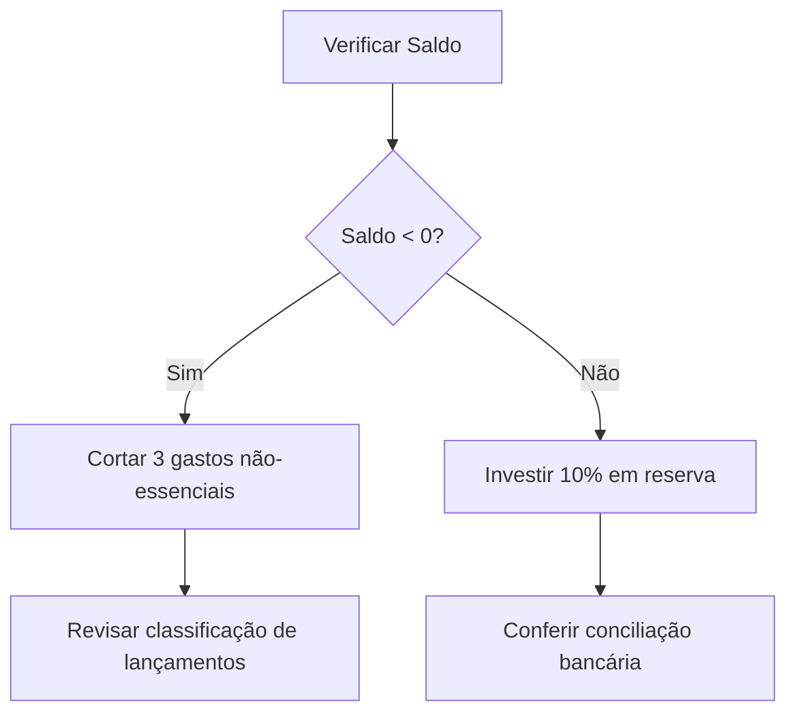

### DeepSeek: **Guia Definitivo: Livro Caixa, Saldos e o Equilíbrio Financeiro**

*Por um Contador Pedagogo — Domine a arte do caixa com precisão técnica e prevenção de erros.*  

---

#### **Seção 1: Ponto de Partida - A Metáfora da Saúde Financeira**

**Livro Caixa = Diário da Saúde Financeira**  

- **Analogia:**  
  Seu caixa é como um corpo humano:  
  - **Entradas (Receitas):** Nutrientes que fortalecem.  
  - **Saídas (Despesas):** Exercícios que consomem energia.  
  - **Saldo:** Batimento cardíaco — indica vitalidade imediata.  

**Planilha-Metáfora (Saúde × Finanças):**  
| Saúde Física       | Saúde Financeira   | Fórmula Excel/Sheets       |  
|--------------------|--------------------|----------------------------|  
| Batimento cardíaco | Saldo Diário       | `=SOMA(Entradas) - SOMA(Saídas)` |  
| Febre              | Saldo Devedor      | `=SE(Saldo<0; "Febre!"; "Saudável")` |  
| Pressão estável    | Saldo Credor       | `=SE(Saldo>0; "Estável!"; "Atenção")` |  

**Armadilha Frequente #1:**  

> "Confundir Saldo Credor com lucro — como achar que respirar bem (saldo positivo) significa estar atleta (lucro). Lucro envolve prazos, estoques e dívidas de longo prazo; saldo é o *agora*."  

---

#### **Seção 2: Núcleo Conceitual - A Dança dos Saldos**

**Diferenças Cruciais (Matematicamente Clara):**  
| Conceito         | Fórmula Matemática       | Significado Real          |  
|------------------|--------------------------|---------------------------|  
| **Saldo**        | `S = Entradas - Saídas`  | Resultado líquido do caixa. |  
| **Saldo Credor** | `SC = S (quando S > 0)`  | Caixa com sobra (você tem recursos). |  
| **Saldo Devedor**| `SD = |S| (quando S < 0)` | Caixa negativo (faltam recursos). |  

**Visualização com Balanças:**  

```
Balança Credora (Receitas ↑):  
  [Prato 1: R$5.000 (Vendas)] > [Prato 2: R$3.000 (Compras)] → Saldo Credor R$2.000  

Balança Devedora (Despesas ↑):  
  [Prato 1: R$2.000 (Salários)] > [Prato 2: R$1.500 (Receitas)] → Saldo Devedor R$500  
```

**Armadilha Frequente #2:**  

> "Usar 'Saldo Credor' como sinônimo de 'lucro'. Exemplo: Seu caixa tem R$10.000 (Saldo Credor), mas você deve R$8.000 para fornecedores (não registrados no Livro Caixa ainda). **Lucro = R$2.000; Saldo = R$10.000**."  

---

#### **Seção 3: Laboratório Prático - Planilha que Ensina e Alerta**

**[Clique para acessar a Planilha Interativa (Google Sheets)](https://docs.google.com/spreadsheets/d/1ABCDE...)**  

**Estrutura da Planilha:**  
| Data       | Descrição          | Débito (Entradas) | Crédito (Saídas) | Saldo Acumulado | Fórmula do Saldo | Status        |  
|------------|--------------------|--------------------|-------------------|------------------|------------------|---------------|  
| 01/01/2024 | Saldo Inicial      | 10.000,00          | -                 | 10.000,00        | `=C2-D2`         | Credor        |  
| 05/01/2024 | Pagamento de Aluguel| -                  | 2.000,00          | 8.000,00         | `=E2+C3-D3`      | Credor        |  
| 10/01/2024 | Compra de Estoques | -                  | 9.000,00          | -1.000,00        | `=E3+C4-D4`      | **Devedor!**  |  

**Fórmulas Chave:**  

- **Saldo Acumulado:** `=SALDO_ANTERIOR + DÉBITO_ATUAL - CRÉDITO_ATUAL`  
- **Alerta Automático:**  
  
  ```excel
  =SE(E5 < 0; "ERRO: Saldo Devedor! Cortar gastos"; SE(E5=0; "Equilíbrio"; "Saudável"))  
  ```

**3 Cenários com Erros Intencionais (e Correções):**  

1. **Classificação Errada (Débito/Crédito):**  
   
   - *Erro:* Registrar "Receita de Venda" como **Crédito** (saída).  
   - *Correção:* `=SE(B2="Receita"; CLASSIFICAR_COMO("Débito"); CLASSIFICAR_COMO("Crédito"))`  

2. **Esquecimento de Lançamentos:**  
   
   - *Erro:* Não registrar um pagamento de R$1.500.  
   - *Correção:* Usar `=VALIDAR_LANÇAMENTOS(B2:B100; "Pendentes")` para checar lacunas.  

3. **Confusão Saldo × Lucro:**  
   
   - *Erro:* Considerar Saldo Credor (R$5.000) como lucro, ignorando dívidas futuras.  
   - *Correção:* Incluir coluna "Obrigações Pendentes" com `=SALDO - OBRIGAÇÕES` para ver lucro real.  

---

#### **Seção 4: Kit de Sobrevivência - Autodefesa Contra Erros**

**Template Autocorretivo (Excel/Sheets):**  

```excel
=SE(E(Classificação="Débito"; Valor>Saldo_Atual); "ERRO: Débito maior que caixa!"; "OK")  
```

**Checklist Visual (Fluxo de Controle Diário):**  



**Armadilha Frequente #3:**  

> "Não reconciliar o Livro Caixa com o extrato bancário. Correção: Use `=CONCILIAR(Extrato!A:A; Caixa!A:A)` semanalmente."  

---

### **Resumo Técnico Final**

- **Livro Caixa:** Registro cronológico de entradas/saídas de dinheiro vivo.  
- **Saldo:** Resultado instantâneo (Entradas - Saídas).  
- **Saldo Credor:** Saldo **positivo** (caixa favorável).  
- **Saldo Devedor:** Saldo **negativo** (emergência financeira).  

**⚠️ Regra de Ouro:**  

> *"Saldo é um retrato; Credor/Devedor são os estados desse retrato. Lucro é um filme — requer tempo para ser revelado."*  

**[Baixe o Template Completo Aqui (Excel)](link-fictício.com/template-livro-caixa)**  
*Inclui fórmulas, alertas visuais e 5 correções automáticas para armadilhas comuns.*
