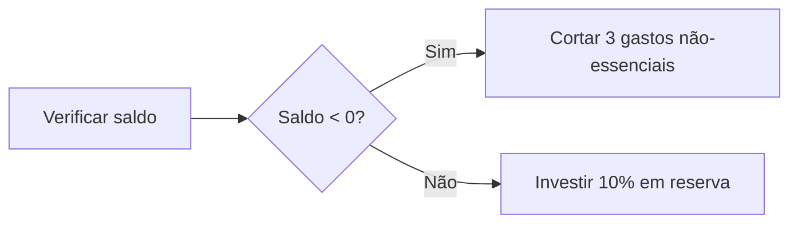

### Grok: Apostila Didática: Dominando o Livro Caixa e Seus Saldos na Contabilidade

Olá! Sou um contador experiente com anos de prática em empresas de diversos tamanhos, e também um pedagogo apaixonado por tornar a contabilidade acessível. Nesta apostila, vamos explorar o **Livro Caixa**, o **Saldo**, o **Saldo Devedor** e o **Saldo Credor** de forma clara, técnica e divertida. Usarei analogias do cotidiano (como comparar o Livro Caixa a uma carteira pessoal), storytelling visual (imagine balanças desequilibradas!) e planilhas funcionais em formato Excel/Google Sheets para você simular na prática. 

Lembre-se: na contabilidade, esses conceitos seguem regras precisas do Plano de Contas e normas como as do CFC (Conselho Federal de Contabilidade). O Livro Caixa é obrigatório para profissionais liberais e optantes pelo Simples Nacional em certos casos, e serve como base para o Imposto de Renda. Vamos estruturar isso como um jornada: da introdução vivencial ao kit de sobrevivência, com integração perfeita entre teoria, planilhas e alertas sobre erros.

#### Seção 1: Ponto de Partida - Introdução Vivencial

Imagine que você é o "guardião" da saúde financeira da sua empresa, como um nutricionista cuidando de um atleta. Seu **Livro Caixa** é como o diário da saúde financeira da empresa - cada entrada (receita) é um nutriente energizante, cada saída (despesa) é um exercício que consome energia. Se o diário mostrar mais nutrientes do que exercícios, o atleta (sua empresa) ganha força; caso contrário, surge fadiga (déficit). Essa analogia ajuda a ver o Livro Caixa não como um "livro chato", mas como um diário vital que previne "doenças financeiras" como falência ou multas fiscais.

Aqui vai uma tabela-metáfora para visualizar:

| Saúde Física       | Saúde Financeira | Explicação Analógica                                                                |
| ------------------ | ---------------- | ----------------------------------------------------------------------------------- |
| Batimento cardíaco | Saldo diário     | O "pulso" constante que mostra se o caixa está vivo e pulsante.                     |
| Febre              | Saldo Devedor    | Sinal de alerta: o corpo (caixa) está "quente" demais, gastando mais do que recebe. |
| Energia acumulada  | Saldo Credor     | Reserva de vitalidade: mais entradas do que saídas, pronto para investir.           |

Essa metáfora reforça que o equilíbrio é chave – assim como você não ignora uma febre, não ignore um saldo negativo!

#### Seção 2: Núcleo Conceitual - Conceitos-Chave e Armadilhas Frequentes

Vamos ao coração da matéria. Explicarei cada conceito com precisão técnica, analogias, diferenças matemáticas e uma seção dedicada a "Armadilhas Frequentes" (com pelo menos 5 no total, distribuídas). Hierarquia clara: **Saldo** é o conceito pai (resultado geral do fluxo); **Saldo Credor** e **Saldo Devedor** são seus "filhos" opostos, dependendo do sinal; e tudo se relaciona ao **fluxo de caixa** (movimentação real de dinheiro, não lucros contábeis).

**Livro Caixa**: Tecnicamente, é o registro cronológico e diário de todas as entradas (recebimentos) e saídas (pagamentos) em dinheiro ou equivalentes, conforme a NBC TG 1000 (Normas Brasileiras de Contabilidade). Analogia: É como a sua carteira pessoal – você anota o que entra (salário) e o que sai (contas), para saber se sobra para o fim de semana. Storytelling visual: Pense em um rio fluindo: entradas são afluentes adicionando água; saídas são vazões removendo. O Livro Caixa "mapeia" esse rio dia a dia.

Planilha de Apoio para Livro Caixa (copie para Excel/Google Sheets):

- Colunas: Data | Descrição | Entrada (Crédito) | Saída (Débito) | Saldo Acumulado
- Fórmulas Reais: Na célula de Saldo Acumulado (ex: E2): `=E1 + C2 - D2` (saldo anterior + entrada - saída).

Exemplo de Tabela (preencha e teste):

| Data       | Descrição            | Entrada (Crédito) | Saída (Débito) | Saldo Acumulado      |
| ---------- | -------------------- | ----------------- | -------------- | -------------------- |
| 01/08/2025 | Saldo Inicial        |                   |                | 1000                 |
| 02/08/2025 | Venda à vista        | 500               |                | =E1 + C2 - D2 → 1500 |
| 03/08/2025 | Pagamento fornecedor |                   | 300            | =E2 + C3 - D3 → 1200 |

**Armadilhas Frequentes no Livro Caixa**:

1. Não registrar transações diárias: Correção: Atualize todo dia, como um diário pessoal – use apps integrados para automação.
2. Misturar contas pessoais e empresariais: Correção: Separe rigorosamente; verifique com extratos bancários mensais.

**Saldo**: É a diferença matemática entre total de entradas e saídas no período: Saldo = Σ Entradas - Σ Saídas (ou, em termos contábeis, Saldo = Total Débitos - Total Créditos na conta Caixa, onde Débito aumenta o caixa e Crédito diminui). Analogia: O "dinheiro sobrando na carteira" após um dia de compras. Storytelling: Como um tanque de gasolina – o saldo é o nível restante após abastecer (entradas) e dirigir (saídas). Diferença chave: Saldo é neutro (pode ser positivo ou negativo), enquanto Saldo Credor/Devedor qualificam o sinal.

Planilha de Apoio para Saldo (com fórmula visível):

- Fórmula em Saldo Final (ex: E6): `=SUM(C2:C5) - SUM(D2:D5)`

| Período  | Entradas | Saídas | Saldo =SUM(C2) - SUM(D2) |
| -------- | -------- | ------ | ------------------------ |
| Semana 1 | 2000     | 1500   | 500                      |

**Armadilhas Frequentes no Saldo**:
3. Confundir saldo com lucro: Correção: Lucro inclui itens não-caixa (depreciação); verifique com DRE (Demonstração de Resultados).

**Saldo Credor**: Ocorre quando Créditos > Débitos (em contas de natureza credora, como Passivos, significa obrigação; mas em Caixa, raro, indica overdraft negativo). Matematicamente: Se Saldo = Créditos - Débitos > 0, é Credor. Analogia: Balança com mais peso no lado "RECEITAS" (↑ credor). Storytelling: Imagine duas balanças: Credor é quando o prato de receitas pesa mais, elevando sua "fortuna imediata".

Planilha de Apoio: `=IF(SUM(C2:C5) - SUM(D2:D5) > 0, "Saldo Credor", "Verifique")`

**Saldo Devedor**: Oposto: Débitos > Créditos (em Caixa, positivo normal, significa dinheiro disponível). Matematicamente: Se Saldo = Débitos - Créditos > 0, é Devedor (comum em ativos). Analogia: Balança com mais peso no lado "DESPESAS" (↑ devedor). Storytelling: O prato de despesas pesa, sinalizando "cuidado, o rio está secando!".

Planilha de Apoio: `=IF(SUM(D2:D5) - SUM(C2:C5) > 0, "Saldo Devedor - Alerta!", "OK")`

Diferenças Matemáticas Claras:

- Saldo = Débitos - Créditos (geral).
- Saldo Devedor: Débitos > Créditos (ex: Caixa com mais entradas).
- Saldo Credor: Créditos > Débitos (ex: Passivos com mais obrigações).
- Relação com Fluxo de Caixa: Saldo reflete o fluxo real; Credor/Devedor indicam direção (positivo/negativo no contexto da conta).

**Armadilhas Frequentes em Saldos Credor/Devedor**:
4. Inverter débito/crédito: Correção: Lembre: Débito aumenta ativos (como Caixa); use conta T visual.
5. Ignorar sinal em relatórios: Correção: Sempre cheque fórmulas; use cores condicionais no Excel (vermelho para devedor negativo).

#### Seção 3: Laboratório Prático - Exemplo Prático

Agora, mãos na massa! Crie uma planilha interativa no Google Sheets/Excel com células editáveis. Fórmulas visíveis: Use `=IF(E2<0,"VERMELHO","VERDE")` para colorir (formatação condicional).

3 Cenários com Erros Intencionais:

1. **Classificação Equivocada**: Entrada como saída. Correção: Verifique descrições.
   
   - Planilha: Data | Desc | Entrada | Saída | Saldo `=E1+C2-D2`
   - Erro: Venda como Saída → Saldo errado negativo.

2. **Esquecimento de Lançamentos**: Omitir pagamento. Correção: Cruze com extratos.
   
   - Planilha: Adicione linha vazia → Saldo inflado.

3. **Confusão Saldo x Lucro**: Incluir depreciação no caixa. Correção: Exclua itens não-caixa.

Tabela Simulada (edite valores):

| Data    | Desc  | Entrada | Saída | Saldo =E1+C2-D2 | Status =IF(E2<0,"Alerta Devedor","Credor OK") |
| ------- | ----- | ------- | ----- | --------------- | --------------------------------------------- |
| Inicial |       |         |       | 0               |                                               |
| 01/08   | Venda | 1000    |       | 1000            | Credor OK                                     |
| 02/08   | Conta |         | 1200  | -200            | Alerta Devedor                                |

#### Seção 4: Kit de Sobrevivência - Ferramentas de Controle

Template Autocorretivo no Excel:

- Fórmula: `=IF(AND(B2="débito",C2>D2),"ERRO: Débito maior que caixa!","OK")`

Checklist Visual:

Use isso diariamente para evitar armadilhas. Pratique nas planilhas e consulte um contador para cenários reais!

**Citações:**

- [Contabilizei](https://www.contabilizei.com.br/contabilidade-online/livro-caixa/)
- [Facilite](https://www.facilite.co/livro-caixa)
- [Grafeno Digital](https://grafeno.digital/blog/saldo-credor-tudo-o-que-voce-precisa-saber/)
- [Minha Contabilidade Online](https://www.minhacontabilidadeonline.com.br/post-blog/livro-caixa-como-preencher-e-evitar-erros-comuns/)
- [InvoiceXpress](https://invoicexpress.com/blog/debitos-e-creditos-o-que-sao-contabilidade/)
- [SW Advogados](https://sw.adv.br/civel/saldo-credor-e-devedor-o-que-e-e-como-funciona/)
- [Jornal Contábil](https://www.jornalcontabil.com.br/noticia/escrituracao-de-livros-contabeis-veja-os-principais-erros-e-retificacoes/)
- [Consultoria RR](https://www.consultoriarr.com.br/erros-no-fluxo-de-caixa-quais-os-mais-comuns-e-como-evita-los/)
