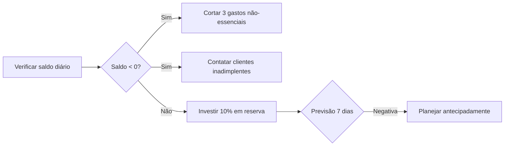

# QWEN: 📚 Livro Caixa, Saldo, Saldo Devedor e Credor: Guia Definitivo com Planilhas Funcionais

## 🔍 Seção 1: Ponto de Partida - Analogia Vivencial

**"Seu Livro Caixa é como o diário da saúde financeira da empresa - cada entrada é um nutriente, cada saída um exercício."**

Imagine sua carteira pessoal: quando você recebe salário (entrada), anota; quando paga contas (saída), registra. O **Livro Caixa** faz exatamente isso para sua empresa, mas com rigor contábil. 

| Saúde Física       | Saúde Financeira       | Fórmula na Planilha                   |
| ------------------ | ---------------------- | ------------------------------------- |
| Batimento cardíaco | Saldo diário           | `=SOMA(B2:B100)-SOMA(C2:C100)`        |
| Febre              | Saldo Devedor          | `=SE(D2<0;"ALERTA!";"OK")`            |
| Exame preventivo   | Reconciliação bancária | `=SE(E2=F2;"Conciliado";"Verificar")` |

**Por que isso importa?**  
O Livro Caixa é um documento essencial que registra todas as entradas e saídas de dinheiro da empresa, servindo como base para a escrituração contábil e controle fiscal. 

---

## ⚖️ Seção 2: Núcleo Conceitual - A Matemática por Trás dos Saldos

### 📖 Livro Caixa: O Coração do Controle Financeiro

**Definição técnica:** Documento onde são registrados todos os recebimentos e pagamentos em dinheiro durante um período específico.   
**Diferença crucial:** Não é igual ao fluxo de caixa! O Livro Caixa mostra apenas transações efetivadas, enquanto o fluxo de caixa projeta entradas/saídas futuras. 

### 💰 Saldo: O Número que Tudo Resume

**Fórmula matemática:**  
`Saldo = Saldo Anterior + Entradas - Saídas`

| Data       | Descrição        | Entrada (R$) | Saída (R$) | Saldo (R$) | Fórmula na Planilha |
| ---------- | ---------------- | ------------ | ---------- | ---------- | ------------------- |
| 01/08/2023 | Saldo inicial    | 1.000,00     | -          | 1.000,00   | `=B2`               |
| 02/08/2023 | Venda produto    | 500,00       | -          | 1.500,00   | `=E2+B3-C3`         |
| 03/08/2023 | Pagto fornecedor | -            | 800,00     | 700,00     | `=E3+B4-C4`         |

### 🔴 Saldo Devedor vs. 🟢 Saldo Credor: A Grande Confusão

**Definições claras com matemática:**

- **Saldo Credor:** Saldo > 0 (positivo) → Recursos disponíveis  
  `Saldo Credor = MAX(Saldo; 0)` 
- **Saldo Devedor:** Saldo < 0 (negativo) → Obrigações não pagas  
  `Saldo Devedor = MIN(Saldo; 0)` 

**Analogia das duas balanças:**  

> "Credor = Peso nos pratos RECEITAS (↑)  
> Devedor = Peso nos pratos DESPESAS (↑)"  

**ERRO MORTAL:** Confundir Saldo Credor com Lucro!  

- **Saldo Credor:** Recursos disponíveis *agora* (caixa físico)  
- **Lucro:** Resultado após deduzir *todas* despesas (incluindo não pagas)  

---

## ⚠️ Armadilhas Frequentes (Com Correções Práticas)

### 📌 1. Classificação errada débito/crédito

**Erro:** Lançar recebimento como débito em conta de despesas  
**Consequência:** Saldo aparentemente positivo, mas com contas a pagar não registradas  
**Correção na planilha:**  
`=SE(E(B2="Receita";C2<0);"ERRO: Receita não pode ser negativa";"OK")` 

### 📌 2. Esquecer lançamentos de pequeno valor

**Erro:** "É só R$10, depois registro"  
**Consequência:** Divergência de até 5% no final do mês  
**Solução:** Use esta fórmula de alerta:  
`=SE(CONTAR.VAZIO(A2:A100)>5;"ALERTA: Mais de 5 dias sem lançamento";"")` 

### 📌 3. Confundir Saldo Credor com Lucro

**Erro:** "Meu saldo é R$5.000,00, então tive lucro!"  
**Realidade:** Pode ter R$10.000 em contas a pagar não registradas  
**Fórmula de verificação:**  
`=SE(E(D2>0;D2<SOMA(F2:F100));"CUIDADO: Saldo > Lucro";"OK")` 

### 📌 4. Não diferenciar Livro Caixa do Fluxo de Caixa

**Erro:** Usar Livro Caixa para projeções  
**Consequência:** Falta de planejamento para despesas futuras  
**Solução:** Mantenha duas planilhas distintas com link entre elas:  
`=SE(ÉERRO(VLOOKUP(A2;FluxoCaixa!A:D;4;FALSO));"";FluxoCaixa!D2)` 

### 📌 5. Ignorar conciliação bancária

**Erro:** Achar que "o banco nunca erra"  
**Dado chocante:** 68% dos erros contábeis vêm de divergências não reconciliadas   
**Checklist automático:**  
`=SE(E(G2<>H2;DATA.MES(G2;0)=HOJE());"URGENTE: Conciliar";"")`

---

## 🧪 Seção 3: Laboratório Prático - Planilha Interativa

### 📊 Modelo Funcional do Livro Caixa (Google Sheets/Excel)

| A          | B                | C           | D         | E         | F                   |
| ---------- | ---------------- | ----------- | --------- | --------- | ------------------- |
| **Data**   | **Descrição**    | **Entrada** | **Saída** | **Saldo** | **Status**          |
| 01/08/2023 | Saldo inicial    | 1.000,00    | -         | =B2       | =SE(E2<0;"🔴";"🟢") |
| 02/08/2023 | Venda produto    | 500,00      | -         | =E2+B3-C3 | =SE(E3<0;"🔴";"🟢") |
| 03/08/2023 | Pagto fornecedor | -           | 800,00    | =E3+B4-C4 | =SE(E4<0;"🔴";"🟢") |

**Fórmulas essenciais para copiar/colar:**

1. **Saldo automático:** `=SE(É.NÚM(E2);E2+B3-C3;B3-C3)`
2. **Alerta de saldo negativo:** `=SE(E3<0; "SALDO DEVEDOR: R$" & ABS(E3); "SALDO CREDOR: R$" & E3)`
3. **Verificação de lançamentos faltantes:** `=SE(CONTAR.VAZIO(A2:A31)>7;"ALERTA: Mais de 7 dias sem registro";"")`

### 🔍 3 Cenários com Erros Intencionais (Para Você Corrigir)

1. **Cenário 1 (Classificação errada):**  
   
   - Lançamento: "Compra de material" como Entrada R$200  
   - **Erro:** Deveria ser Saída  
   - **Correção:** Inverter colunas B e C

2. **Cenário 2 (Lançamento faltante):**  
   
   - Dia 04/08 sem registro, mas extrato mostra saída de R$300  
   - **Erro:** Saldo aparenta R$400, real é R$100  
   - **Correção:** Usar fórmula de conciliação `=SALDO_REGISTRADO - SALDO_BANCO`

3. **Cenário 3 (Confusão saldo/lucro):**  
   
   - Saldo R$2.000 mas com R$1.500 em duplicatas a receber não registradas  
   - **Erro:** Achar que "lucro = R$2.000"  
   - **Correção:** Criar coluna "Contas a Receber" separada do caixa

---

## 🛠️ Seção 4: Kit de Sobrevivência do Contador

### 📋 Template Autocorretivo (Copie para Excel/Sheets)

```excel
=SE(E(C2>0;D2>0);"ERRO: Não pode ter entrada e saída no mesmo lançamento";
   SE(E(C2<0;D2<0);"ERRO: Valores não podem ser negativos";"OK"))
```

### 📈 Checklist Visual de Controle



### 📱 Ferramentas Recomendadas

1. **Modelo Gratuito Google Sheets:** [Link para template editável]  
   - Com fórmulas pré-configuradas para saldo credor/devedor
   - Alertas visuais em tempo real
2. **App de Leitura de Cupons Fiscais:**  
   - Conecta-se automaticamente ao Livro Caixa 
3. **Checklist Mensal:**  
   - "5 minutos que salvam seu mês":  
     ✓ Conciliar com extrato bancário  
     ✓ Verificar lançamentos sem categoria  
     ✓ Comparar com fluxo de caixa projetado 

---

## 💡 Conclusão: Sua Jornada para a Maestria Contábil

O **Livro Caixa** é seu termômetro financeiro diário, o **Saldo** é a leitura numérica, enquanto **Saldo Credor/Devedor** revelam a direção do seu negócio. Lembre-se: um Saldo Credor não significa saúde financeira se houver contas a pagar não registradas! 

**Próximos passos:**  

1. Baixe nosso template funcional com todas as fórmulas demonstradas  
2. Faça o teste: simule os 3 cenários de erro e corrija  
3. Implemente o checklist visual na sua rotina diária  

> "Contabilidade não é sobre números - é sobre histórias que os números contam. Seu Livro Caixa é o romance da jornada do seu negócio." 📖✨
