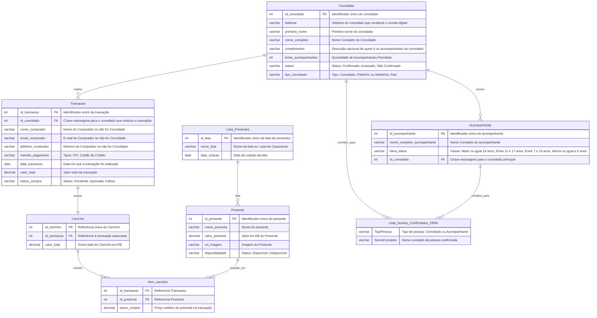

# Diagrama site nicolasebrenda.com.br

```mermaid
erDiagram
    Convidado {
        int id_convidado PK "Identificador único do convidado"
        varchar telefone "Telefone do convidado que receberá o convite digital"
        varchar primeiro_nome "Primeiro nome do convidado"
        varchar nome_completo "Nome Completo do Convidado"
        varchar complemento "Descrição opcional de quem é os acompanhantes do convidado"
        int limite_acompanhantes "Quantidade de Acompanhantes Permitida"
        varchar status "Status: Confirmado, Acessado, Não Confirmado"
        varchar tipo_convidado "Tipo: Convidado, Padrinho ou Madrinha, Pais" 
    }
    Acompanhante {
        int id_acompanhante PK "Identificador único do acompanhante"
        varchar nome_completo_acompanhante "Nome Completo do acompanhante"
        varchar faixa_etaria "Faixas: Maior ou igual 18 anos, Entre 11 e 17 anos, Entre 7 e 10 anos, Menor ou igual a 6 anos"
        int id_convidado FK "Chave estrangeira para o convidado principal"
    }
    Transacao {
        int id_transacao PK "Identificador único da transação"
        int id_convidado FK "Chave estrangeira para o convidado que realizou a transação"
        varchar nome_comprador "Nome do Comprador se não for Convidado"
        varchar email_comprador "E-mail do Comprador se não for Convidado"
        varchar telefone_comprador "Número do Comprador se não for Convidado"
        varchar metodo_pagamento "Tipos: PIX, Cartão de Crédito"
        date data_transacao "Data em que a transação foi realizada"
        decimal valor_total "Valor total da transação"
        varchar status_compra "Status: Pendente, Aprovada, Falhou"
    }
    Presente {
        int id_presente PK "Identificador único do presente"
        varchar nome_presente "Nome do presente"
        decimal valor_presente "Valor em R$ do Presente"
        varchar url_imagem "Imagem do Presente"
        varchar disponibilidade "Status: Disponível, Indisponível"
    }
    Lista_Presentes {
        int id_lista PK "Identificador único da lista de presentes"
        varchar nome_lista "Nome da lista ex: Lista de Casamento"
        date data_criacao "Data de criação da lista"
    }
    Carrinho {
        int id_carrinho PK "Referência única do Carrinho"
        int id_transacao FK "Referência à transação associada"
        decimal valor_total "Soma total do Carrinho em R$"
    }
    Item_carrinho {
        int id_transacao FK "Referencia Transacao"
        int id_presente FK "Referencia Presente"
        decimal preco_unitario "Preço unitário do presente na transação"
    }
    Lista_Nomes_Confirmados_VIEW {
        varchar TipoPessoa "Tipo de pessoa: Convidado ou Acompanhante"
        varchar NomeCompleto "Nome completo da pessoa confirmada"
    }

    Convidado ||--o{ Acompanhante : possui
    Convidado ||--o{ Transacao : realiza
    Transacao ||--|| Carrinho : possui
    Carrinho ||--o{ Item_carrinho : contem
    Presente ||--o{ Item_carrinho : incluido_em
    Lista_Presentes ||--o{ Presente : lista
    Convidado ||--o{ Lista_Nomes_Confirmados_VIEW : contribui_para
    Acompanhante ||--o{ Lista_Nomes_Confirmados_VIEW : contribui_para
```
