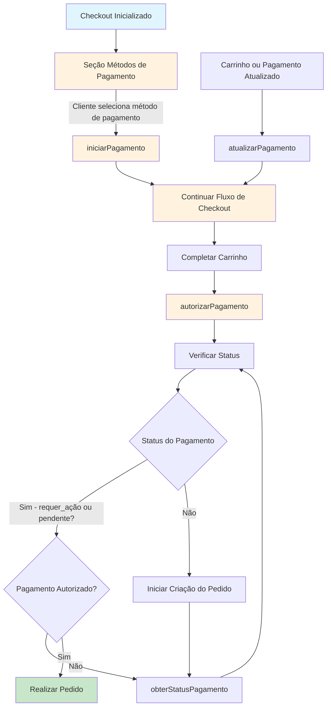

# MedusaJS: Como criar um processador de pagamento

Neste documento, você aprenderá a criar um Processador de Pagamentos no seu backend Medusa. Se você não conhece a arquitetura de pagamentos do Medusa, confira a [visão geral](https://docs.medusajs.com/modules/carts-and-checkout/payment) primeiro.

## Visão geral

Um Processador de Pagamentos é o método de pagamento usado para autorizar, capturar e reembolsar pagamentos, entre outras ações. Um exemplo de Processador de Pagamentos é o Stripe.

Por padrão, a Medusa tem um `manual`provedor de pagamento com implementação mínima. Pode ser sinônimo de um método de pagamento em dinheiro na entrega. Permite operadores de lojas para gerenciar o pagamento eles mesmos, mas ainda manter o controle de suas diferentes etapas no Medusa.

Um processador de pagamento é um serviço que estende a `AbstractPaymentProcessor` e implementa seus métodos. Portanto, adicionar um Processador de Pagamento é tão simples quanto criando um arquivo de serviço em `src/services`. O nome do arquivo é o nome da classe do processador de pagamento como um slug e sem a palavra `Service`.

Por exemplo, se você estiver criando um `MyPaymentService` classe, o nome do arquivo é `src/services/my-payment.ts`.

```ts
import { AbstractPaymentProcessor } from "@medusajs/medusa";

class MyPaymentService extends AbstractPaymentProcessor {
  // methods here...
}

export default MyPaymentService
```

Os métodos do processador de pagamento são usados ​​em diferentes pontos do fluxo de finalização da compra, bem como no processamento de um pedido após ele ser feito.



## Propriedade do Identificador

O `PaymentProvider`entidade tem 2 propriedades: `id` e `is_installed`. 

O `identifier` a propriedade no serviço do processador de pagamento é usada quando o processador de pagamento é adicionado ao banco de dados.

O valor desta propriedade também é usado para referenciar o processador de pagamento em toda a Medusa.

Por exemplo, ele é usado para [adicionar um processador de pagamento](https://docs.medusajs.com/v1/api/admin#regions_postregionsregionpaymentproviders) a uma região.

```ts
class MyPaymentService extends AbstractPaymentProcessor {
  static identifier = "my-payment"
  // ...
}
```

## Erro do processador de pagamento

Antes  de mergulhar nos métodos do Processador de Pagamento, você notará que parte da assinatura de retorno esperada desses métodos inclui `PaymentProcessorError`.

```ts
interface PaymentProcessorError {
  error: string
  code?: string
  detail?: any
}
```

Ao implementar os métodos do Processador de Pagamento, se você precisar informar ao núcleo Medusa que ocorreu um erro em um determinado estágio, retornar um objeto com os atributos definidos no `PaymentProcessorError`interface.

 Por exemplo, o processador de pagamento Stripe tem o seguinte método para criar o objeto de erro, que é usado em outros métodos:

```ts
abstract class StripeBase extends AbstractPaymentProcessor {
  // ...
  protected buildError(
    message: string,
    e: Stripe.StripeRawError | PaymentProcessorError | Error
  ): PaymentProcessorError {
    return {
      error: message,
      code: "code" in e ? e.code : "",
      detail: isPaymentProcessorError(e)
        ? `${e.error}${EOL}${e.detail ?? ""}`
        : "detail" in e
        ? e.detail
        : e.message ?? "",
    }
  }

  // used in other methods
  async retrievePayment(
    paymentSessionData: Record<string, unknown>
  ): Promise<
    PaymentProcessorError |
    PaymentProcessorSessionResponse["session_data"]
  > {
    try {
      // ...
    } catch (e) {
      return this.buildError(
        "An error occurred in retrievePayment",
        e
      )
    }
  }
}
```

## construtor

Você pode usar o `constructor`do seu Processador de Pagamento para ter acesso a diferentes serviços na Medusa através [dependency injection](https://docs.medusajs.com/v1/development/fundamentals/dependency-injection).

Você também pode usar o construtor para inicializar sua integração com o provedor terceirizado. Por exemplo, se você usar um cliente para se conectar às APIs do provedor terceirizado, você pode inicializá-lo no construtor e usá-lo em outros métodos no serviço.

Além disso, se você estiver criando seu Processador de Pagamento como um plugin externo para ser instalado em qualquer backend Medusa e quiser acessar as opções adicionadas para o plugin,
Você pode acessá-lo no construtor. As opções são passadas como um segundo parâmetro.

### Exemplo:

```ts
class MyPaymentService extends AbstractPaymentProcessor {
  // ...
  constructor(container, options) {
    super(container)
    // you can access options here

    // you can also initialize a client that
    // communicates with a third-party service.
    this.client = new Client(options)
  }
  // ...
}
```

## Métodos

### capturePayment

Este método é usado para capturar o valor do pagamento de um pedido. Normalmente, é acionado manualmente pelo operador da loja a partir do administrador.

Este método também é usado para capturar pagamentos de uma troca de uma ordem, ou quando uma solicitação é enviada para a [Rota da API de Captura de Pagamento](https://docs.medusajs.com/v1/api/admin#payments_postpaymentspaymentcapture) .

Você pode utilizar este método para interagir com o provedor terceirizado e executar quaisquer ações necessárias para capturar o pagamento.

#### Exemplo:

```ts
import {
  PaymentProcessorError,
  // ...
} from "@medusajs/medusa"
// ...

class MyPaymentService extends AbstractPaymentProcessor {
  // ...
  async capturePayment(
    paymentSessionData: Record<string, unknown>
  ): Promise<Record<string, unknown> | PaymentProcessorError> {
    const paymentId = paymentSessionData.id

    // assuming client is an initialized client
    // communicating with a third-party service.
    const captureData = this.client.catch(paymentId)

    return {
      id: paymentId,
      ...captureData
    }
  }
}
```

#### Parâmetros

> `paymentSessionData` Record `<string, unknown>` `Required`
> O `data`campo do Pagamento para seu primeiro parâmetro.

> `Promise` `Promise` <`Record`<`string`, `unknown`> | [PaymentProcessorError](https://docs.medusajs.com/v1/modules/carts-and-checkout/interfaces/payment.PaymentProcessorError.mdx)> `Required`
> 
> Um objeto de erro ou um valor armazenado no  `data` campo do Pagamento.
> 
> `Record` <`string`, `unknown`> | `PaymentProcessorError``Record`<`string`, `unknown`> | [PaymentProcessorError](https://docs.medusajs.com/v1/modules/carts-and-checkout/interfaces/payment.PaymentProcessorError.mdx)  `Required`

### autorizar pagamento

Este método é usado para autorizar o pagamento usando a Sessão de Pagamento de um pedido. Isso é chamado quando o  [o carrinho estiver concluído](https://docs.medusajs.com/v1/api/store#carts_postcartscartcomplete) e antes do pedido ser criado.

Este método também é usado para autorizar pagamentos de uma troca de uma ordem e ao autorizar sessões em uma cobrança de pagamento.

Você pode interagir com um provedor terceirizado e executar quaisquer ações necessárias para autorizar o pagamento.

A autorização de pagamento pode exigir uma ação adicional do cliente antes de ser declarada autorizada. Uma vez realizada essa ação adicional, o `authorizePayment`

O método será chamado novamente para validar que o pagamento está totalmente autorizado. Portanto, certifique-se de implementá-lo também neste caso, se necessário.

Assim que o pagamento for autorizado com sucesso e o status da Sessão de Pagamento for definido como `authorized`, a ordem ou swap associada pode então ser colocada ou criada.

Se a autorização de pagamento falhar, um erro será gerado e o pedido não será criado.

> **Observação**:
> 
> O status da autorização de pagamento é determinado usando o [método getPaymentStatus](https://docs.medusajs.com/v1/modules/carts-and-checkout/backend/add-payment-provider#getpaymentstatus) . Se o status for `requires_more`, então significa que ações adicionais são necessárias do cliente. Se você tentar criar o pedido com um status que não seja `authorized`, o processo falhará.

#### Exemplo:

```ts
import {
  PaymentProcessorError,
  PaymentSessionStatus,
  // ...
} from "@medusajs/medusa"
// ...

class MyPaymentService extends AbstractPaymentProcessor {
  // ...
  async authorizePayment(
    paymentSessionData: Record<string, unknown>,
    context: Record<string, unknown>
  ): Promise<
    PaymentProcessorError |
    {
      status: PaymentSessionStatus;
      data: Record<string, unknown>;
    }
  > {
    try {
      await this.client.authorize(paymentSessionData.id)

      return {
        status: PaymentSessionStatus.AUTHORIZED,
        data: {
          id: paymentSessionData.id
        }
      }
    } catch (e) {
      return {
        error: e.message
      }
    }
  }
}
```

#### Parâmetros

> `paymentSessionData` Registro <string, desconhecido> Required
> 
> O `data` campo da sessão de pagamento.
> 
> `context` Registro <string, desconhecido> Required
> 
> O contexto da autorização. Pode incluir alguns dos seguintes campos:
> 
> - `ip`: O IP do cliente.
> - `idempotency_key`: A [Chave de Idempotência](https://docs.medusajs.com/v1/modules/carts-and-checkout/payment#idempotency-key) associada ao carrinho atual. É útil ao tentar efetuar pagamentos novamente, ao tentar finalizar a compra novamente em um ponto que falhou ou para pagamentos que exigem ações adicionais do cliente.
> - `cart_id`: O ID de um carrinho. Isso ocorre apenas durante operações como fazer um pedido ou criar uma troca.

#### Devoluções

> `Promise` Promise < [PaymentProcessorError](https://docs.medusajs.com/v1/modules/carts-and-checkout/interfaces/payment.PaymentProcessorError.mdx) | object> Obrigatório
> 
> Os detalhes da autorização ou um objeto de erro.

### cancelarPagamento

Este  método é usado para cancelar o pagamento de um pedido. Normalmente, esse método é acionado por uma das seguintes situações:

1. Antes de efetuar um pedido e após a autorização do pagamento, é realizada uma verificação de estoque dos produtos para garantir que eles ainda estejam disponíveis para compra. Se a verificação de estoque falhar para qualquer um dos produtos, o pagamento será cancelado.
2. Se o operador da loja cancelar o pedido do administrador.
3. Quando o pagamento do swap de uma ordem é cancelado.

Você pode utilizar este método para interagir com o provedor terceirizado e executar quaisquer ações necessárias para cancelar o pagamento.

#### Exemplo:

```ts
import {
  PaymentProcessorError,
  // ...
} from "@medusajs/medusa"
// ...

class MyPaymentService extends AbstractPaymentProcessor {
  // ...
  async cancelPayment(
    paymentSessionData: Record<string, unknown>
  ): Promise<Record<string, unknown> | PaymentProcessorError> {
    const paymentId = paymentSessionData.id

    // assuming client is an initialized client
    // communicating with a third-party service.
    const cancelData = this.client.cancel(paymentId)

    return {
      id: paymentId,
      ...cancelData
    }
  }
}
```

#### Parâmetros

> `paymentSessionData`Registro<string, desconhecido> Required
> 
> O `data`campo do Pagamento.

#### Devoluções

> `Promise` Promise < Registry <string, desconhecido> | [PaymentProcessorError](https://docs.medusajs.com/v1/modules/carts-and-checkout/interfaces/payment.PaymentProcessorError.mdx) > Obrigatório
> 
> Um objeto de erro ou um valor armazenado no `data`campo do Pagamento.

### iniciarPagamento

Este método é chamado se uma região tiver apenas um provedor de pagamento habilitado ou quando [uma Sessão de Pagamento for selecionada](https://docs.medusajs.com/v1/api/store#carts_postcartscartpaymentsession) que ocorre quando o cliente seleciona seu método de pagamento preferido durante a finalização da compra.

Ele é usado para permitir que você faça as chamadas necessárias ao provedor terceirizado para inicializar o pagamento. Por exemplo, no Stripe, esse método é usado para criar uma intenção de pagamento para o cliente.

#### Exemplo:

```ts
import {
  PaymentProcessorContext,
  PaymentProcessorSessionResponse,
  // ...
} from "@medusajs/medusa"

class MyPaymentService extends AbstractPaymentProcessor {
  // ...
  async initiatePayment(
    context: PaymentProcessorContext
  ): Promise<
    PaymentProcessorError | PaymentProcessorSessionResponse
  > {
    // assuming client is an initialized client
    // communicating with a third-party service.
    const clientPayment = await this.client.initiate(context)

    return {
      session_data: {
        id: clientPayment.id
      },
    }
  }
}
```

#### Parâmetros

> `context`[PaymentProcessorContext](https://docs.medusajs.com/v1/modules/carts-and-checkout/interfaces/payment.PaymentProcessorContext.mdx) obrigatório
> 
> O contexto do pagamento.
> 
> `email`string Obrigatório
> 
> E-mail do cliente.
> 
> `currency_code`string Obrigatório
> 
> O código da moeda selecionado, normalmente associado ao carrinho do cliente.
> 
> `amount`número necessário
> 
> O valor do pagamento.
> 
> `resource_id`string Obrigatório
> 
> O ID do recurso ao qual o pagamento está associado. Por exemplo, o ID do carrinho.
> 
> `context`Registro<string, desconhecido> necessário
> 
> O contexto do carrinho.
> 
> `paymentSessionData`Registro<string, desconhecido> necessário
> 
> Se a sessão de pagamento ainda não tiver sido criada ou iniciada, será um objeto vazio.
> Se a sessão de pagamento existir, será o valor da sessão de pagamento `data` campo.
> 
> `billing_address`nulo | [Endereço](https://docs.medusajs.com/v1/modules/entities/classes/entities.Address.mdx)
> 
> Endereço de cobrança do pagamento.
> 
> `customer`[Cliente](https://docs.medusajs.com/v1/modules/entities/classes/entities.Customer.mdx)
> 
> O cliente associado a este pagamento.
