# Deepseek: Mermaid e MER - Como fazer Modelo e Entidade Relacionamento Corretamente com Mermaid

Aqui estão 10 exemplos de diagramas de entidade-relacionamento em Mermaid, com versões incorretas (❌) e corretas (✅):

### 1. Relacionamento Binário Básico

**❌ Errado (sintaxe de cardinalidade incorreta)**

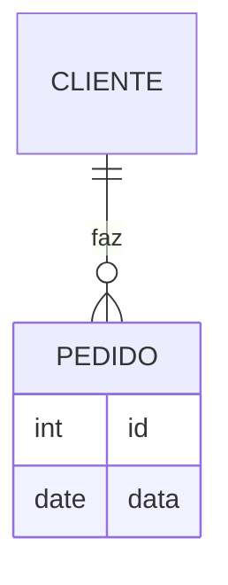

**✅ Correto**

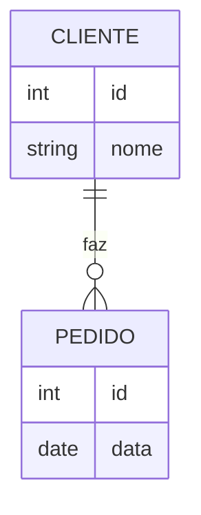

---

### 2. Relacionamento com Atributo

**❌ Errado (atributo em relacionamento não suportado)**

```mermaid
erDiagram
    ALUNO }|--|| CURSO : "matriculado_em" {
        date data_matricula
    }
```

**✅ Correto (usar entidade associativa)**

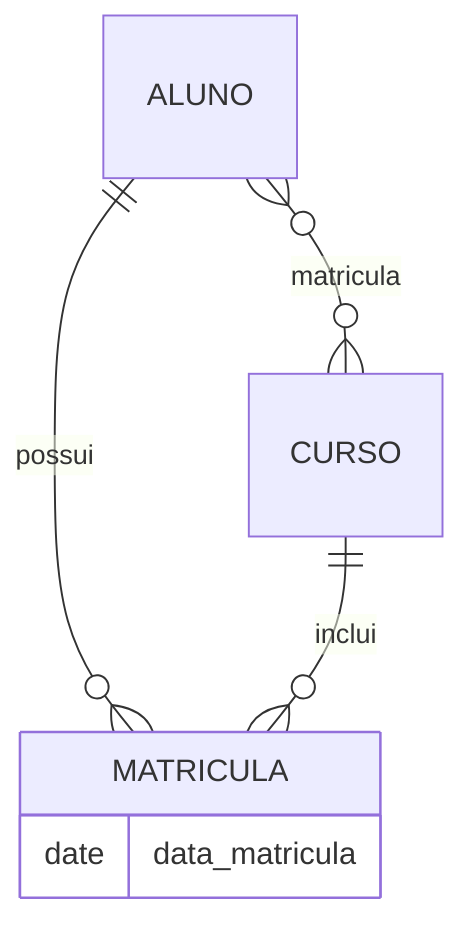

---

### 3. Relacionamento Ternário

**❌ Errado (Mermaid não suporta n-ários diretamente)**

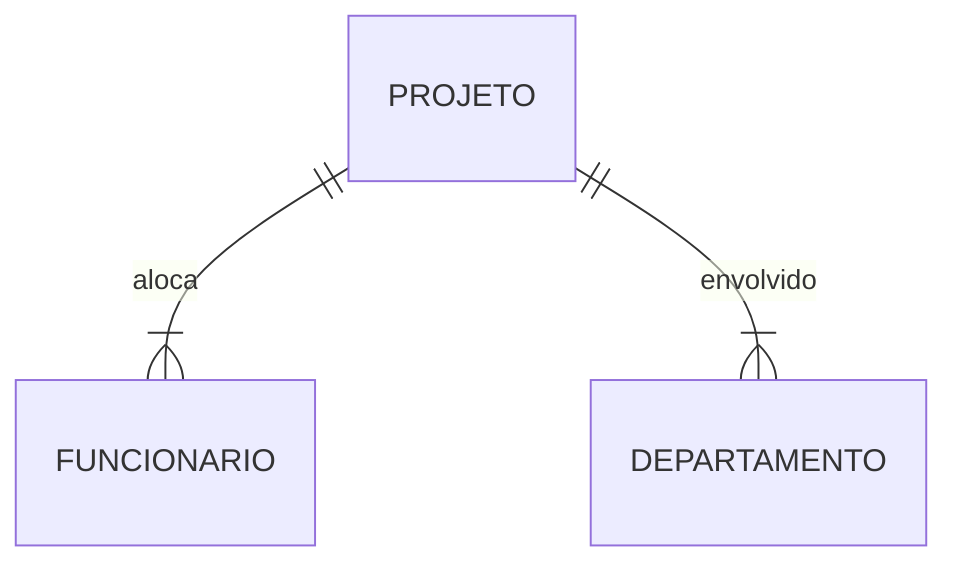

**✅ Correto (usar entidade associativa)**

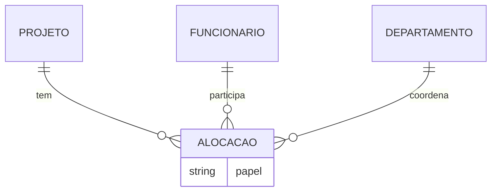

---

### 4. Cardinalidade Múltipla

**❌ Errado (cardinalidade ambígua)**

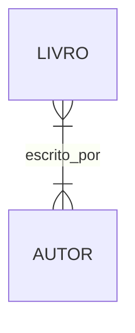

**✅ Correto (definir cardinalidade corretamente)**

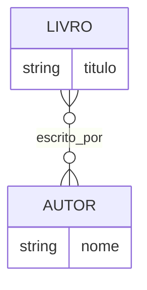

---

### 5. Entidade sem Atributos

**❌ Errado (entidade vazia)**

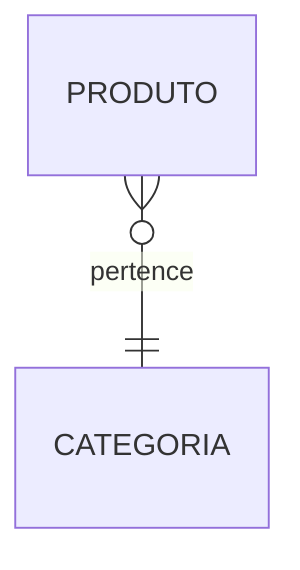

**✅ Correto (adicionar atributos)**

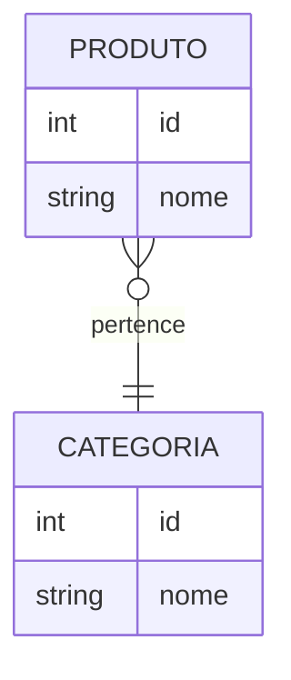

---

### 6. Sintaxe de Relacionamento Invertida

**❌ Errado (ordem das entidades incorreta)**

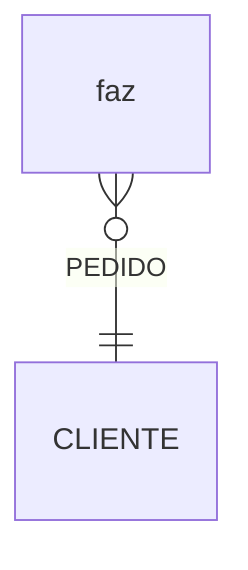

**✅ Correto**

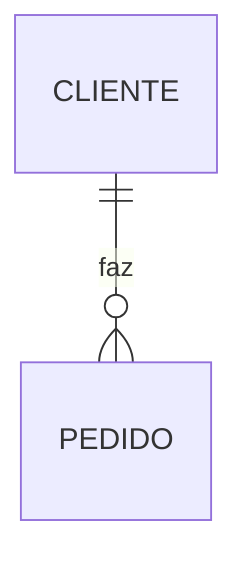

---

### 7. Herança (Generalização)

**❌ Errado (sintaxe não suportada)**

```mermaid
erDiagram
    PESSOA <|-- FUNCIONARIO
    PESSOA <|-- CLIENTE
```

**✅ Correto (usar notação do Mermaid)**

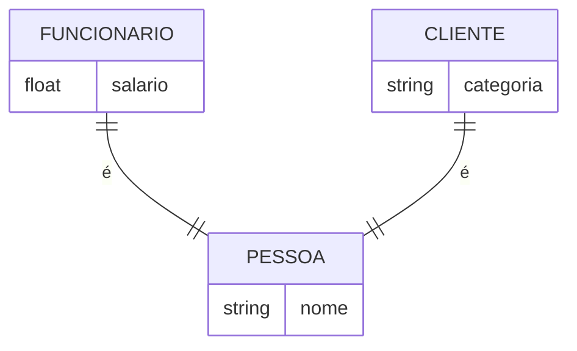

---

### 8. Chave Estrangeira

**❌ Errado (chave estrangeira na entidade errada)**

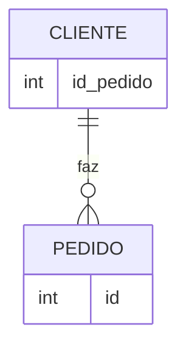

**✅ Correto (chave estrangeira no pedido)**

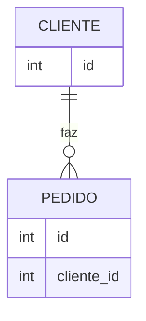

---

### 9. Relacionamento Recursivo

**❌ Errado (autorrelacionamento mal definido)**

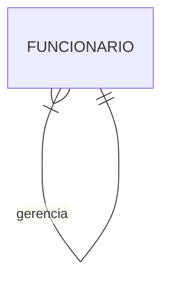

**✅ Correto**

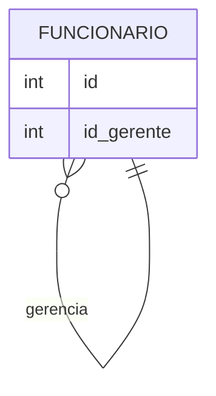

---

### 10. Entidade Associativa com Atributos

**❌ Errado (atributos na linha de relacionamento)**

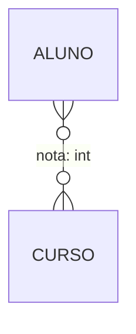

**✅ Correto (usar entidade separada)**

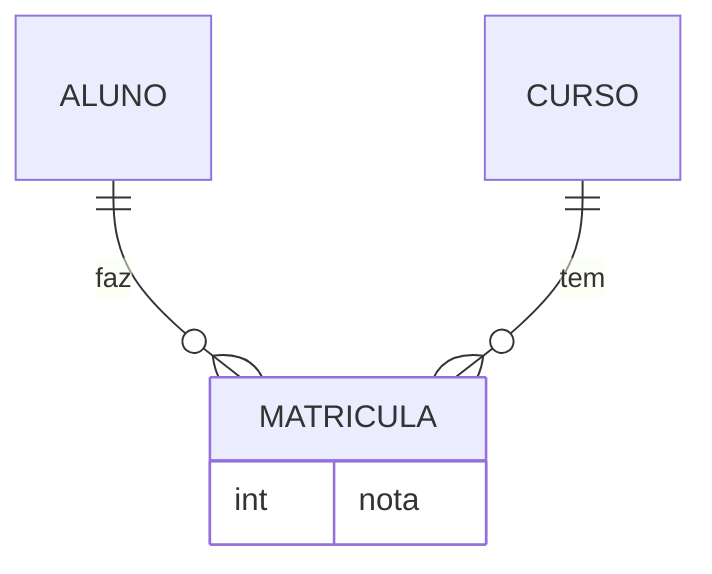

---

### Observações:

1. Mermaid não suporta atributos diretamente em relacionamentos (exemplo 2 e 10).
2. Relacionamentos n-ários (exemplo 3) exigem entidades associativas.
3. Sempre declare atributos dentro de chaves `{}` para entidades.
4. A ordem das entidades na definição do relacionamento segue `ENTIDADE1 <cardinalidade>--<cardinalidade> ENTIDADE2 : "rótulo"`.
