# Perplexity: 7 Exemplos Corretos e Incorretos de Diagramas ER em Mermaid

## 1. Relacionamento Um-para-Muitos

### ❌ **INCORRETO** - Símbolos de cardinalidade errados

```mermaid
erDiagram
    CLIENTE -->> PEDIDO : faz
    CLIENTE {
        int id PK
        string nome
    }
    PEDIDO {
        int id PK
        int cliente_id FK
    }
```

### ✅ **CORRETO** - Cardinalidade correta para um-para-muitos

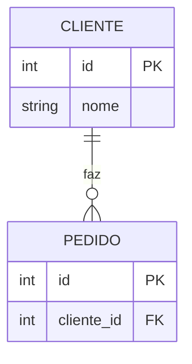

***

## 2. Relacionamento Muitos-para-Muitos

### ❌ **INCORRETO** - Relacionamento direto sem entidade associativa

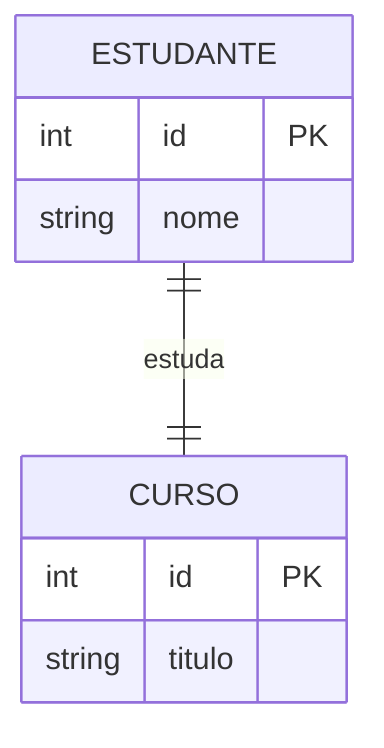

### ✅ **CORRETO** - Relacionamento muitos-para-muitos adequado

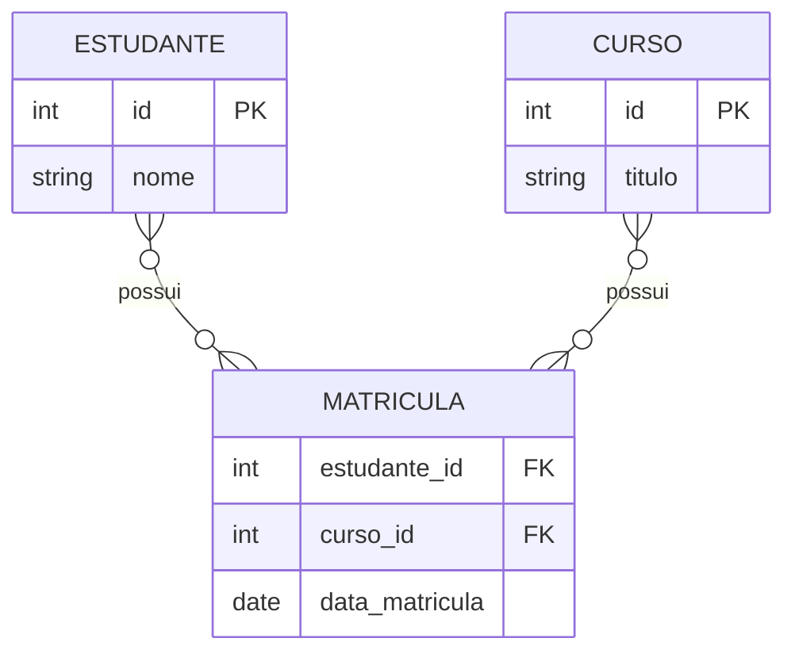

***

## 3. Sintaxe de Atributos

### ❌ **INCORRETO** - Sintaxe de atributos mal formada

```mermaid
erDiagram
    PRODUTO {
        id: integer PRIMARY KEY,
        nome: varchar(100),
        preco: decimal(10,2)
    }
```

### ✅ **CORRETO** - Sintaxe adequada para atributos

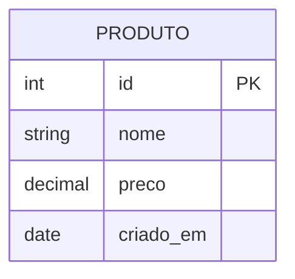

***

## 4. Relacionamento com Linha Pontilhada

### ❌ **INCORRETO** - Uso inadequado de linha pontilhada

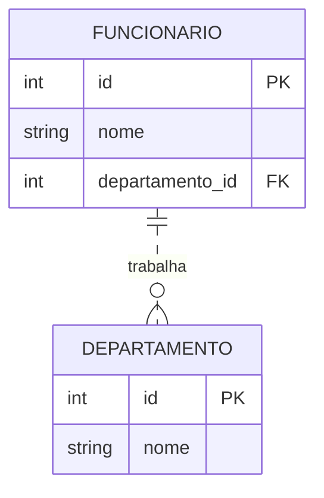

### ✅ **CORRETO** - Relacionamento identificativo vs não-identificativo

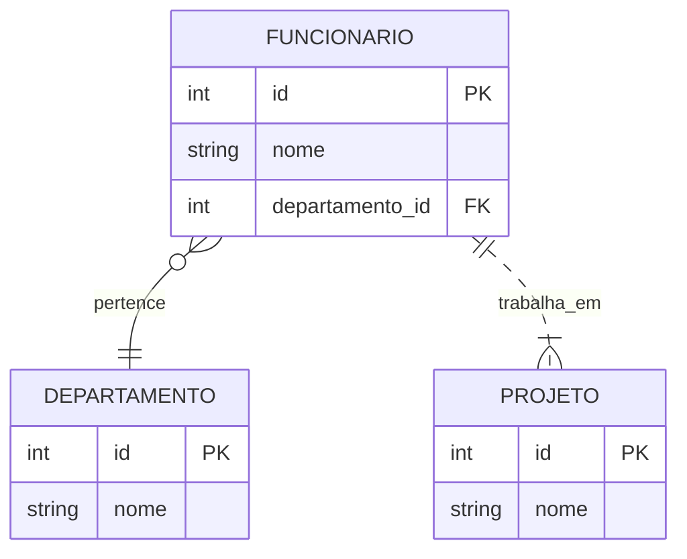

***

## 5. Entidade com Chaves Múltiplas

### ❌ **INCORRETO** - Múltiplas chaves primárias incorretas

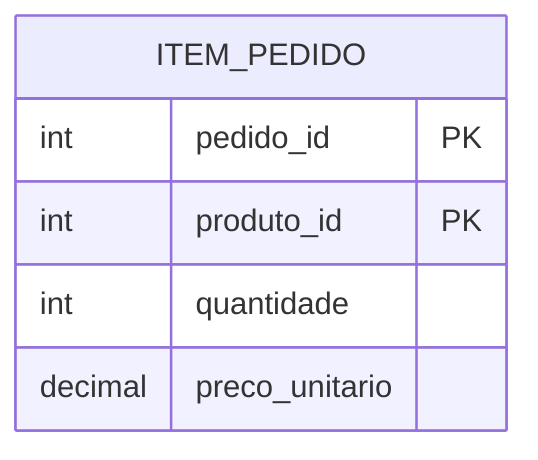

### ✅ **CORRETO** - Chave primária composta adequada

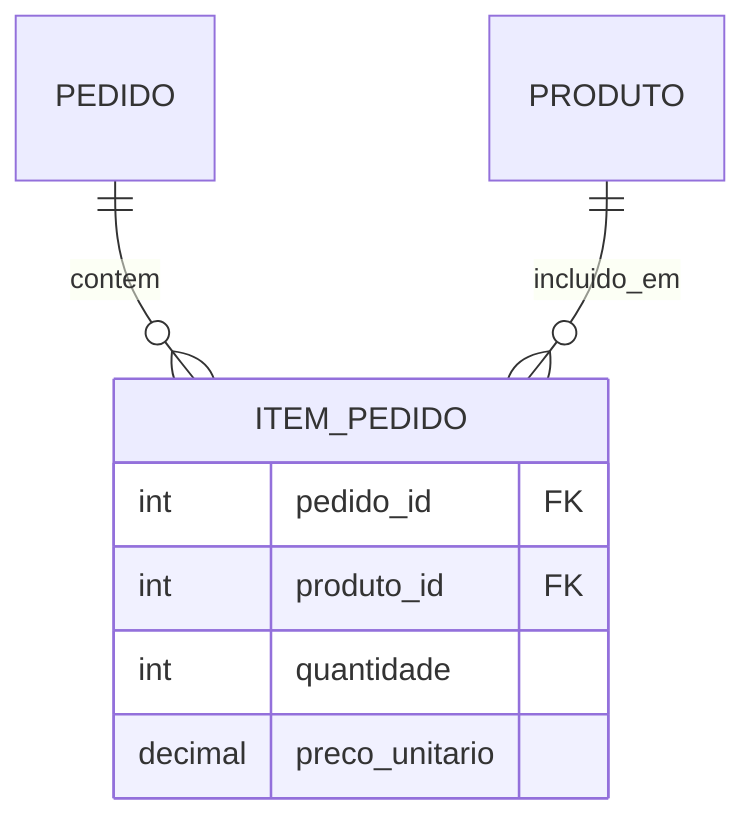

***

## 6. Relacionamento Um-para-Um

### ❌ **INCORRETO** - Cardinalidade errada para um-para-um

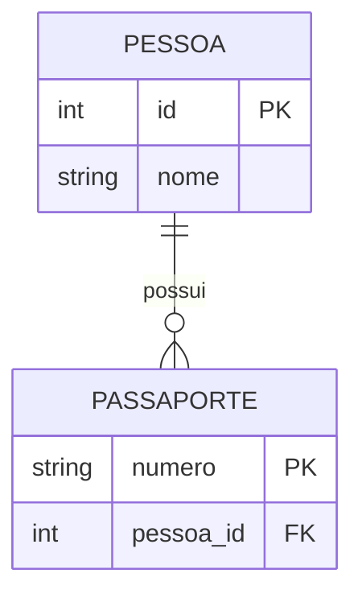

### ✅ **CORRETO** - Relacionamento um-para-um adequado

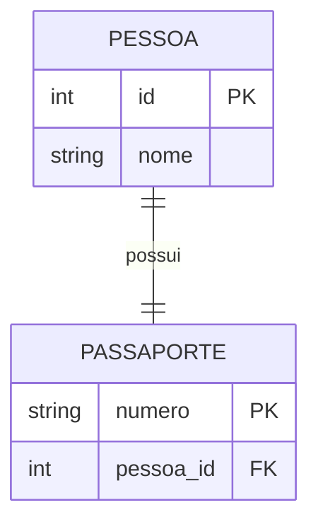

***

## 7. Labels de Relacionamento

### ❌ **INCORRETO** - Labels ausentes ou inadequados

```mermaid
erDiagram
    AUTOR ||--o{ LIVRO
    AUTOR {
        int id PK
        string nome
    }
    LIVRO {
        int id PK
        string titulo
        int autor_id FK
    }
```

### ✅ **CORRETO** - Labels descritivos nos relacionamentos

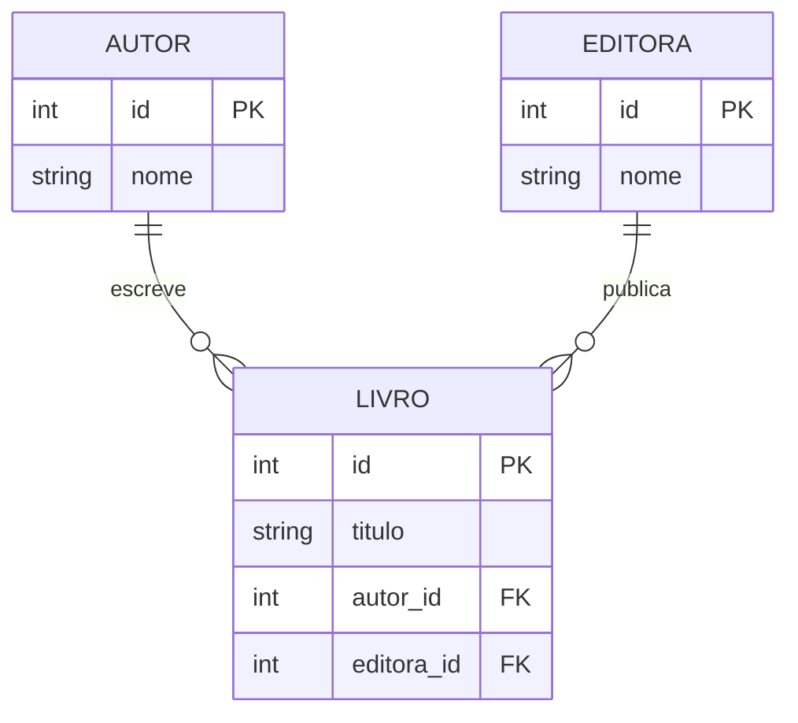
