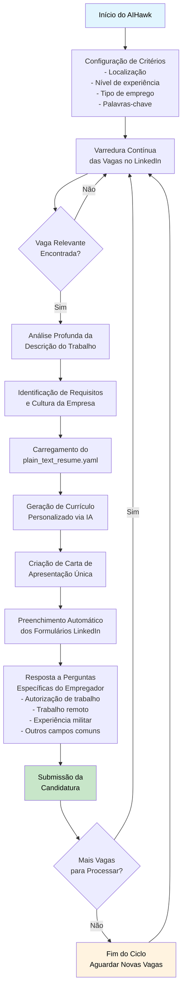

# Candidatando em Vagas de Emprego pelo Linkedin em 2025: O Ultimato

# 1. Introdução

O mercado de trabalho está cada vez mais digitalizado e competitivo, onde sistemas automatizados como o Applicant Tracking System (ATS) e os algoritmos do LinkedIn desempenham um papel crucial na triagem inicial de candidatos, o profissional que busca se destacar e ser encontrado por recrutadores precisa de uma abordagem estratégica.    
Uma solução eficaz e didática para aumentar as chances de conseguir emprego, especialmente através do LinkedIn, envolve a otimização minuciosa tanto do currículo quanto do perfil na plataforma: é essencial** identificar e incorporar palavras-chave relevante**s presentes nas descrições das vagas e no vocabulário do setor, estruturar as informações de maneira clara, organizada e com títulos padronizados,** demonstrar conquistas e resultados quantificávei**s nas experiências profissionais, utilizando verbos de ação, e manter o currículo e o perfil na rede social** sempre atualizado**s e alinhados com os objetivos de carreira; além disso, a** atividade constante e o engajamento estratégico no LinkedIn, incluindo o preenchimento completo de todas as seções e a interação com conteúdo relevante, são fundamentais para aumentar a visibilidade perante os algoritmos e atrair a atenção dos recrutadores, abrindo caminho para as entrevistas.   

# 2. O que é ATS?

O **Sistema de Rastreamento de Candidatos (ATS)**, ou Applicant Tracking System, é um software fundamental no universo de Recursos Humanos, projetado para gerenciar e otimizar o processo de recrutamento e seleção.    
Ele centraliza todas as etapas, desde a publicação de vagas até a análise final, permitindo a coleta eficiente e o armazenamento de currículos. Sua principal função é a **triagem automática de candidaturas** com base em palavras-chave, qualificações, experiência e outros critérios predefinidos. Isso acelera significativamente o processo, economizando tempo dos recrutadores.    
A integração da Inteligência Artificial (IA) é uma tendência crescente, aprimorando a precisão da triagem, reduzindo viés, fornecendo insights baseados em dados, e automatizando comunicações com candidatos. Em 2025, o uso de ATS é visto como **imprescindível** para a eficiência e competitividade das empresas no mercado de trabalho, embora sua implementação possa ter custos e requeira treinamento da equipe.   

# 3. Como otimizar um currícula para ATS?

Para otimizar um currículo e perfil online para o ATS e aumentar a visibilidade, é crucial adotar práticas estratégicas.    
O candidato deve **identificar e utilizar palavras-chave relevantes** encontradas nas descrições das vagas e no vocabulário da área de atuação, incluindo habilidades técnicas e softwares específicos, inserindo-as em seu currículo e no perfil do LinkedIn.    
A **estrutura do documento deve ser clara e organizada**, com títulos de seção padrão como "Experiência Profissional", "Educação" e "Habilidades". É recomendado utilizar formatos compatíveis com o ATS, como .docx ou .pdf, evitando elementos visuais excessivos, colunas ou imagens que dificultem a leitura automática.    
Na descrição das experiências, deve-se **focar em conquistas e resultados quantificáveis**, utilizando verbos de ação para demonstrar proatividade e impacto. Além disso, é essencial **manter o currículo e o perfil sempre atualizados**, personalizá-lo para cada vaga, garantir a precisão das informações, escrever siglas por extenso, e preencher todas as seções do perfil no LinkedIn minuciosamente para aumentar a chance de ser encontrado por recrutadores.   

# 4. Quais são os passos para preparar o perfil e o currículo para ter maior SSI e visibilidade do ATS?

Compreendendo o cenário atual de busca por emprego, onde o **Sistema de Rastreamento de Candidatos (ATS)** e os algoritmos do LinkedIn desempenham um papel fundamental na triagem e visibilidade, o profissional deve focar na **otimização estratégica de seu currículo e perfil online**.    
Para ser eficaz e didático nessa preparação, visando maior SSI e visibilidade para o ATS e recrutadores, **é crucial identificar e utilizar palavras-chave relevantes** das descrições de vagas e do vocabulário do setor em todas as seções pertinentes do currículo e do perfil, incluindo a escrita de siglas por extenso.    
A **estrutura do currículo deve ser organizada e clara**, adotando títulos de seção padrão e formatos compatíveis com o ATS (.docx ou .pdf), enquanto se evitam elementos visuais complexos que dificultem a leitura automatizada. Nas descrições de experiências, **o foco deve ser em conquistas e resultados mensuráveis**, utilizando verbos de ação para demonstrar impacto e proatividade.    
Adicionalmente, é essencial **manter o currículo e, especialmente, o perfil do LinkedIn constantemente atualizados**, preenchendo todas as seções do perfil minuciosamente para aumentar a completude e relevância, e **adaptar o conteúdo para cada aplicação**.    
Por fim, a **atividade contínua e o engajamento estratégico** na plataforma, interagindo e construindo relacionamentos, são vitais para impulsionar a visibilidade algorítmica e atrair a atenção dos recrutadores, além de passar pela triagem inicial.   

# 5. Como adaptar meu currículo para passar no ATS?

Antes de mergulharmos nas estratégias específicas, é importante entender que o cenário de recrutamento em 2025 realmente mudou significativamente. Os sistemas de inteligência artificial, automação e algoritmos transformaram como os currículos são filtrados e como os candidatos são selecionados, mas algumas das afirmações sensacionalistas que você encontrou precisam ser contextualizadas com dados reais.   
Para garantir que seu currículo seja eficazmente processado pelos Applicant Tracking Systems (ATS) e destaque suas qualificações para os recrutadores, a formatação e o conteúdo são cruciais. Em um cenário onde 60% das empresas já utilizam ATS para triagem automática de currículos, e a Inteligência Artificial (IA) está cada vez mais presente para otimizar o processo de recrutamento, com a expectativa de que 70% das interações em seleções de talentos envolvam IA nos próximos anos, seguir as melhores práticas é fundamental. Um currículo bem estruturado e com as palavras-chave certas pode ser a chave para conquistar uma oportunidade.   
De forma prática para adaptar um currículo e ser lido por sistemas de triagem como o ATS, o profissional deve seguir práticas estratégicas baseadas no conhecimento consolidado das fontes.    
É essencial **identificar e incorporar palavras-chave relevantes**, encontradas nas descrições das vagas desejadas e no vocabulário técnico do setor, em todas as seções apropriadas do currículo, incluindo habilidades, experiências e resumo.    
É crucial também **escrever siglas por extenso** para garantir que o sistema as reconheça. A **estrutura do currículo deve ser clara, organizada e simples**, utilizando títulos de seção padrão como "Experiência Profissional", "Educação" e "Habilidades".    
Deve-se **escolher formatos de arquivo compatíveis**, como .docx ou .pdf, e **evitar elementos visuais complexos**, colunas, imagens ou gráficos que possam dificultar a leitura automatizada.    
Nas descrições das experiências profissionais, é fundamental **focar em conquistas e resultados quantificáveis**, utilizando verbos de ação para demonstrar impacto e proatividade. Por fim, o currículo deve ser **mantido sempre atualizado** e **personalizado para cada vaga**, garantindo que as informações estejam alinhadas com os requisitos específicos da posição, além de verificar a precisão e evitar erros de ortografia ou gramática.   

 --- 

## 5.1 .Na prática: Criando um Currículo Eficiente para passar em qualquer filtro ATS com ou sem Inteligência Artificial

O objetivo é criar um documento **simples, limpo e otimizado** para a leitura de sistemas automatizados e, posteriormente, para recrutadores. Evite designs muito criativos, gráficos ou elementos visuais excessivos, que podem dificultar a leitura do ATS, que geralmente lê da esquerda para a direita.   
**Passo 1: Iniciar no Google Docs e Configurar a Fonte e Layout**   
    

- Abra o **Google Docs** e selecione um documento em branco.   
- Defina a **fonte principal como Arial**. Fontes profissionais e legíveis, como Arial ou Calibri, são ideais para a compatibilidade com o ATS.   
      
- Mantenha **margens claras** para uma apresentação organizada.   

**Passo 2: Seção de Dados Pessoais (Apenas o Essencial)**   

- No topo do documento, inclua apenas: **Nome completo** (como "João da Silva Silveira") com **fonte 25**.   
- Faça um subtítulo com palavras chaves que incluem seus "cargos" / especialidades: Exemplo: "Programador Full-Stack Node.js \| Pós doutorando em X \| Especialista em Y" ou "Contador \| Webwriter \| Empresário \| Freelancer \| MBA em Administração"   
- **Contato atualizado**: Telefone e e-mail.   
- **Cidade e estado** (não precisa incluir a rua).   
- Adicione o **URL do seu LinkedIn**. É crucial para que o recrutador possa ver seu perfil completo.   

**Passo 10: Atualização Constante**   

- Mantenha seu currículo **sempre atualizado** com novas conquistas, cursos, projetos ou habilidades. Cada oportunidade é única e seu currículo deve ser adaptado com palavras-chave e experiências relevantes.   

# 6. Separando Fatos de Exageros

Como dito anteriormente, o mercado de recrutamento em 2025 é caracterizado por uma forte integração tecnológica. As pesquisas confirmam que o recrutamento atual é marcado por inovação tecnológica, humanização dos processos e foco crescente na diversidade e experiência do candidato [^1](https://mudes.org.br/saiba-as-tendencias-em-recrutamento-e-selecao-para-2025-o-futuro-da-gestao-de-talentos/).    

> Dentro de uma propaganda paga, um curso é apresentado e o mesmo vende o seu curso chamando a atenção dizendo que as pessoas estão se candidatando errado no linkedin. A partir dessa provocação o vídeo da propaganda paga analisa de forma crítica os métodos tradicionais de candidatura a vagas de emprego, destacando pontos que dificultam o sucesso dos candidatos. A seguir, apresentamos os principais problemas identificados pelo autor, um resumo do conceito de “social index” e, por fim, a solução proposta.   

## 6.1. A PROPAGANDA: Os 3 Jeitos Errados de se Candidatar

Segundo o autor da propaganda do curso, os métodos mais comuns utilizados na busca por emprego têm baixa efetividade:   

- **Candidatura por Vagas Anunciadas: **Muitos candidatos se inscrevem em vagas divulgadas em redes sociais ou por meio de anúncios. A alta concorrência faz com que os currículos, em geral, não cheguem à análise dos recrutadores.   
- **Inscrição Massiva em Sites e no LinkedIn: **Outra abordagem é cadastrar-se em diversas vagas por meio de sites especializados ou do próprio campo de vagas do LinkedIn. Com milhares de currículos recebidos pelas empresas, a chance de ser selecionado para uma entrevista se torna praticamente nula.   
- Dependência Exclusiva de Indicações: Embora as indicações possam facilitar o processo, o autor ressalta que confiar apenas nesse método é problemático. Ele argumenta que, se a contratação dependesse unicamente de indicações, não haveria a necessidade de departamentos de Recursos Humanos estruturados e investidos em recrutamento.
  ---

No contexto do LinkedIn, o "social index" ou pontuação do perfil emerge como um fator crucial para a visibilidade profissional. Essa métrica, que leva em consideração palavras-chave, a completude do perfil e o engajamento do usuário, influencia diretamente a forma como os recrutadores encontram e avaliam os candidatos. Perfis bem otimizados, com pontuações elevadas, têm maior probabilidade de serem notados pelos algoritmos e robôs utilizados pelos recrutadores, aumentando assim as chances de serem contatados para entrevistas.   
Você pode encontrar o SSI no seguinte link:* [https://www.linkedin.com/sales/ssi ](https://www.linkedin.com/sales/ssi)*   
Mas vamos analisar especificamente afirmações feitas por "cursos" de "consiga seu próximo emprego":   

### Afirmação 1: Candidatar em Vagas Anunciadas com muitos candidatos já candidatados

**Essa afirmação é parcialmente verdadeira**: Os resultados mostram que, de fato, a alta concorrência em vagas anunciadas reduz significativamente a chance de seu currículo ser avaliado. Um estudo verificou que quando você se candidata a uma vaga diretamente no LinkedIn, muitos recrutadores não conseguem visualizar todas as candidaturas devido ao volume recebido[ ^1](https://pt.linkedin.com/pulse/o-seu-curr%C3%ADculo-n%C3%A3o-est%C3%A1-sendo-visto-pelos-quais-s%C3%A3o-os-sposito)5. Isso não significa que seja impossível, apenas que é necessário otimizar sua abordagem.   

### Afirmação 2: Se inscrever em massa sem parar, reduz suas chances drasticamente.

**Afirmação é verdadeira: A pesqu**isa confirma que candidatar-se massivamente tem efetividade quase nula. Dados mostram que candidatos que se inscreveram em 100 vagas e obtiveram apenas 2 visualizações tiveram apenas 2% de efetividade ^15. Os s[ist](https://pt.linkedin.com/pulse/o-seu-curr%C3%ADculo-n%C3%A3o-est%C3%A1-sendo-visto-pelos-quais-s%C3%A3o-os-sposito)emas ATS (Applicant Tracking System) filtram automaticamente a maioria dos currículos antes mesmo que cheguem aos recrutadores humanos ^4.   

### Afirmação 3: Só consegue emprego quem tem QI (Quem Indica)

- Inclua sua **idade em anos** (ex: 23 anos), e **evite sua data de nascimento ou CPF** para proteger seus dados e evitar fraudes.   
- **Não use foto**.   
- **Não inclua RG, CPF ou estado civil**.   

**Passo 3: Título da Vaga/Objetivo Profissional**   

- Diretamente abaixo do seu nome, inclua a **vaga para a qual você está se candidatando**.   
- Exemplo do vídeo: "Executivo de Vendas em Startups" ou "Account Executive". Você pode usar barras para indicar equivalência entre termos em português e inglês.   
- Aumente um pouco o tamanho da letra para que tenha um **certo destaque**.   

**Passo 4: Resumo Profissional (Mini Currículo Otimizado)**   

- Esta seção deve vir logo após o seu objetivo/título.   
- Crie um texto **conciso, de no máximo um ou dois parágrafos**.   
- Deve contar um pouco sobre o que você já fez, sua formação, experiência e objetivo profissional atual.   
- **Otimize com palavras-chave**: Inclua habilidades técnicas, formação acadêmica, softwares (ex: AutoCAD, SAP, CRM) e termos específicos da vaga ou da sua área de atuação.   
- Use termos como "**forte atuação**" e "**expertise**" para enfatizar habilidades importantes.   
- Exemplo: "*Profissional formado em [sua faculdade], com experiência na área comercial e de marketing. Iniciei minha carreira no banco X, depois fui para o banco Y e hoje foco em startups na área de vendas. Busco novas oportunidades na área de vendas, onde posso agregar com meus conhecimentos em técnicas de vendas e CRM.*".   

**Passo 5: Experiência Profissional (Foque em Conquistas e Resultados)**   

- Liste suas experiências **da mais recente para a mais antiga** (formato cronológico reverso).   
- Para cada cargo, foque nas suas **conquistas e responsabilidades**, utilizando **verbos de ação** (ex: "implementei", "coordenei", "desenvolvi", "alcancei") para transmitir dinamismo e profissionalismo.   
- **Quantifique seus resultados sempre que possível** com números e métricas, pois isso demonstra impacto e é facilmente lido pelo ATS. Exemplo: "*Gerenciei uma equipe de sete colaboradores que aumentou as vendas em 20% no primeiro ano*".   
- Se você teve **várias promoções dentro da mesma empresa**, o vídeo sugere consolidar essas experiências sob uma única entrada da empresa, detalhando os cargos e conquistas em *bullet points* para economizar espaço e manter a concisão.   
- Integre **palavras-chave específicas da vaga e do setor** nas descrições de suas responsabilidades e conquistas.   

**Passo 6: Formação Acadêmica e Cursos (Base da sua Trajetória)**   

- Liste seu curso, instituição e ano de conclusão.   
- Para cursos complementares e certificações, **priorize os mais recentes e relevantes para a vaga**.   

**Passo 7: Habilidades e Competências (Otimize para Palavras-Chave)**   

- Separe suas habilidades em **Hard Skills** (conhecimentos técnicos, softwares como Excel avançado, Power BI, AutoCAD, SAP, AWS, Node.js, Vue.js, React.js, Python, R, Estatística, etc.) e **Soft Skills** (habilidades interpessoais como liderança, trabalho em equipe, resolução de problemas, comunicação).   
- **Mencione todas as suas habilidades específicas** ao invés de agrupá-las genericamente. Por exemplo, em vez de "experiência em software de gerenciamento de relacionamento", liste "experiência em Salesforce".   
- **Adapte essa seção para cada vaga**, destacando as competências mais alinhadas ao perfil que a empresa está buscando e que são mencionadas nas ofertas de emprego.   
- Use negrito ou itálico para **destacar palavras-chave importantes** (ex: metodologias de vendas, termos técnicos) para o recrutador humano, mas lembre-se que o ATS foca mais no conteúdo em si.   

**Passo 8: Revisão e Refinamento Final**   

- **Revise cuidadosamente a ortografia, gramática e formatação**. Erros podem levar o ATS a descartar seu currículo.   
- **Mantenha a concisão**: O Jonny Viccari no vídeo enfatiza que seu currículo, inicialmente com 3 páginas, precisou ser reduzido para 2. Para níveis júnior ou estágio, **uma página é o ideal**. Currículos maiores não significam currículos melhores.   
- **Use títulos de seção padrão** (ex: "Experiência Profissional", "Formação Acadêmica", "Habilidades"). Evite títulos personalizados ou "criativos" que o ATS pode não reconhecer.   
- **Escreva siglas por extenso** (ex: "Facebook Ads" ao invés de "FB Ads") para garantir que o ATS as reconheça.   
- **Não tente "trapacear" o ATS** adicionando palavras-chave ocultas (em branco ou sob uma camada invisível), pois o sistema pode detectar e isso reflete negativamente.   

**Passo 9: Salvar e Enviar no Formato Correto**   

- O formato **PDF é geralmente a escolha ideal** para manter a formatação intacta.   
- **Atenção**: Alguns ATS mais antigos podem interpretar PDFs como imagens, dificultando a leitura. Nesses casos, o formato **.docx (Microsoft Word) é uma alternativa segura** e mais facilmente processada.   
- **Sempre verifique a preferência de formato da empresa** na descrição da vaga.   
- **Renomeie o arquivo** de forma profissional, como "CV\_SeuNome.pdf".   
- **Verifique se não há uma página em branco** no final do PDF, o que pode acontecer ao exportar.   

**Essa afirmação é parcialmente falsa**: Enquanto é verdade que não se deve depender exclusivamente de indicações, as pesquisas mostram que programas de indicação de funcionários são extremamente valiosos. Empresas desenvolvem programas específicos para gratificar colaboradores que indicam candidatos qualificados[ ^](https://blog.abler.com.br/programa-de-indicacao/)9, pois "nenhum funcionário quer prejudicar sua imagem na empresa indicando alguma pessoa que não trará bons resultados"[ ^](https://blog.abler.com.br/programa-de-indicacao/)9.   

# 7. A "Nota Secreta" do LinkedIn - O SSI (Social Selling Index)

A "nota" mencionada no anúncio realmente existe e se chama Social Selling Index (SSI). É um indicador criado pelo LinkedIn que avalia a eficácia de um perfil na plataforma [^11](https://pt.linkedin.com/pulse/social-selling-index-o-indicador-secreto-do-linkedin-que-almeida-2kjvf), variando de 0 a 100.   
Este índice é dividido em quatro pilares fundamentais:   

- Estabelecimento de marca pessoal   
- Conexão com pessoas estratégicas   
- Interação com insights relevantes   
- Criação de relacionamentos [^11](https://pt.linkedin.com/pulse/social-selling-index-o-indicador-secreto-do-linkedin-que-almeida-2kjvf)   

Perfis com SSI alto realmente tendem a aparecer mais nas buscas internas do LinkedIn, já que o algoritmo da plataforma prioriza perfis ativos, bem conectados e que geram valor para suas redes [^11](https://pt.linkedin.com/pulse/social-selling-index-o-indicador-secreto-do-linkedin-que-almeida-2kjvf). Isso confirma que pequenas modificações no seu perfil podem aumentar suas chances de ser encontrado por recrutadores.   

# 8. Como os Recrutadores Realmente Trabalham em 2025

## 8.1. Os 3 "Robôs" e a IA no Recrutamento

Os recrutadores utilizam efetivamente sistemas automatizados de triagem. O ATS permite que filtrem currículos de forma mais eficiente, utilizando palavras-chave, experiência e formação [^4](https://genyo.com.br/ats-no-rh/). Esses sistemas fazem uma análise inicial antes que o recrutador humano veja seu currículo.   
No LinkedIn especificamente, os algoritmos de correspondência utilizam machine learning para "casar" as vagas com os perfis de candidatos automaticamente [^3](https://pt.linkedin.com/pulse/como-funciona-o-algoritmo-do-linkedin-para-recrutadores-t--gzdfe). Os recrutadores têm acesso a ferramentas como o LinkedIn Recruiter, que oferece:   

- Filtros de pesquisa avançados   
- Pesquisas booleanas para ampliar alcance   
- Correspondência de IA para recomendações de candidatos [^13](https://business.linkedin.com/pt-br/talent-solutions/resources/talent-acquisition/how-to-use-linkedin-recruiter)   

O que acaba gerando   

1. Primeiro contato feito diretamente do recrutador (Mensagem feita diretamente por uma Inteligência Artificial Generativa - LLM)   
2. Filtro por correspondência (Caso você se candidatou) analisando por ATS e por significado (Inteligência Artificial)   
3. Uma iteração intermediária, feita por testes ou até mesmo por robôs no perfil do recrutador (Mensagens todas criadas por Inteligência Artificial) para verificar algumas informações e marcar a data e o horário (Também outra automação)   
4. Apenas aqui você verá um humano e ele normalmente não participou ativamente de nenhum dos passos anteriores, ele vai te conhecer na entrevista cara a cara. (*PS: Pode existir ainda a possibilidade da empresa TAMBÉM FAZER A ENTREVISTA COM IA hoje com recursos corretos, ela pode pagar um sistema de text-to-voice e você irá conversar com uma IA e nem irá perceber! Bizarro não?)*   

Isso faz com que no geral tenha na maioria dos casos, três camadas de automação e inteligência artificial até que você realmente fale com um humano. Ou seja, aquela pessoa que te chamou no privado não foi um humano foi um robô, e provavelmente hoje em dia se ele respondeu novamente é um robô também!   

# 9. Vaga Fantasma

Em contexto de mercado de trabalho, "vaga fantasma" refere-se a uma oferta de emprego falsa, criada por empresas sem intenção real de preencher a posição, muitas vezes com objetivos de marketing ou para coletar informações sobre candidatos.   
O que são "vagas fantasmas"?   

- **Definição: **São ofertas de emprego publicadas por empresas, mas que, na realidade, não existem ou já foram preenchidas.   

**Motivos:**   

- Estratégia de marketing: Atrair candidatos e gerar interesse na empresa.   
- **Coletar informaçõe**s: Obter currículos e dados de candidatos para futuras contratações ou análises de mercado.   
- **Prevenir discriminação**: Publicar vagas para cumprir requisitos legais ou evitar processos por discriminação.   
- **Inflar estatísticas**: Aumentar artificialmente o número de vagas abertas.   

**Como identificar:**   

- **Data de publicação:** Vagas que permanecem abertas por muito tempo sem serem preenchidas.   
- **Descrições vagas:** Descrições de cargo genéricas ou com pouca informação.   
- Falta de resposta: Não receber resposta da empresa após a candidatura.   
- **Muitas candidaturas:** Muitas candidaturas para uma vaga que aparentemente não existe.   

**Impacto:**   

- **Perda de tempo e frustração:** Candidatos que se candidatam a vagas que não existem.   
- **Distorção do mercado:** Cria uma falsa percepção de oferta de trabalho.   
- **Erosão da confiança:** Afeta a credibilidade das empresas e das plataformas de recrutamento.   

**Exemplo:**   
Uma empresa pode anunciar uma vaga de "Desenvolvedor de Software" para um IPO futuro, sem ter planos concretos de contratar alguém para essa função no momento.   
Como se proteger:   

- **Pesquisar a empresa:** Verificar a reputação da empresa e a veracidade das vagas publicadas.   
- **Verificar a data de publicação:** Desconfiar de vagas que permanecem abertas por muito tempo.   
- **Ler atentamente a descrição:** Desconfiar de descrições vagas ou com pouca informação.   
- **Não se candidatar a vagas que parecem falsas:** Se tiver dúvidas, não se candidate.   

**Buscar outras fontes:** Consultar outras fontes de informação sobre o mercado de trabalho   

# FAQ para entender o cenário atual:

## 1. Como criar o melhor currículo em 2025 que chame a atenção dos entrevistadores?

Em 2025, um currículo eficaz precisa ser otimizado tanto para os sistemas ATS quanto para recrutadores humanos:   
**Para os sistemas ATS:**   

- Escolha um formato adequado (preferencialmente cronológico) [^17](https://jpefconsultoria.com.br/artigos/como-escrever-um-curriculo-compativel-com-ats-2)   
- Use palavras-chave relevantes para a vaga específica [^19](https://www.toolify.ai/pt/ai-news-pt/elaborando-currculos-prova-de-ia-guia-completo-para-2025-3380573)   
- Mantenha estrutura organizada com seções claras (experiência, habilidades, educação) [^2](https://www.iabasico.com/posts/como-criar-um-curriculo-irresistivel-com-ia-em-2025)   
- Prefira formatos como Word a PDF em algumas situações [^17](https://pt.linkedin.com/pulse/como-adaptar-seu-curr%C3%ADculo-para-passar-pela-michelle-navarro-slfrf)   
- Use títulos de seção padrão e evite layouts complexos [^17](https://pt.linkedin.com/pulse/como-adaptar-seu-curr%C3%ADculo-para-passar-pela-michelle-navarro-slfrf)   

**Para chamar atenção dos recrutadores:**   

- Limite seu currículo a duas páginas no máximo [^18](https://www.cemprerh.com.br/post/checklist-de-curr%C3%ADculo-atualizado-para-2025-transforme-sua-apresenta%C3%A7%C3%A3o-profissional)   
- Inclua um resumo profissional impactante (3 linhas) [^18](https://www.cemprerh.com.br/post/checklist-de-curr%C3%ADculo-atualizado-para-2025-transforme-sua-apresenta%C3%A7%C3%A3o-profissional)   
- Quantifique resultados: "Aumentei a retenção de clientes em 30% ao implementar um programa de fidelidade" [^18](https://www.cemprerh.com.br/post/checklist-de-curr%C3%ADculo-atualizado-para-2025-transforme-sua-apresenta%C3%A7%C3%A3o-profissional)   
- Use verbos de ação como: Administrado, Alocados, Aprovado [^20](https://undetectable.ai/blog/br/lista-de-palavras-chave-do-curriculo/)   
- Destaque soft skills, que estão ganhando importância crescente [^1](https://www.uai.com.br/app/noticia/mundo-corporativo/2025/03/27/noticia-mundo-corporativo,358556/estrategias-favorecem-respostas-eficazes-em-entrevistas-de-emprego.shtml)   

## 2. Em 2025 o currículo ainda é útil?

**Sim, absolutamente.** O currículo continua sendo essencial no processo de recrutamento, mas sua função evoluiu. Ele serve como um primeiro filtro para os sistemas ATS e como uma apresentação formal de suas qualificações [^4](https://blog.reachr.com.br/ats-o-que-e-e-como-pode-revolucionar-seu-processo-de-recrutamento/). Porém, em 2025, seu perfil no LinkedIn funciona como um "currículo dinâmico" e complementa seu currículo tradicional [^14](https://pt.linkedin.com/pulse/o-que-recrutador-espera-encontrar-seu-perfil-do-linkedin-gomes--c4crf).   
Um recrutador confirma: "Com 85 milhões de usuários só no Brasil, é fácil imaginar que, mesmo com filtros e pesquisas específicas, ainda precisamos avaliar muitos perfis em pouco tempo. Por isso, é importante que seu perfil esteja sempre atualizado e refletindo o seu momento de carreira atual" [^14](https://pt.linkedin.com/pulse/o-que-recrutador-espera-encontrar-seu-perfil-do-linkedin-gomes--c4crf).   

## 3. Que adaptações devo fazer para que os "robôs" tenham interesse no meu currículo?

Para atrair a atenção dos sistemas automatizados, você precisa:   

- **Incluir palavras-chave específicas do setor e da vaga**: Analise descrições de vagas similares e identifique termos recorrentes [^19](https://pt.linkedin.com/pulse/como-adaptar-seu-curr%C3%ADculo-para-passar-pela-michelle-navarro-slfrf)   
- **Estruturar seu currículo com seções padronizadas**: Os ATS dependem de organização clara para categorizar informações [^17](https://jpefconsultoria.com.br/artigos/como-escrever-um-curriculo-compativel-com-ats-2)   
- **Escrever siglas por extenso e depois abreviadas**: Por exemplo, "Gestão de Relacionamento com o Cliente (CRM)" [^17](https://jpefconsultoria.com.br/artigos/como-escrever-um-curriculo-compativel-com-ats-2)   
- **Usar formatos compatíveis**: Escolha formatos que são facilmente lidos pelos sistemas ATS [^5](https://jpefconsultoria.com.br/artigos/como-escrever-um-curriculo-compativel-com-ats-2)   
- **Adaptar seu currículo para cada vaga**: Personalizar o currículo para corresponder aos requisitos específicos da posição aumenta significativamente suas chances [^22](https://pt.linkedin.com/pulse/como-adaptar-seu-curr%C3%ADculo-para-passar-pela-michelle-navarro-slfrf)   

# 10. Estratégias e Práticas para Aumentar suas Chances de Resposta

## 10.1. Otimização do Perfil no LinkedIn

1. **Aprimore seu título profissional**: Não use apenas seu cargo atual. Inclua palavras-chave relevantes de suas competências técnicas [^27](https://www.entes.com.br/blog/dicas-curriculo-mudanca-carreira/).
   Exemplo: **"Analista de Dados \| Machine Learning \| Programação Estatística \| Gestão de Dados \| SQL**" [^27](https://www.entes.com.br/blog/dicas-curriculo-mudanca-carreira/)   
2. **Desenvolva uma seção "Sobre" estratégica**: Estruture-a como um pitch pessoal que destaque suas realizações e habilidades. Responda: Quem é você? O que oferece? Quais são seus objetivos de carreira? [^27](https://www.entes.com.br/blog/dicas-curriculo-mudanca-carreira/)   
3. **Ative seu SSI**: Perfis com um SSI alto têm maior visibilidade nas buscas do LinkedIn, aumentando suas chances de ser encontrado por recrutadores [^11](https://www.rptrader.com.br/seja-visto-e-lembrado-social-selling-no-linkedin-como-funciona/).   
4. **Tenha uma foto profissional**: Perfis com foto têm até 14 vezes mais visualizações, segundo o próprio LinkedIn [^14](https://pt.linkedin.com/pulse/o-que-recrutador-espera-encontrar-seu-perfil-do-linkedin-gomes--c4crf).   

## 10.2. Técnicas de Candidatura Mais Efetivas

1. **Conecte-se diretamente com recrutadores**: Em vez de apenas enviar seu currículo e esperar, estabeleça uma comunicação direta, demonstrando seu interesse e qualificações de forma personalizada [^7](https://www.toolify.ai/pt/ai-news-pt/como-usar-o-linkedin-para-encontrar-um-emprego-em-2025-3359414).   
2. **Utilize a técnica STAR em entrevistas**: Situação, Tarefa, Ação e Resultado é uma metodologia reconhecida por 70% dos entrevistadores para estruturar respostas [^26](https://genyo.com.br/entrevistas/).   
3. **Pesquise a empresa antes**: 75% dos candidatos que pesquisaram sobre a empresa antes da entrevista sentiram mais confiança durante a interação [^26](https://genyo.com.br/entrevistas/).   
4. **Desenvolva seu networking estrategicamente**: Não busque essas relações apenas quando estiver procurando emprego. Faça relações profissionais de forma consistente ao longo de sua trajetória [^29](https://pt.linkedin.com/pulse/confira-essas-5-dicas-de-como-chamar-aten%C3%A7%C3%A3o-do-headhunter-qkyof).   

# 11. Como aumentar meu Social Selling Index (SSI)

Para aumentar seu Social Selling Index (SSI) e, consequentemente, sua visibilidade no LinkedIn, o profissional deve focar em ações estratégicas na plataforma.    
Embora o SSI não seja um **critério direto de seleção**, ele **influencia a visibilidade do perfil** nas buscas de recrutadores, já que o algoritmo prioriza perfis ativos e bem conectados.    
Para melhorar o SSI, o profissional deve **otimizar minuciosamente seu perfil**, adicionando palavras-chave estratégicas, melhorando a seção "Sobre" e demonstrando expertise; é crucial manter o perfil sempre atualizado e **preencher todas as seções detalhadamente**, incluindo experiências, educação, habilidades (hard e soft skills) e recomendações; o preenchimento completo aumenta a prioridade do perfil para o algoritmo.    
Ele também precisa **fazer conexões estratégicas**, priorizando as relevantes para sua rede e posicionamento profissional, em vez de focar apenas na quantidade, e **construir relacionamentos de longo prazo**. Adicionalmente, é fundamental **interagir ativamente e produzir conteúdo de valor**, publicando posts ou artigos, comentando e compartilhando conteúdos com reflexões estratégicas, pois o engajamento constante impulsiona a visibilidade algorítmica e atrai atenção.   

# 12. Por que você não precisa se preocupar com o SSI?

Se a sua única preocupação é candidatar-se a vagas, você não deveria se preocupar diretamente com o Social Selling Index (SSI) porque ele não é um critério explícito de seleção utilizado pelos recrutadores ou pelos algoritmos do LinkedIn para decidir contratações. O SSI foi desenvolvido pelo LinkedIn para avaliar a eficácia da presença digital de um usuário na plataforma, medindo sua capacidade de estabelecer uma marca profissional, como vendas mesmo. Para encontrar as pessoas certas, interagir com *insights* e construir relacionamentos, sendo originalmente direcionado para **profissionais de vendas**.    
Embora perfis com um SSI alto tendam a ter maior visibilidade nas buscas internas do LinkedIn, o índice em si não é um fator direto na triagem de candidaturas.   
No processo de candidatura, o mais crucial é a compatibilidade do seu currículo e perfil com os Applicant Tracking Systems (ATS) e os algoritmos de busca dos recrutadores.    
Lembre-se que manter um perfil completo, ativo e com *engajamento* no LinkedIn (que aumenta seu SSI) pode aumentar a visibilidade NO GERAL e atrair mais recrutadores, porém isso não é definitivo e para conseguir aumentar sua nota o esforço é muito maior e não vale o retorno pois o foco como dito acima é para vendas não para candidaturas.   

# 13. Como as pessoas estão automatizando suas candidaturas

O processo de busca por emprego está passando por uma **transformação significativa**, impulsionado pela crescente adoção dos **sistemas automatizados pelo RH** como **ATS e Inteligência Artificial** e outros ditos acima estão sendo extensivamente pelas empresas o que causa uma extrema pressão na intensa competitividade do mercado levando a principal consequência lógica: **O Candidato-IA**.    

## 13.1. Candidato-IA: O novo agente em resposta a automação massiva dos RHs das empresas

Em 2025, a utilização de ATS se tornou fundamental para a triagem automática de currículos, com cerca de 60% das empresas já utilizando algum tipo de ATS, e espera-se que 70% das interações em seleções de talentos envolvam Inteligência Artificial (IA) nos próximos anos. Este cenário deu origem a um movimento crescente entre os candidato**s: a automação de candidaturas de emprego utilizando inteligência artif**icial.   
Este movimento de "candidato-IA" surgiu como uma resposta direta à natureza tediosa e demorada das candidaturas manuais. Ferramentas como o **AIHawk** (Auto\_Jobs\_Applier\_AIHawk), desenvolvido por Federico Elia, exemplificam essa revolução, permitindo que candidatos apliquem para centenas de vagas diariamente no LinkedIn de forma **personalizada e automatizada**.    
A proposta de valor central é clara: **economizar o tempo** gasto em tarefas repetitivas, liberando os candidatos para focar em atividades de maior impacto, como a preparação para entrevistas e o networking.   
Na prática, essas ferramentas funcionam como **agentes de inteligência artificial** que automatizam a busca e a candidatura de emprego em plataformas como o LinkedIn. Sua arquitetura sofisticada é geralmente baseada em linguagens como **Python** e utilizam **Selenium WebDriver** para navegar autonomamente pelas páginas web. O coração da aplicação reside nos **modelos de linguagem grandes (LLMs)**, como GPT da OpenAI, Gemini do Google, ou modelos locais via Ollama, que geram **conteúdo personalizado**.   
O **fluxo de operação** dessas ferramentas é otimizado para eficiência e relevância:   

- **Varredura Contínua de Vagas:** A ferramenta rastreia continuamente vagas no LinkedIn com base em critérios personalizáveis definidos pelo usuário (localização, nível de experiência, tipo de emprego, palavras-chave).   
- **Análise Profunda da Descrição da Vaga:** Uma vez que uma vaga relevante é identificada, o sistema analisa a descrição do trabalho para compreender os requisitos e a cultura da empresa, identificando palavras-chave relevantes.   
- **Geração Dinâmica de Currículos e Cartas de Apresentação:** Utilizando informações fornecidas pelo usuário em arquivos de configuração (ex: `plain\_text\_resume.yaml`), a IA **adapta dinamicamente o currículo** para destacar as habilidades mais relevantes para aquela vaga específica. Simultaneamente, uma carta de apresentação única é criada, incorporando detalhes específicos sobre a empresa e a posição para demonstrar interesse genuíno.   
- **Preenchimento Automático de Formulários:** O processo é finalizado com o preenchimento automático dos formulários de candidatura, incluindo respostas personalizadas para perguntas específicas feitas pelos empregadores, como autorização de trabalho ou preferências de trabalho remoto.   
- **Volume Impressionante:** Comparado ao método manual, que permite 3-5 candidaturas por dia, o AIHawk pode processar **50-150 candidaturas diárias**, representando um aumento de produtividade de 1000-3000%.   

Apesar da impressionante eficácia em volume, esse movimento traz consigo uma série de desafios e implicações. A **proliferação de candidaturas automatizadas** está inundando os recrutadores com um volume sem precedentes, tornando difícil distinguir entre candidatos qualificados e aqueles cujas candidaturas foram geradas com baixo esforço, criando uma "proporção desfavorável de ruído para sinal".    
Isso leva a uma "corrida armamentista", onde as empresas implementam **filtros de ATS cada vez mais rigorosos**, o que, por sua vez, impulsiona o desenvolvimento de bots mais sofisticados.   

## 13.2. Riscos das automações de agentes em geral para candidaturas

Existem também riscos para os candidatos, como a possibilidade de **informações incorretas ou imprecisas** serem geradas nos currículos e respostas. Além disso, o uso de tais ferramentas pode **violar os termos de serviço do LinkedIn**, que proíbem software de terceiros para automação, levantando o risco de suspensão ou banimento da conta do usuário.    
A automação em massa de candidaturas pode ser interpretada como spam pelos sistemas de detecção do LinkedIn. Outras preocupações incluem a **segurança dos dados** pessoais, que podem ser transmitidos para serviços de terceiros via APIs de IA, e implicações éticas sobre a honestidade e transparência no processo de contratação.   
No entanto, para profissionais em transição de carreira, recém-formados ou especialistas em áreas de alta demanda, a automação de candidaturas por IA pode ser uma ferramenta valiosa para **amplificar dramaticamente o alcance e a frequência de candidaturas**, explorando oportunidades que de outra forma seriam perdidas. A efetividade dessas ferramentas depende crucialmente da **qualidade da configuração inicial** e da personalização das informações fornecidas.   

## 13.3. Como utilizar as ferramentas de automação: AI HALK - Maior projeto de automação de candidaturas

O AIHawk (Auto_Jobs_Applier_AIHawk) revolucionou a busca por emprego ao automatizar completamente o processo de candidatura através de inteligência artificial. Esta ferramenta, desenvolvida por Federico Elia, um engenheiro de software italiano de 23 anos, permite que candidatos apliquem para centenas de vagas diariamente no LinkedIn de forma personalizada e automatizada[[^4]](https://www.businessinsider.com/aihawk-applies-jobs-for-you-linkedin-risks-inaccuracies-mistakes-2024-11).

| Nome do Repositório                                                | Estrelas | Funcionalidades                                             | Descrição                                                                                                                                                              | Tecnologias                                |
| ------------------------------------------------------------------ | -------- | ----------------------------------------------------------- | ---------------------------------------------------------------------------------------------------------------------------------------------------------------------- | ------------------------------------------ |
| [AIHawk](https://github.com/feder-cr/Jobs_Applier_AI_Agent_AIHawk) | ⭐ 28.6k  | Automação com IA, Candidaturas Personalizadas, Web Scraping | Agente de IA que automatiza o processo de candidatura de emprego no LinkedIn de forma personalizada, utilizando inteligência artificial para aplicar a múltiplas vagas | Python, Selenium, OpenAI API, ChromeDriver |

O projeto ganhou destaque mundial após usuários relatarem resultados impressionantes, como a aplicação para mais de 2.800 vagas em três meses, resultando em múltiplas entrevistas e ofertas de emprego [[^9]](https://4gnews.pt/homem-afirma-ter-usado-ia-para-candidatar-se-a-2-843-empregos/)   

## 13.4. Como o AIHawk Funciona

O AIHawk opera como um agente de inteligência artificial que automatiza completamente o processo de busca e candidatura de emprego no LinkedIn. A ferramenta utiliza uma arquitetura sofisticada baseada em Python e Selenium WebDriver para navegar pela plataforma de forma autônoma [[^7]](https://www.youtube.com/watch?v=XynrIBBDBR0).   
Arquitetura Técnica   
O sistema funciona através de múltiplos componentes integrados que trabalham em conjunto para criar uma experiência de candidatura totalmente automatizada. O núcleo da aplicação utiliza modelos de linguagem grandes (LLMs) como GPT da OpenAI, Gemini do Google ou modelos locais através do Ollama para gerar conteúdo personalizado [[^7]](https://www.youtube.com/watch?v=XynrIBBDBR0). A ferramenta integra-se com o LinkedIn através de automação web usando Selenium, permitindo que navegue pelas páginas de emprego, analise descrições de vagas e submeta candidaturas automaticamente [[^20]](https://github.com/feder-cr/Jobs_Applier_AI_Agent_AIHawk/issues/441).   
O processo de personalização é um dos aspectos mais impressionantes do AIHawk. Para cada vaga encontrada, a ferramenta analisa a descrição do trabalho, identifica palavras-chave relevantes e requisitos específicos, e então gera um currículo e carta de apresentação únicos adaptados para aquela posição específica [[^3]](https://github.com/feder-cr/lib_resume_builder_AIHawk). Esta abordagem vai muito além de simplesmente enviar o mesmo currículo para todas as vagas - cada candidatura é tratada como um documento único e personalizado.   

## 13.5. Fluxo de Operação do AIHawk



## 13.6. Guia Prático de Instalação e Uso

### Requisitos Mínimos do Sistema

Para executar o AIHawk efetivamente, seu sistema deve atender aos seguintes requisitos mínimos. O sistema operacional deve ser Windows 10 ou superior, Ubuntu 22, ou qualquer distribuição Linux moderna. A versão do Python deve ser 3.10, 3.11.9 (64-bit), ou 3.12.5 (64-bit), sendo essas as versões confirmadamente testadas e funcionais.   

É obrigatório ter o Google Chrome instalado em sua localização padrão, pois a ferramenta depende do Chrome e ChromeDriver para automação web. Pelo menos 4GB de RAM são recomendados para operação suave, especialmente ao usar modelos de IA locais através do Ollama. Uma conexão estável à internet é crucial, pois a ferramenta precisa acessar continuamente o LinkedIn e APIs de IA.   

### Instalação Passo a Passo

O processo de instalação requer atenção aos detalhes para garantir funcionamento adequado. Primeiro, clone o repositório oficial do GitHub:   

```
git clone https://github.com/feder-cr/Auto_Jobs_Applier_AIHawk.git
cd Auto_Jobs_Applier_AIHawk
```

Crie e ative um ambiente virtual Python para isolar as dependências do projeto:   

```
python3 -m venv virtual
source virtual/bin/activate  # No Windows: .\virtual\Scripts\activate
```

Instale todas as dependências necessárias listadas no arquivo requirements.txt:   

```
pip install -r requirements.txt
```

### Configuração dos Arquivos Essenciais

A configuração adequada dos arquivos YAML é crucial para o funcionamento correto do AIHawk. O arquivo `secrets.yaml` deve conter suas credenciais do LinkedIn e chaves de API:   

```yaml
linkedin_email: "seu_email@example.com"
linkedin_password: "sua_senha_segura"
openai_api_key: "sk-sua_chave_openai"
```

O arquivo `config.yaml` define os parâmetros de busca e comportamento da ferramenta:   

```yaml
remote: true
experience_level:
  entry: true
  associate: true
  mid_senior: false
  director: false
job_types:
  full_time: true
  part_time: false
  contract: false
location: "São Paulo, Brazil"
distance: 100
```

O arquivo `plain\_text\_resume.yaml` contém suas informações profissionais que serão usadas para gerar currículos personalizados:   

```yaml
personal_information:
  name: "Seu Nome"
  email: "seu_email@example.com"
  phone: "+55 11 99999-9999"
experience:
  - company: "Empresa Anterior"
    position: "Cargo"
    duration: "Jan 2020 - Dec 2022"
    description: "Descrição das responsabilidades"
```

### Executando a Ferramenta

Para iniciar o AIHawk, você tem duas opções principais. A primeira é usar geração dinâmica de currículos, onde a ferramenta cria um currículo único para cada aplicação:   

```
python main.py
```

Alternativamente, você pode usar um PDF de currículo específico para todas as aplicações:   

```
python main.py --resume /caminho/para/seu/curriculo.pdf
```

Durante a primeira execução, a ferramenta solicitará que você escolha um estilo de currículo. Para automação completa, você pode modificar o código para selecionar automaticamente um estilo padrão[^20].   

### Automação com Cron Jobs

Para operação 24/7, configure um cron job que execute a ferramenta automaticamente em intervalos regulares. Crie um script shell:   

```bash
#!/bin/bash
cd /caminho/para/Auto_Jobs_Applier_AIHawk
source virtual/bin/activate
python main.py --resume resume-job.pdf
deactivate
```

Torne o script executável e adicione ao crontab:   

```
chmod +x run_auto_jobs.sh
crontab -e
# Adicione: 0 * * * * /caminho/completo/run_auto_jobs.sh >> /caminho/para/cron.log 2>&1
```

## 13.7. Riscos e Considerações de Segurança

Um dos principais riscos associados ao uso do AIHawk é a possibilidade de geração de informações incorretas ou imprecisas nas candidaturas. Usuários relataram casos onde a ferramenta adicionou informações falsas aos currículos ou forneceu respostas que não correspondiam às perguntas feitas pelos empregadores[[^10]](https://www.reworked.co/employee-experience/job-candidates-can-now-spam-employers-more-efficiently/)   

# 14. Alternativas ao AIHawk

Além do repositório AIHawk (Jobs\_Applier\_AI\_Agent\_AIHawk), existe um ecossistema robusto de ferramentas de automação de candidaturas de emprego. Através de uma pesquisa abrangente, identifiquei **16 alternativas principais** que oferecem funcionalidades similares ou complementares ao AIHawk, divididas entre **8 repositórios open source**, **6 serviços comerciais** e **2 extensões de navegador**.   

## 14.1. Repositórios open-source

### Tabela Comparativa de Ferramentas de Automação de Candidaturas no LinkedIn

A tabela abaixo sintetiza os resultados da análise, fornecendo uma visão geral e comparativa dos principais repositórios alternativos ao arquétipo AIHawk.

| Nome do Repositório                                                                                     | Estrelas | Funcionalidades                                                | Descrição                                                                                                                                                   | Tecnologias                                   |
|:------------------------------------------------------------------------------------------------------- |:-------- |:-------------------------------------------------------------- |:----------------------------------------------------------------------------------------------------------------------------------------------------------- |:--------------------------------------------- |
| [LinkedIn-Easy-Apply-Bot](https://github.com/nicolomantini/LinkedIn-Easy-Apply-Bot)                     | ⭐ 1.0k+  | Automação Básica, Web Scraping, Configuração YAML              | Bot Python original para automação de candidaturas "Easy Apply" no LinkedIn com configuração via arquivo YAML e tracking de aplicações.                     | Python, Selenium, ChromeDriver                |
| [GodsScion Auto job applier linkedIn](https://github.com/GodsScion/Auto_job_applier_linkedIn)           | ⭐ 902+   | Web Scraping, Filtros Avançados, Stealth, Planejamento de IA   | Bot completo com foco em discrição e futuras integrações de IA para personalização.                                                                         | Python, Selenium, Undetected-Chromedriver     |
| [EasyApplyJobsBot](https://github.com/wodsuz/EasyApplyJobsBot)                                          | ⭐ 662+   | Multi-plataforma, Filtros Avançados, IA (Pro)                  | Bot Freemium que suporta LinkedIn, Glassdoor e outros, com IA na versão paga.                                                                               | Python, Selenium, BeautifulSoup, ChromeDriver |
| [linkedin easy apply bot](https://github.com/joaosilvalopes/linkedin-easy-apply-bot)                    | ⭐ 314+   | Configuração Granular, Web Scraping, Regex                     | Fork do repositório nicolomantini reescrito em TypeScript/Node.js com melhorias em configuração granular, uso de regex e manuseio de timeout personalizado. | TypeScript, Node.js, Puppeteer                |
| [job-application-bot-by-ollama-ai](https://github.com/lookr-fyi/job-application-bot-by-ollama-ai)       | ⭐ 302+   | Filtros Semânticos, IA Local (Ollama), Aplicativo nativo macOS | Aplicativo desktop macOS que utiliza Ollama AI para automação 24/7 de candidaturas LinkedIn sem necessidade de chaves de API externa.                       | Swift, macOS, Ollama, AI Local                |
| [coding.ai EasyApply Linkedin](https://github.com/coding-ai/EasyApply-Linkedin)                         | ⭐ 298+   | Automação Básica, Web Scraping                                 | Ferramenta RPA simples e direta para automatizar candidaturas "Easy Apply" no LinkedIn.                                                                     | Python, Selenium, ChromeDriver                |
| [job-hunter](https://github.com/noobnarayan/job-hunter)                                                 | ⭐ 23+    | Portal MERN, IA para Otimização, Filtros Avançados             | Portal de busca de empregos em stack MERN com capacidades de IA para centralizar oportunidades tech e otimizar descrições de vagas.                         | MongoDB, Express, React, Node.js, AI          |
| [linkedIn\_auto\_jobs\_applier\_with\_AI](https://github.com/jomacs/linkedIn_auto_jobs_applier_with_AI) | ⭐ 19+    | Automação com IA, Candidaturas Personalizadas                  | Fork do AIHawk que automatiza candidaturas no LinkedIn utilizando inteligência artificial para aplicações personalizadas e em múltiplas vagas.              | Python, Selenium, AI/ML                       |

## 14.2. Plataformas closed-source

| Plataforma                                 | Funcionalidades                                                                                                                         | Descrição                                                                                                                                                   | Aplicações/Dia                                    | Preço                                  | Plataformas Suportadas             |
|:------------------------------------------ |:--------------------------------------------------------------------------------------------------------------------------------------- |:----------------------------------------------------------------------------------------------------------------------------------------------------------- |:------------------------------------------------- |:-------------------------------------- |:---------------------------------- |
| [JobCopilot](https://jobcopilot.com)       | Configuração única, Adaptação automática de currículos, Aprendizado contínuo, Application tracker                                       | Plataforma comercial que automatiza candidaturas buscando em mais de 500.000 páginas de carreira de empresas. Inclui AI resume builder e tracking completo. | 50 personalizadas                                 | A partir de $8.90/semana (~$35.60/mês) | 500.000+ empresas mundiais         |
| [LazyApply](https://lazyapply.com)         | Múltiplos perfis de currículo, Análises avançadas, Auto-preenchimento                                                                   | Serviço que suporta múltiplas plataformas com diferentes planos escalonáveis de aplicações diárias.                                                         | 15 (básico), 150 (intermediário), 1.500 (premium) | Planos escalonados                     | LinkedIn, Indeed, ZipRecruiter     |
| [bulkapply.ai](https://bulkapply.ai)       | Agentes de IA, Extensão de navegador, Resposta automática a perguntas, Pontuação de currículos, Descoberta de vagas                     | Utiliza agentes de IA para automação completa conectando múltiplas plataformas. Promete economia total de tempo no processo de candidatura.                 | Não especificado                                  | Não especificado                       | Múltiplas plataformas via extensão |
| [undetectable.ai](https://undetectable.ai) | Perfil profissional personalizado, Seleção automática de vagas, Aplicações customizadas não-genéricas                                   | Ferramenta de IA avançada que cria perfil personalizado e seleciona vagas automaticamente. Foco em aplicações que se destacam.                              | Não especificado                                  | Não especificado                       | LinkedIn e outros sites            |
| [loopcv.pro](https://loopcv.pro)           | Aplicação automática, Envio de emails para recrutadores, Estatísticas detalhadas, Testes A/B de currículos, Otimização baseada em dados | Autoproclamada como "primeira plataforma de automação de busca de emprego". Permite testes A/B e otimização orientada por dados.                            | Não especificado                                  | Não especificado                       | Múltiplas plataformas              |
| [aiapply.co](https://aiapply.co)           | Preparação para entrevistas, Geração de currículos e cartas personalizados, Mock interviews com IA                                      | Plataforma completa que combina automação de candidaturas com ferramentas de preparação para entrevistas. Oferece mock interviews com IA.                   | Centenas                                          | Não especificado                       | Múltiplas plataformas              |

# 15. Análise Comparativa

## 15.1. Repositórios Open Source vs Serviços Comerciais

Os repositórios open source oferecem **controle total** sobre o código, **personalização ilimitada** e **custo zero**, mas requerem conhecimento técnico para instalação e configuração. Os serviços comerciais proporcionam **facilidade de uso**, **suporte técnico** e **interfaces polidas**, porém com custos mensais que variam de $15 a $200+ dependendo do volume de aplicações.   

## 15.2. Linguagens de Programação

**Python domina** o cenário open source (7 de 8 repositórios), oferecendo bibliotecas robustas como Selenium, BeautifulSoup e integração fácil com APIs de IA. JavaScript/Node.js aparece em menor quantidade mas oferece boa integração com APIs web.   

## 15.3. Plataformas Suportadas

Enquanto o **LinkedIn permanece dominante**, ferramentas multi-plataforma estão ganhando tração, suportando Indeed, Glassdoor, ZipRecruiter, AngelCo e plataformas regionais como Naukri.com.   

# 16. Conclusão

O ecossistema de automação de candidaturas evoluiu significativamente, oferecendo alternativas robustas ao AIHawk para diferentes necessidades e orçamentos. **Desenvolvedores técnicos** podem optar por repositórios open source para máximo controle, enquanto **usuários casuais** podem preferir serviços comerciais pela conveniência. A **escolha da ferramenta** deve considerar fatores como volume desejado de aplicações, orçamento disponível, conhecimento técnico e preferências de privacidade de dados.   
