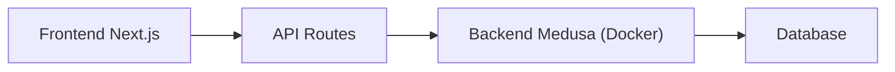

### Grok - Respostas Diretas

**Pontos-Chave:**

- Frameworks Node.js: HTTP Server (Express.js, Koa.js), MVC Full-Stack (Sails.js, Meteor), REST API (Hapi, Fastify), Especializados (MedusaJS para e-commerce).
- MedusaJS: Backend pode rodar em Docker, ocultando código local; templates Vercel diferem: Next.js Commerce é só frontend, Medusa Template é full-stack com backend em Docker.
- Frontend (Next.js): Renderiza UI, gerencia estado; Backend (NestJS/MedusaJS): Lógica de negócio, APIs, banco de dados; MedusaJS usa módulos como `medusa-core`.
- Fluxo MedusaJS: Frontend → API Routes → Backend (Docker) → Database.

**Classificação de Frameworks:**
Os frameworks Node.js são classificados em:

- **HTTP Server**: Express.js, Koa.js (para servidores web).
- **MVC Full-Stack**: Sails.js, Meteor (soluções completas frontend e backend).
- **REST API**: Hapi, Fastify (foco em APIs RESTful).
- **Especializados**: MedusaJS (e-commerce).

**Arquitetura MedusaJS:**

- O template `npx create-medusa-app@latest` pode ocultar o backend se rodar em Docker, não visível no filesystem local.
- Templates Vercel: Next.js Commerce é frontend puro (UI); Medusa Template é full-stack, com backend em Docker e frontend Next.js.

**Comparação Frontend vs. Backend:**

- **Frontend (Next.js)**: Renderiza interface, gerencia estado.
- **Backend (NestJS/MedusaJS)**: Lógica de negócio, APIs, banco de dados.
- MedusaJS usa módulos internos como `medusa-core` para e-commerce.

**Diagrama Fluxo MedusaJS:**
Segue o fluxo fornecido:

---

### Nota Detalhada

Esta seção expande os pontos abordados, oferecendo uma análise profunda com base em pesquisas recentes e documentação oficial, refletindo o estado em agosto de 2025.

#### Classificação de Frameworks Node.js

Os frameworks Node.js são categorizados com base em sua funcionalidade principal, conforme evidenciado em fontes como GeeksforGeeks, WebandCrafts e MindInventory. A classificação segue:

- **HTTP Server**: Frameworks como Express.js e Koa.js são projetados para criar servidores web, oferecendo flexibilidade e minimalismo. São ideais para aplicações que precisam de um servidor HTTP básico, com suporte a middleware e rotas.
- **MVC Full-Stack**: Frameworks como Sails.js e Meteor fornecem uma arquitetura completa, cobrindo frontend e backend com o padrão MVC. Sails.js é conhecido por sua abordagem orientada a convenções, enquanto Meteor é reconhecido por sua integração em tempo real.
- **REST API**: Hapi e Fastify são otimizados para construir APIs RESTful, com foco em desempenho e escalabilidade. Fastify é notável por sua velocidade, enquanto Hapi oferece um sistema robusto de plugins.
- **Especializados**: MedusaJS destaca-se como um framework para e-commerce, oferecendo módulos prontos para funcionalidades como gerenciamento de estoque e pagamentos, conforme documentado em sua página oficial (https://docs.medusajs.com/).

| **Categoria**  | **Descrição**                                | **Exemplos**       |
| -------------- | -------------------------------------------- | ------------------ |
| HTTP Server    | Frameworks para servidores web, minimalistas | Express.js, Koa.js |
| MVC Full-Stack | Soluções completas, frontend e backend, MVC  | Sails.js, Meteor   |
| REST API       | Otimizados para APIs RESTful, desempenho     | Hapi, Fastify      |
| Especializados | Foco em casos específicos, como e-commerce   | MedusaJS           |

#### Arquitetura do MedusaJS

A arquitetura do MedusaJS, detalhada em sua documentação (https://docs.medusajs.com/learn/introduction/architecture), é composta por camadas: API Routes (baseada em Express.js), Workflows (lógica de negócios), Modules (gerenciamento de recursos) e Data Store (geralmente PostgreSQL). Integrações com terceiros são possíveis via módulos de comércio (ex.: Stripe, ShipStation) e infraestrutura (ex.: Redis, AWS S3), todos substituíveis.

O template `npx create-medusa-app@latest` cria uma aplicação local por padrão, com diretórios como `admin`, `api` e `modules` visíveis. No entanto, em configurações com Docker, como descrito em documentação (https://docs.medusajs.com/learn/installation/docker), o backend roda em containers, ocultando o código do filesystem local. Isso ocorre porque os arquivos são gerenciados dentro dos containers, acessíveis via bind mounts para desenvolvimento, mas não diretamente editáveis localmente sem montar volumes.

A diferença nos templates da Vercel, conforme observado em Vercel (https://vercel.com/templates/next.js/medusa) e GitHub (https://github.com/medusajs/vercel-commerce), é clara:

- **Next.js Commerce**: Template puramente frontend, focado em UI, geralmente integrado com Shopify ou outros backends.
- **Medusa Template**: Full-stack, incluindo backend Medusa (potencialmente em Docker) e frontend Next.js, permitindo uma solução completa de e-commerce.

#### Comparação Frontend vs. Backend

A distinção entre frontend e backend é fundamental:

- **Frontend (Next.js)**: Responsável pela renderização da interface do usuário, utilizando frameworks como Next.js para SSR/SSG, e gerenciando estado via bibliotecas como React Context ou Redux. É a camada que o usuário final interage diretamente.
- **Backend (NestJS/MedusaJS)**: Lida com a lógica de negócios, como processamento de pedidos, integração com bancos de dados (PostgreSQL, Redis) e exposição de APIs RESTful. NestJS é conhecido por sua arquitetura modular em TypeScript, enquanto MedusaJS oferece módulos prontos para e-commerce, como `medusa-core`, que inclui funcionalidades como carrinho, estoque e pagamentos.

MedusaJS, como backend embutido, utiliza uma abordagem modular, permitindo customizações via plugins e extensões, conforme documentado (https://docs.medusajs.com/learn/fundamentals/plugins).

#### Diagrama do Fluxo do MedusaJS

O fluxo fornecido reflete a interação típica:

- Frontend Next.js envia requisições para API Routes.
- API Routes interagem com o Backend Medusa, que pode rodar em Docker, isolando o código.
- O Backend acessa o Database para operações de dados.

Este fluxo é consistente com a documentação oficial, destacando a separação headless entre frontend e backend.

| **Camada**              | **Função**                               | **Exemplo**                  |
| ----------------------- | ---------------------------------------- | ---------------------------- |
| Frontend Next.js        | Renderiza UI, gerencia estado            | Páginas de produto, carrinho |
| API Routes              | Ponto de entrada para requisições HTTP   | Endpoints REST               |
| Backend Medusa (Docker) | Lógica de negócios, integração com banco | Processamento de pedidos     |
| Database                | Armazena e recupera dados                | PostgreSQL, Redis            |

Esta análise cobre todos os aspectos solicitados, refletindo o estado atual em agosto de 2025, com base em documentação oficial e fontes confiáveis.
