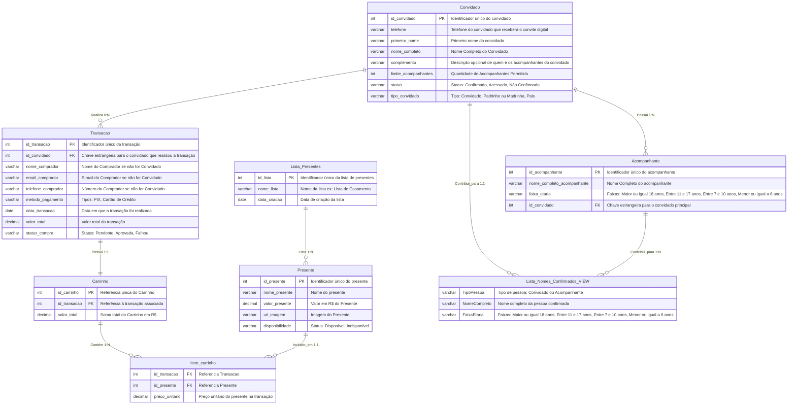

# Roteiro de estudos para aprender Web

> **Atenção**: *Luis, quero que saiba que esse documento é muito importante, estou te passando praticamente tudo que eu sei e estive estudando nos últimos 5 anos e te passando o melhor conteúdo que já tive contato, além do conteúdo que estou reunindo nos últimos meses para fazer o site do casamento porque eu tive que me atualizar. Quando eu trabalhava em 2020 como freelancer ainda não existia o NextJS, por exemplo. Mas existem coisas que nunca mudam e é isso que estou tentando te ensinar aqui.*
> 
> *Esse documento vai **muito além de um simples tutorial**, é uma porta de entrada para você entender Web e realmente ficar ninja nisso o mais rápido possível, porque estou te passando o conhecimento... Espero que valorize.*
> 
> *Minha dica é a seguinte: **Nunca queime etapas**, se você sentir que aprendeu uma coisa complexa mas a camada **mais básica você pulou**, te garanto que você vai ter **dificuldades no futuro**.*
> 
> *Neste documento, eu estou te passando a **ordem certa para você entender web sem travar**, indo do básico ao extremo avançado.*
> 
> *Observe que , obviamente o documento está incompleto porque não irei dar todas as informações já de cara, programação é **prática e teoria**, os dois intercalam igual tocar um violão.*
> 
> *Então depois de fazer o básico, a gente avança mais. O escopo do projeto não é EXTREMAMENTE COMPLEXO. Mas exige revisões, cuidado e principalmente, inteligência invés de só sair fazendo.*
> 
> *Agradeço sua ajuda e espero que goste do conteúdo.*
> *Ass: Nicolas*

## Configurando a Máquina

### Porque essas coisas são importantes?

Escolher WSL para Docker significa começar com o **pé direito** desde o primeiro momento. 

Com performance até 20% superior em relação ao Windows nativo e cinco vezes menos consumo de memória, você está não apenas aprendendo Docker, mas fazendo isso em um ambiente que espelha exatamente a realidade de produção. 

Isso elimina a frustração comum de iniciantes que desenvolvem em Windows e depois descobrem que suas aplicações se comportam diferentemente em outros computadores porque o **Docker**, ele encapsula sua aplicação e todas as suas dependências em containers isolados, fazendo com que ela funcione da mesma forma em qualquer máquina que execute Docker.

Estes passos são necessários para uma código moderno e robusto, principalmente quando começamos a pensar nos conceitos modernos **de Infraestrutura como Código (IaC)**. 

### 1. Instalando o WSL

Se você utiliza Windows, por favor, considere utilizar **WSL**: [Aprenda a usar
o WSL](https://www.youtube.com/watch?v=o1_E4PBl30s) e se [aprofundar aqui](https://www.youtube.com/watch?v=28jHuWBi72w).

Para atualizar utilize esse comando:

Abra o CMD ou PowerShell.

Para instalar use esse comando aqui:

```
wsl --install
```

Para atualizar utilize esse comando:

```
wsl --update
```

Verifique se a versão é a versão 2 ou mais recente:

```
wsl --version
```

Verifique se foi instalado alguma distro com esse comando

```
wsl --list --all
```

## 2. Aprendendo Git

Estudar o **git** ([Cheatsheet comandos básicos aqui](https://education.github.com/git-cheat-sheet-education.pdf) + [Vídeos do
Akita Usando Git Direito](https://www.youtube.com/watch?v=6OokP-NE49k) e [Entendendo GIT](https://www.youtube.com/watch?v=6Czd1Yetaac))

No início dos anos 2000, Linus Torvalds já era famoso por ter criado o kernel Linux, um sistema operacional de código aberto que reunia milhares de desenvolvedores ao redor do mundo.

Quando o projeto do kernel migrou para um sistema de controle de versão proprietário, Linus percebeu de cara o problema que se enfiou: A solução proprietária não era escalável e tinha sérios problemas de performace.

Em abril de 2005, ele desenvolveu o Git em poucas semanas, inspirado em conceitos como delta e de outros sistemas distribuidos, aplicando com maestria.

O Git resolve o problema de múltiplos desenvolvedores modificando arquivos simultaneamente através de um sistema de snapshots organizados em commits, permitindo a criação de branches independentes onde cada pessoa pode trabalhar sem interferir no trabalho dos outros, e quando necessário, combina automaticamente as mudanças identificando conflitos apenas quando há ambiguidades, transformando assim a colaboração em software num processo organizado.

## 3. Configurando seu usuário Github dentro do WSL

Para configurar o seu usuário Github, usando o GIT dentro do WSL com o [meu tutorial aqui](https://bruxo.hashnode.dev/faca-seu-push-automaticamente-com-ssh-no-github-linux).

## 4. O que é Docker?

**Em resumo podemos dizer que**: O Docker é uma ferramenta que *"empacota"* uma aplicação e todas as suas dependências / bibliotecas, isso significa que é como se *"congelasse"* momentâneamente a máquina assim todos os desenvolvedores utilizam exatamente a mesma *"máquina"* e os mesmos *"programas"*, padronizando os resultados finais. Mas cuidado, Docker **NÃO É UMA MÁQUINA VIRTUAL**. 

As configurações e sistema operacional operam no mínimo de unidades isoladas e para isso deram o nome de **containers**; 

Cada container executa exatamente o mesmo conjunto de instruções em qualquer máquina com Docker, garantindo que o software funcione de forma consistente, reproduzível e segura, sem conflitos entre projetos ou variações de ambiente.

Para entender o que é Docker você pode usar a [documentação oficial](https://docs.docker.com/desktop/features/wsl/) e um [vídeo curtinho de 10 minutos que tem o áudio em Português](https://youtu.be/rIrNIzy6U_g?si=ePXIlbsSYPzuQ8RJ).

Para instalar o Docker a gente vai seguir esses passos:

### 4.1 Instalação do Docker

Primeiro, não esqueça de atualizar seu Linux (WSL) antes de seguir com a instalação do Docker, esse comando irá atualizar os pacotes (programas) do sistema operacional e tornarão possível instalar o Docker, npm, npx, yarn, Node, NVM etc...

```
sudo apt update
sudo apt upgrade -y
```

 Para instalar dentro do WSL com Ubuntu 22.04 você usa esses comandos dentro do WSL:

```bash
sudo apt install -y apt-transport-https ca-certificates curl software-properties-common
```

Adicionar a chave GPG do Docker:

```bash
curl -fsSL https://download.docker.com/linux/ubuntu/gpg | sudo gpg --dearmor -o /usr/share/keyrings/docker-archive-keyring.gpg
```

Adicione o Repositório do Docker:

```bash
echo "deb [signed-by=/usr/share/keyrings/docker-archive-keyring.gpg] https://download.docker.com/linux/ubuntu $(lsb_release -cs) stable" | sudo tee /etc/apt/sources.list.d/docker.list > /dev/null
```

Instale o Docker Engine:

```bash
sudo apt install -y docker-ce docker-ce-cli containerd.io
```

 Adicione o Usuário ao Grupo Docker

```bash
sudo usermod -aG docker $USER
```

Verifique a Instalação:

```
docker --version
```

## 5. História do front-end e do Back-end

> *Se você usa um martelo e sabe martelar, você é um bom martelador; Mas se você sabe o porquê de existir um martelo, como fabricar um martelo, os diferentes dipos de martelo, você é mais que um martelador, você é um **engenheiro**.*

Por isso, recomendo fortemente os vídeos do Akita, um cara singular, empresário e programador a mais de 40 anos passou pela bolha das ".com", fez sua própria empresa, faliu e fez outra e hoje conta sua tragetória e a tragetória da tecnologia com uma didática incrível. 

Se sobrar tempo recomendo fortemente assistir e tentar entender a [história do front-end](https://www.youtube.com/watch?v=VKmPGmFY7H4) e [história do back-end Parte 1](https://www.youtube.com/watch?v=Qjk-cSW-jk4) e [história do back-end Parte 2](https://www.youtube.com/watch?v=N6vgZr1k03g) nos vídeos do Akita pra entender o porquê das ferramentas atuais existirem.

> *AVISO DE EXCESSO DE INFORMAÇÕES!*
> 
> *Com esses vídeos você vai entender **TUDO**. **SEM EXCEÇÃO** sobre a área E É NORMAL **NÃO ENTENDER TUDO DE PRIMERA**, depois desse vídeo você nunca mais verá as coisas da mesma forma.*
> 
> *Por isso, recomendo salvar o vídeo, depois de tentar assistir pelo menos 1 vez é claro,  nos seus favoritos pra você assistir futuramente...*

## 6. NodeJS

Até antes de 2009 o Javascript sempre foi estritamente algo que estava dentro do navegador.

Até que em Ryan Dahl em 2009, criou o NodeJS fazendo com que o Javascript rodasse fora do navegador.

Isso abriu um leque de possibilidades que antes não era possível como: **Electron**, que cria aplicações binárias em desktop através do Javscript, ou seja, é um código web, mas no final é um aplicativo desktop.

Aqui algumas palavras chaves são importantes:

- **Runtime**

- **I/O não bloqueante**

- **Orientado a Eventos**

- **Single-threaded**

- **Loop de eventos**

- **Assíncrono**

**Mas o que isso significa?**

- **Runtime** significa o que já falei anteriormente, rodar o javascript fora do navegador. Isso possibilitou uma gama de possibilidades como por exemplo o Electron que é basicamente aplicativos desktops binários feitos com Javascript, isso só é possível pela **runtime** **NodeJS**.

- **I/O não bloqueante**: É a forma do NodeJS operar em que o servidor inicia uma operação de leitura / escrita dentro da máquina e continua processando outras tarefas sem esperar o resultado. Ou seja, ele continua sem esperar algo terminar a não ser que você explicitamente diga para ele esperar, ou seja, `await`.

- **Single-threaded**: Imagine uma fábrica, se ela tem várias esteiras, no final temos vários pacotes sendo despachados certo? Agora tente imaginar uma fábrica com uma esteira só. Conseguiu ? Com uma esteira nós somo obrigados a colocar os pacotes tudo em uma esteira só. Como isso se relaciona com esse conceito. Thread é fio. Imagine que multi-thread seja a fábrica com muitas esteiras. A fábrica com uma esteira só evita a bagunça em casos de ter apenas um funcionário para carregar o pacote dentro do caminhão.
  
  - Execução de código JavaScript em uma única linha de processamento principal dentro do processador, dando segurança e evitando os riscos de memória que comumente acontecem em multi-thread se mal programados ou configurados.

- **Loop de eventos**: Em NodeJS existe um "maestro" da esteira da fábrica, esse maestro controla uma fila, igual a fila de um banco. O loop de eventos vai gerenciar a fila de eventos e callbacks, verificando continuamente se há tarefas prontas para serem executadas.

- **Assíncrono**:  É quando as operações ocorrem em segundo plano, permitindo que o fluxo principal continue sem esperar pela conclusão. Não é um conceito inventado pelo NodeJS mas é sua principal força.

### 6.1. Referências Para entender NodeJS

Para entender melhor eu recomendo esse vídeo desmitifica parte das palavras: [JavaScript Event Loop](https://www.youtube.com/watch?v=va8-xdxTywU) a [documentação oficial é essa](https://nodejs.org/en/learn/getting-started/introduction-to-nodejs) mas eu recomendo o [W3Schools](https://www-w3schools-com.translate.goog/nodejs/nodejs_architecture.asp?_x_tr_sl=en&_x_tr_tl=pt&_x_tr_hl=pt-BR&_x_tr_pto=wapp) porque eles explicam a arquitetura e é menos técnico e mais explicativo.

## 7. ReactJS

Antes de mergulhar no Next.js, é essencial entender o que é o React, pois o Next.js usa React para construir a interface. Em React, tudo gira em torno de componentes, que são pedaços de código que retornam um bloco de interface escrito em JSX (uma sintaxe parecida com HTML). Um componente pode ser uma função ou classe que recebe props (dados de entrada) e retorna o que deve aparecer na tela. Isso permite criar interfaces divididas em blocos reutilizáveis, como botões, formulários ou listas, que você pode montar como peças de Lego para construir páginas completas.

Se você brevemente ir nessa documentação inicial do React, você vai entender o próximo parágrafo: https://react.dev/learn

O React também introduz o conceito de estado (`state`) e `hooks` para componentes funcionais. O `state` armazena valores que mudam com o tempo, como se um botão foi clicado ou o texto digitado em um campo. Para manipular esse estado, usamos hooks como `useState`, que retorna um valor e uma função para atualizá-lo; e `useEffect`, que executa código quando o componente carrega ou quando o estado muda. Esses hooks substituíram os antigos métodos de ciclo de vida de componentes de classe, tornando mais simples e direto lidar com efeitos colaterais, como buscar dados de uma API ou escutar eventos.

Um site interessante para entender como o React renderiza as coisas na tela é esse: [React lifecycle methods diagram](https://projects.wojtekmaj.pl/react-lifecycle-methods-diagram/)

O vídeo que recomendo para isso é esse: [React - Dicionário do Programador](https://www.youtube.com/watch?v=NhUr8cwDiiM), o Código Fonte faz uma geral muito boa para entender o básico do framework porém hoje em dia o React já está bastante diferente. Mas entender algo como era antes, nos ajuda entender porque a ferramenta evoluiu e porque foi para onde foi.

## 7. O que é Typescript?

Entender o que é Typescript [aqui com esse tutorial](https://www.typescriptlang.org/pt/docs/handbook/typescript-from-scratch.html) que conta um pouco da história do Javascript e com [esse vídeo curtinho e didático super 'mão na massa'](https://www.youtube.com/watch?v=cZpNkXb4Ge0).

## 8. PostgreSQL

Entender PostgreSQL só a introdução: [Esse vídeo de 10 minutos ajuda bastante](https://www.youtube.com/watch?v=Z_SPrzlT4Fc). Não precisamos passar disso porque vamos utilizar uma ORM para isso, por isso vem o próximo passo.

## 9. O que é ORM?

Para entender superficialmente o que é ORM: [Tutorial explicativo aqui](https://www.devmedia.com.br/orm-object-relational-mapper/19056) ou se preferir o vídeo de [9 minutos do Código Fonte é suficiente](https://www.youtube.com/watch?v=snOXxJa31GI)

Mas de forma resumida: Um ORM (Object-Relational Mapping) é uma camada de software que traduz estruturas de dados em código orientado a objetos (classes e objetos) para tabelas e registros de um banco de dados relacional, permitindo que o desenvolvedor crie, leia, atualize e exclua dados usando apenas operações com objetos em sua linguagem de programação, **sem precisar escrever comandos SQL manualmente**. 

Essa abstração mantém o código mais limpo, consistente e menos propenso a erros, além de evitar o famoso (**SQL INJECTION**). Com ele você trabalha com os conceitos de modelagem na sua linguagem de programação ao invés de manipular com a sintaxe de banco de dados. Se precisar mudar o banco, não tem problema, essa é a maior vantagem: **Imutabilidade do código perante a mudança dos bancos por baixo dos panos**.

## 10. O que é Prisma?

Para entender o que é o Prisma eu recomendo: [Esse vídeo aqui de 7 min apenas](https://www.youtube.com/watch?v=_kOscYKIA-w) e [esse aqui, que é mais 'mão na massa'](https://www.youtube.com/watch?v=uApCW1gcpdE) , por fim,  [a documentação oficial é essa aqui](https://www.prisma.io/docs/orm/prisma-schema/overview).

**Em resumo é isso aqui:** Se você entendeu ORM você entende o que é o Prisma. 

Ele é exatamente o que se propõe no ORM, portanto, é a mesma coisa. 

A ferramenta ajuda você a se conectar um banco de dados de forma simples. 

Basta você definir em um arquivo de como serão suas tabelas e colunas, a isso chamamos de `migrations` , usando uma sintaxe clara com a linguagem de programação Typescript, a partir disso o Prisma cria automaticamente funções em sua linguagem de programação para inserir, buscar, alterar e apagar registros nesse banco sem você ter que escrever código SQL;

O Prisma ORM se destaca dos outros ORMs como TypeORM, oferece um **fluxo de trabalho baseado em esquema**, onde as funções geradas são garantidas por tipagem e a prova mudanças;

## 11. NestJS

NestJS se destaca por trazer conceitos consolidados de engenharia de software de *modularidade* e *injeção de dependências*.

Ele organiza sua aplicação em **módulos**, **controladores** (controllers) e **serviços** (services), oferecendo templates prontos para lidar com **rotas**, **pipelines de validação**, **autenticação** e **interceptadores**. Com isso, você ganha uma **arquitetura escalável** e **consistente**, sem precisar reinventar a estrutura do projeto a cada novo recurso.

A **injeção de dependência** (Dependency Injection) é um padrão que permite ao NestJS fornecer automaticamente instâncias de classes (por exemplo, serviços) onde forem necessárias, sem que você precise criá-las manualmente. Isso normalmente é feito com os tipos usando `@`.

**Caso de uso do NestJS com o Prisma**: Vídeo super recomendado por ser didático e simples -> [Vídeo do Cod3r NestJS + Prisma](https://www.youtube.com/watch?v=-5JgJRohSzU)

## 12. NextJS

Revisar o NextJS (Era onde você estava fazendo): [Documentação Inicial Aqui](https://nextjs.org/docs/app/getting-started), [Documentação FullStack aqui](https://nextjs.org/docs/app/getting-started/route-handlers-and-middleware), [Documentação do ct a o NextJS](https://nextjs-org.translate.goog/learn/react-foundations/what-is-react-and-nextjs?_x_tr_sl=pt&_x_tr_tl=en&_x_tr_hl=pt-BR&_x_tr_pto=wapp)

## 13. MedusaJS

Se sobrar tempo ver um pouco de tempo ler sobre o [MedusaJS aqui](https://docs.medusajs.com/learn)

## 14. NextJS + NestJS + MedusaJS, não está complicado de mais?

Next.js, embora seja um framework full-stack, foca principalmente na construção  de interfaces e no roteamento de páginas, oferecendo renderização  híbrida (SSR, SSG, ISR) e APIs básicas através de **route handlers**, **server actions** e **middleware**.  

Isso permite criar tanto o frontend quanto pequenas rotinas de backend  sem sair do mesmo projeto, mas **não substitui uma arquitetura backend robusta** nem um sistema de comércio eletrônico completo.

NestJS entra como a camada de aplicação de servidor estruturada: ele traz padrões claros de **módulos**, **controladores**, **serviços** e **injeção de dependência**, facilitando a organização de lógicas complexas, autenticação,autorização, validação e comunicação com bancos de dados via ORMs. 

Utilizar Next.js apenas para APIs pode cuidar de endpoints *simples*, mas para regras de negócio complexas como workflows de pagamento, gestão de convidados e integrações externas com gateway de pagamentos o NestJS proporciona escalabilidade, testabilidade e padronização de código.

MedusaJS complementa esses dois ao oferecer um **core de e-commerce** **pronto**, com modelos de produto, carrinho, checkout, pagamentos e extensões por plugins. 

Em vez de reinventar a roda, você monta um backend de loja configurável com Medusa, rodando dentro de NestJS (ou  como serviço separado), e conecta seu frontend Next.js ao Medusa por  meio de *APIs REST* ou *GraphQL*. Essa combinação assegura:

- **Next.js** cuidando de SEO, performance de páginas, modularidade e entidades bem defindas e autenticação leve.

- **NestJS** gerenciando lógica de negócio, segurança, filas e integrações.

- **MedusaJS** fornecendo a infraestrutura de e-commerce, com extensibilidade e atualizações centralizadas.

Ao adotar este trio, você maximiza produtividade: mantém seu frontend  rápido e moderno, seu backend sólido e testável, e sua loja robusta com  todas as features de comércio eletrônico já implementadas. Isso reduz  tempo de desenvolvimento, melhora a manutenção e separa claramente  responsabilidades, sem sacrificar a consistência do stack  JavaScript/TypeScript.

---

## 15. Acesso dos cursos do Full Cycle:

- Login: nicolasom15@gmail.com

- Senha: wPqbz5w7M@2CtQRR

- Link da plataforma: https://plataforma.fullcycle.com.br/

- Link dos cursos, se te interessar:
  
  - [Link 1 Admin catalogo de vídeo - Codeflix - Typescript Back-end]()
  
  - [Link 2 Microsserviço: API do Catálogo com TypeScript - Back-end]()
  
  - [Link 3 - Gateway de Pagamento a prova de falhas]()

- O que temos até agora?
  
  - Site Home: https://gemini.google.com/share/db1f3de66815
  
  - Experiência do Usuário com Dialog: [Dialog Stack - Shadcn.io.](https://www.shadcn.io/components/layout/dialog-stack)
  
  - Figma: [Protótipo do Site do Casamento](https://www.figma.com/design/SLUICrCQV9Kvewj6fKaDFi/Casamento--Site-e-Convite-?node-id=137-38&t=bv1a0huxdHTtbeyu-1)

## 16. Conclusão

> *Luis, para concluir esse documento, queria dizer que a jornada está longe de acabar. Tecnologia é aprendizagem contínua e isso aqui é o resumo do resumo. Existe muito mais do que foi dito aqui e tudo depende da teoria e prática andarem juntos.*
> 
> *Lembre-se: seguir a ordem certa que eu passei é crucial; pular etapas só vai gerar dor de cabeça depois.*
> 
> *O escopo do projeto do casamento pode parecer no início ser EXTREMAMENTE complexo, mas não é.* 
> 
> *Óbvio que tudo aqui que vamos fazer **exige** e **deve** ter **revisões constantes**, mas acredito que começamos bem, porque hoje em dia, o desenvolvimento vai além de só sentar e codar, preza pela visão em olhar no futuro, pensar desde a experiência do usuário até como a aplicação vai entrar no servidor e, acima de tudo, inteligência.*
> 
> *O tempo para o projeto é curto mas tudo que trouxe é tudo que pude consolidar e estive estudando nos ultimos meses.*
> 
> *Este documento não esgota tudo mas vai te dar uma visão geral bem maior que antes.*
> 
> *Conforme você domina o básico, vamos fazendo o site do casamento com tudo que já planejei e pesquise (É muita coisa), minha dificuldade é juntar todos esses "retalhos" que estão espalhados. Creio que com esse material, podemos ir e voltar várias vezes nos conceitos aqui abordados e avançar cada vez mais, como quem intercala teoria e prática ao tocar um violão.*

## 17. Modelagem do Site do Casamento


